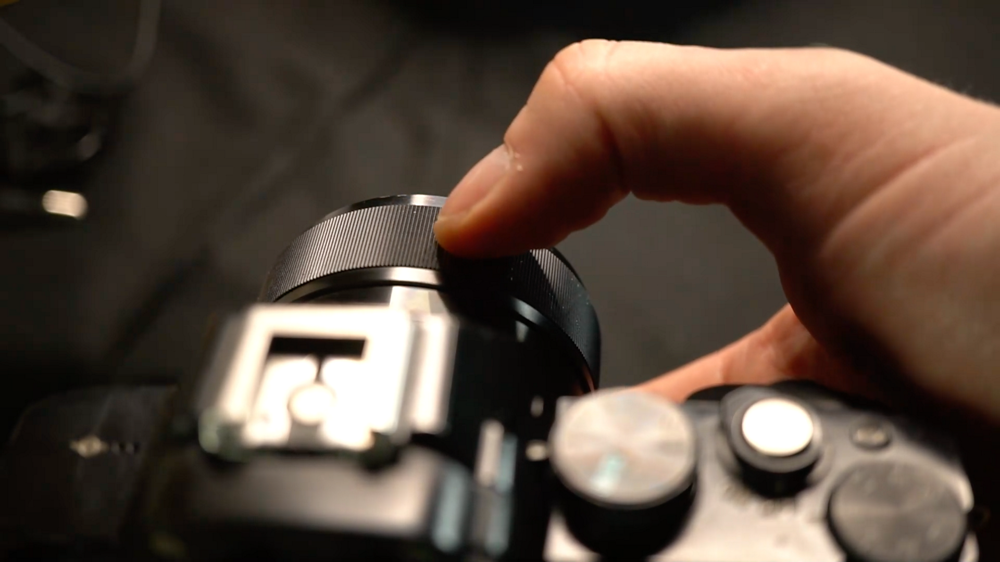
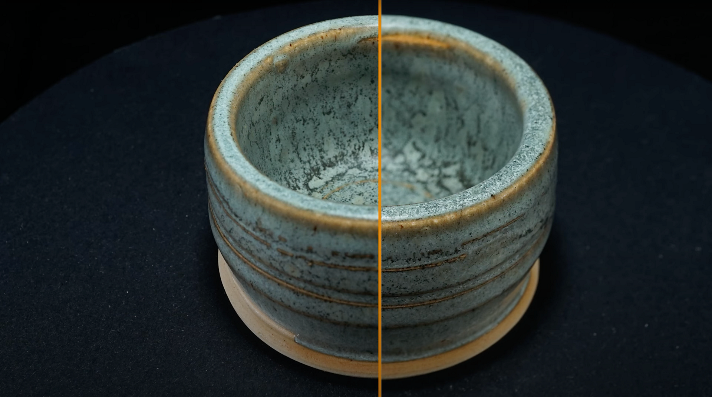

# Camera Settings  Focus

>[!WARNING]
>
> Support for 3D Capture has been removed as of Sampler version 5.1.

## Camera Settings - Focus

<b>Aperture</b> is the most complex camera setting, so in this user guide we’ll explain it in-depth.

You prefer to watch this guide as a video tutorial? You can find it [here](https://youtu.be/kFZ71ZWuap0?si=MDuvyO9w96rFpsQ9 "aperture and focus for 3D capture video tutorial").

## Focusing a lens

By default, your camera’s autofocus system controls this, setting focus automatically. That makes sense when photographing people, large environments, or anything dynamic, but for our controlled, static subject it might even cause issues; autofocus can make mistakes and ruin a photo, even in between two shots.

Every DSLR can switch from autofocus to a full <b>manual focus</b>. This means you are completely in control of focus, by twisting the focus ring on the lens. This way you’re sure the focus won’t jump between shots. If you read your camera manual, there will probably be settings to help you, such as “focus peaking”, where a colored effect is drawn over the camera display. This helps see what part of the image is in focus. There might even be a zoom-magnifier, where the display shows a small, blown up portion of the current view, helping you achieve pixel-perfect focus. Especially this zoom magnifier is crucial to help nail your focus.

Using Manual focus will help you see and understand better what is happening with your<b> aperture</b> and <b>focus</b>. The downside is you do have to <b>readjust your focus each time your camera, or subject moves</b>. It’s easy to forget and ruin a photo, so best make it a habit to check.

## Choosing the aperture value

<b>Aperture</b> is tricky because it affects <b>focus</b> and <b>sharpness</b>. We don’t want parts of our subject to not be in focus, this causes problems for the photogrammetry process. That means a large aperture, usually between f1.8 and f3.5 for standard lenses, will be a problem. On the other hand, going for the smallest possible aperture, f/32 is also not great, things also get less sharp on this end, and the amount of light coming in is tiny, leading to underlighting issues.

While the depth of field gets wider with smaller apertures, it also scales with focus distance. That means you’ll have more depth-of-field up close, and much less, up to complete sharpness, further away. That can be problematic for small objects, if you want them to take up most of the photo.

So what is the right aperture value? As a rule of thumb, find out what the sharpest aperture range is for your lens, and start with this value. This is probably<b> F8 or f11, up to f16</b>.  Check if <b>everything is in focus</b>, if not, reduce step by step until f20 or so. If your object is still not fully in focus, try moving a bit further away from it. Even 10-15 cm distance can make a difference for small objects.

Also keep in mind your choice of lens can make a difference. Default kit lenses that come with a camera are usually not the sharpest or highest quality, and it can be worth investing in a higher-quality lens. Especially for closeups, macro lenses can be useful, as they let your focus much closer to the lens.

## Focus bracketing

There is one special trick you can do, to achieve perfect sharpness when all else fails. <b>Focus bracketing</b> means you take <b>multiple pictures</b>, at <b>different focus distances</b>, and combine them in Photoshop. It requires <b>a lot of extra work</b>, especially with full loop series, so it should only be used as a last resort.

If you have 2 or more photographs with different focus, load them into different layers.

Select all layers, and go to <b>Edit</b> &gt; <b>Auto Align layers</b>. Hit ok with the default settings. Photoshop will try to do a pixel perfect alignment of all selected layers

Next, go to <b>Edit</b> &gt; <b>Auto Blend Layers</b>. Again, choose ok with all default settings. Photoshop will blend the sharpest parts of your layers together.

If all went well, you now have a perfectly sharp photograph. It’s worth turning at least some of these steps into a recorded action, to save you some time.

Now that you've learned everything there is to know about Aperture and Focus for the 3D capture process, learn more about [how to create an ideal lighting set up](../../help/guide/3d-capture/capture-lighting-sub/3d-capture-lighting-substance-3d-sampler.md).
