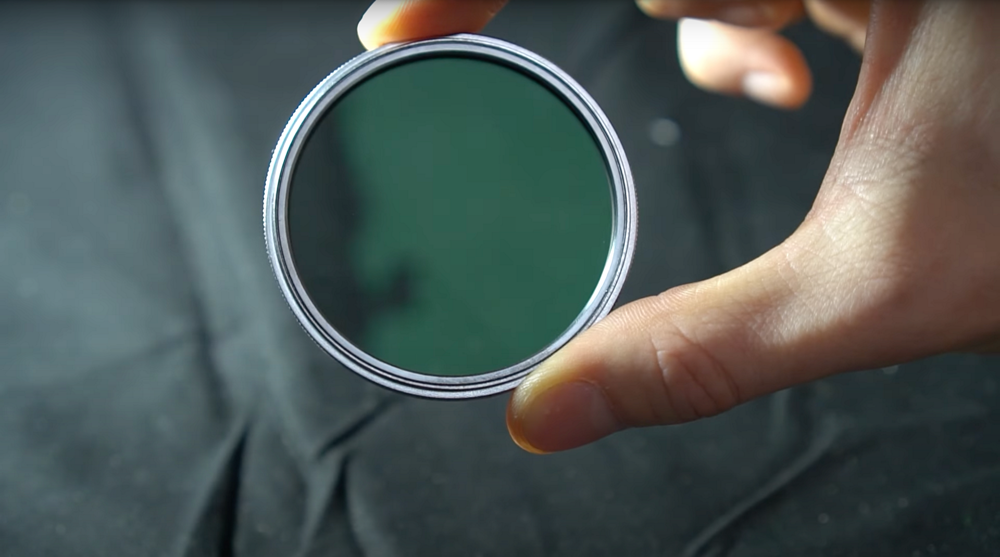
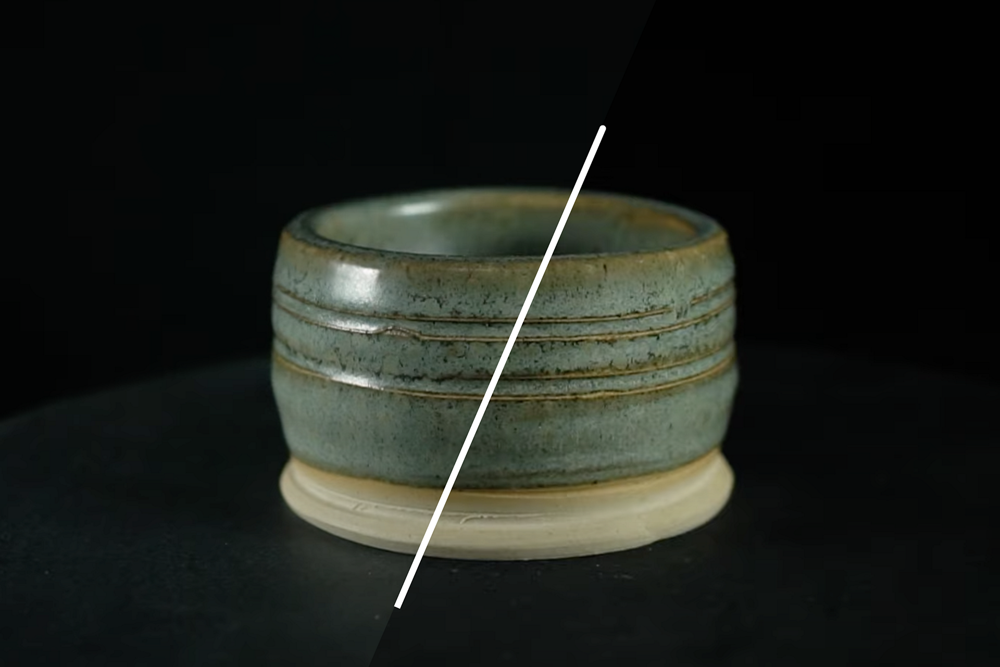

# Cross-polarising for 3D Capture

>[!WARNING]
>
> Support for 3D Capture has been removed as of Sampler version 5.1.

## Cross-Polarising

In this user guide we’ll go over how to deal with reflective objects and the issues they cause, and how to use light polarization to solve this.

You prefer to learn about this topic in a video tutorial? Find it [here](https://youtu.be/VWsbP56MDk0?si=Hdp7vblJB6L1RPxK "Cross polarizing tutorial").

When light hits a surface, it’s usually reflects in a diffused way, bouncing uniformly, giving the surface it’s color appearance. But depending on the surface roughness, some light can be reflected straight towards your eye or camera. This <b>specular reflection</b> changes depending on your viewing angle.

Photogrammetry works by aligning visuals patterns and elements between photographs, it assumes the look of an object won’t change between each consecutive photograph. So, specular reflection is an unwanted effect here. A mild case object might have just a reflective coating, but objects that are metal can be much trickier and take more effort to solve. We’ll tackle the mild case in this user guide. We just have to capture a perfect basecolor, unspoiled by specular highlights. It’s easy to add the reflectivity back in 3D once captured.

To solve this, we can filter our specular reflections using a method called <b>cross-polarisation</b>. When light is polarized, all the waves are oriented in the same direction. If you then polarise it again, in a perpendicular direction, it gets completely blocked, rendering it invisible.

Polarizing mostly affects specular light, as these are focused light rays, traveling in a specific direction, as opposed to the scattered diffuse light that we want to keep.

You polarize light with a polarizing filter, a special transparent sheet that filters the waves. They come in many forms, we’ll use screw-on glass filters for your lenses, as well as DIY-style polarizing film sheets

The basic idea is to <b>add a filter to your light</b>, and <b>your lens</b>, and set them up to be <b>perpendicular to each other</b>. That means you’ll need to finetune filter orientation by rotating them. Once they’re set up, specular reflections from that light become invisible. It’s quite special to see, twisting your filters can suddenly completely eliminate all glare from a polarized light.

A polarising filter for your lens should be bought, as you want optimal optics, still allowing for clear sharp photos. Different lenses have different sizes thread to screw filters onto, so make sure to get the right one for your lens of choice, or a few sizes for multiple lenses if you’re experimenting.

Polarizing your lights is cheaper and simpler:<b> polarizing film sheets</b> are relatively inexpensive. You can use an entire sheet, or cut pieces out. It’s a good idea to cut circular pieces covering the entire light, as it makes it easier to rotate them. Some lights are better for this, they might have a little filter holder, or magnets to hold sheets in place. If not, sticky tape always works!

Make sure to <b>add the polariser after any diffusers</b>, as diffusing the light cancels any polarisation.

Most cheaper ring flashes screw into your filter slot, and might not let you attach a lens filter anymore. They also don’t have any way to attach polarising filters to the flash light itself, so you’ll have to make your own. Only top-of-the line models support this properly.

<b>Rotating and matching polarisers across your setup needs to be done constantly</b>. Your lens filter needs to be fully perpendicular to all your lights, the only way to do this is to look at your camera display and adjust things. I like to start by taping a single sheet to my flash, and then adjust my lens filter to block the flash’s reflections. You can only do this by taking a picture, or by dry-firing the flash. It’s a bit involved, you can mark the correct orientation on your lens filter with a marker, and then try not to touch the lens and flash filter anymore.

Adjusting the polarisation on your video lights is different, but easier. You’ll have to constantly tweak your lights as you move them, or when you adjust the camera height. Simply <b>rotate the sheet until it looks right on your camera display</b>.

<b>Every single light source that shows up in reflections need to be polarized</b>, so you might have to close windows or turn screens off.

When properly set-up, you should be able to capture an object as if it’s completely matte, with no reflections and even lighting. Just like seeing your mesh with only the basecolor texture applied, it lets you capture difficult reflective objects.

Now learn more about [how to process your 3D capture using Substance 3D Sampler](../../help/3d-capture/processing-advanced-cap/processing-advanced-3d-captures.md)!
