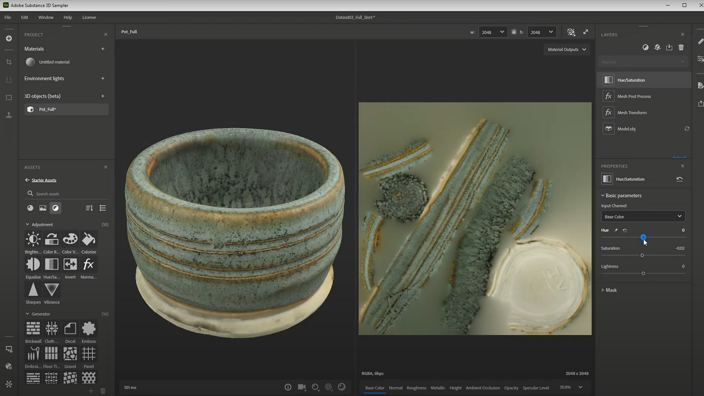

# Editing 3D Captured meshes

>[!WARNING]
>
> Support for 3D Capture has been removed as of Sampler version 5.1.

## Editing 3D Captured meshes

In this user guide we’ll go over some techniques to edit &amp; post process 3D captured objects in Substance 3D Sampler.

You prefer to watch this as a video tutorial? You can find it [here.](https://youtu.be/6_EZEAR0Uy8?si=6AaCUHD6nnWZyKUE "Advanced 3D Capture - Mesh Post Processing tutorial video")

Once you’ve finished the 3D capture process and added a mesh to your Sampler project, you can do modifications to it. These can be either changes to the mesh, or to the material. Mesh filters are new since Sampler 4.0. Material filters use all the familiar filters that were in Sampler before.

When you’re editing a captured 3D object in Sampler, <b>you can stack Mesh and Material filters in a mixed way</b>, they automatically apply to the correct part of your data. The quick filter list does not discern between the two types.

## Mesh filters

Let’s look at mesh filters first. There are two in Sampler: <b>mesh Transform</b> and <b>mesh post process</b>.

<b>Mesh transform</b> is a simple filter that lets you <b>translate</b>, <b>rotate</b> and <b>scale</b> your mesh. Most commonly you can flip an object over, or adjust its scale. Any scan comes with a transform pre-applied.

<b>Mesh post process</b> is the same as the post-processing step at the end of the 3D capture dialog, but in a dynamic filter. It lets you <b>remesh</b> , <b>re-uv</b> and <b>rebake</b> your textures. This filter is intended to <b>optimize your meshes by reducing tricount, improving the UVs and scaling texture down</b>. One of the best results from using it, is the improved UV-layout. Default, original 3D capture outputs have very fragmented UVs, usually the new automatic UVs are an improvement.

It’s not a fast filter, any time you change a parameter the mesh is processed. It’s best to be a bit patient with it.

## Material filters

Material Filters are much more diverse, anything that you can use on regular materials can be used on the 3D Capture mesh’s material, but keep in mind results might not always work, as many filters are intended for uniform, tiling materials.

The most useful filters tend to be adjustments like bright <b>contrast</b>, <b>hue saturation</b>, as well as some of the more advanced filters for editing channels. As we couldn’t capture the roughness of our object, we’ll use some filters to bring it back.

You can use a <b>Hue Saturation filter</b> to get the colors to match the real ones from your object even more. There are better ways to get color accuracy, but they are much more involved than this quick filter.

Next you might want to bring back the reflections that existed in your object. We can use the <b>Color Replace filter</b> here. Color Replace lets you grab a color from your texture, and change all areas with that color.

By default it colors everything in the color you have selected, but if you turn on <b>Advanced Segmentation</b>, then set it to <b>Mask From Basecolor</b> and <b>Replace</b> in <b>Roughness</b> instead, you can turn all the selected color’s area roughness much shinier. Playing with luminosity variation and mask range can helps with fine-tuning the mask.

Finally, you’d might like to bring back a little bit of detail from the basecolor into the roughness. The <b>Channel switch filter</b> allows me to mix and blend details between different channels. You can set the <b>input to Basecolo</b>r, the <b>output to Roughness</b>, and then play with the Blend mode and opacity to get something interesting and close enough to real life.

Finally if you want some more control over the final roughness, you can use a Brightness Contrast filter, and set it to affect the roughness channel. Then you tweak the values to make the roughness just a bit crunchier.

Every object is different, and depending on your dataset specific adjustments might be needed. You can even make use of the <b>Clone Stamp tool</b> to erase parts of your texture that you want to remove, like capturing aid markers. Just keep in mind that any material filter that uses specific locations on your texture will be dependent on your UV layout, so do the mesh processing before any material filters.

Once you are happy with your object and textures, you can <b>export </b>your result using the <b>Share &gt; Export As</b> dialog. General settings let you choose name and path, Mesh settings let you choose 3D mesh format, and material settings let you configure the material of the mesh. You can toggle mesh or material off to export only one of them individually. Once exported, your mesh is ready to use in other 3D applications.

 