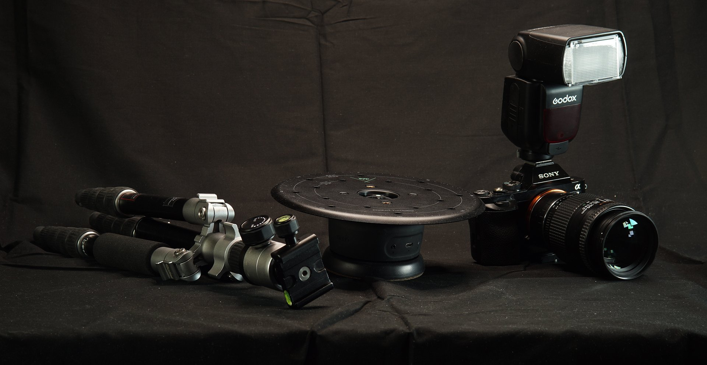

# 3D Capture Equipment

>[!WARNING]
>
> Support for 3D Capture has been removed as of Sampler version 5.1.

## Base equipment and setup

In this user guide we will go over advanced methods to take photographs to use in the photogrammetry workflow in Substance 3D Sampler.

You prefer to watch this content as a video tutorial? You can find it [here](https://youtu.be/f8iCtZ3Gmzs?si=Q353ZDCScO1YnHJT "3D Capture base equipment tutorial").

The focus on will be on shooting smaller objects indoors, in a controlled environment, with access to some more advanced equipment. There will be no focus on specific brands and products, as the goal is to try to keep the explanations generic enough so it can be applied to different equipment.

## Camera

Regarding your camera, a <b>DSLR camera</b> is essential to elevate the quality, and to have more control over the photos. Some high end smartphones might get close, but it’s difficult to extend and connect those with other photography equipment.

Any DSLR that supports <b>manual mode</b>, exchangeable lenses, can support an <b>external flash</b>, and has <b>12Mp or more resolution</b> is a good choice.

## Tripod

For shooting smaller subjects it is ideal to keep the camera at a set position, and rotate the object. For this a tripod and a product turntable are needed. The big advantage to such a static setup is that it makes it possible to flip a smaller object upside-down and capture the underside as well.

A tripod is needed, and although it does not have to be complicated the cheap plastic ones might make things complicated if they have to be adjusted often. A big, heavy studio tripod is overkill for a photogrammetry setup, so a mid-range metal tripod, <b>easily adjustable in height</b>, with a<b> good, metal head</b> might be ideal.

## Turntable

Regarding the turntable a simple, manual one will do for many cases, but an automated turntable that can trigger your camera automatically can make things simpler and faster. Manual turntables are very cheap, and are practical when on a budget. Motorized ones make it easier to do precise turns in repeatable way, and if the turntable can trigger the camera it can be many times faster to use than a manual one.

## Light and background

A DSLR, a tripod and a turntable setup are already enough to capture simple objects in ideal conditions. That means shooting with uniform natural light, such as from a ceiling window, or multiple surrounding windows. The object shot should also be fairly matte, not reflecting much.

The one major thing to pay attention to, is a uniform background. The photogrammetry system is easily confused by a static background with a rotating object, which is why it is important to eliminate that factor. When there is a busy background it is possible to use a simple paper or cardboard sheet, or a uniformly coloured cloth, to hide things.

Once everything is setup, the idea is simple: take plenty of photos, <b>going in full 360 degree loops. 16 shots per rotation is a good number, in at least 5 different loops</b>. One <b>from the side</b>, and <b>two from differing heights</b>, for the bottom and top each.

Now learn more about the c[amera settings you will need to use for the 3D capture process](../../3d-capture/camera-settings-exposure/camera-settings-exposure-substance-3d-sampler.md).
