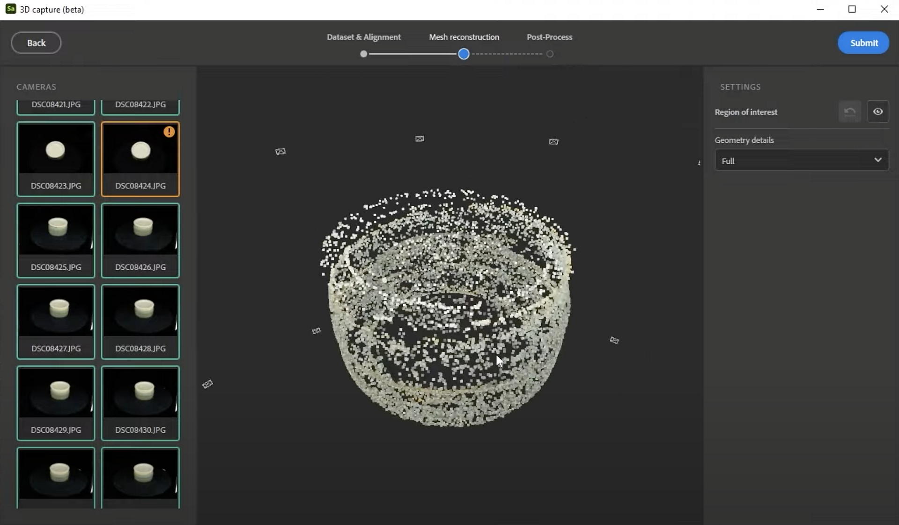
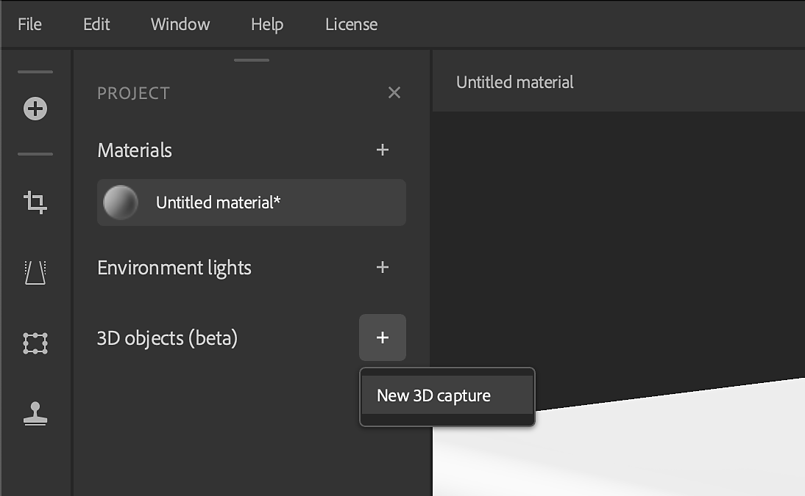
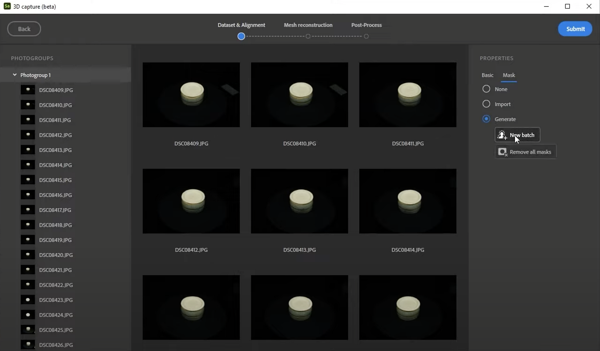

# Processing advanced 3D captures

>[!WARNING]
>
> Support for 3D Capture has been removed as of Sampler version 5.1.

## Processing advanced 3D captures in Substance 3D Sampler

In this user guide we’re taking an in-depth look at processing your 3D Capture datasets in Substance 3D Sampler.

You prefer to watch this as a video tutorial? You can find it [here](https://youtu.be/vJQ756Up55Y?si=GiAnajXRGkb5gyTH "Advanced 3D Capture - Capture Processing tutorial").

When doing 3D capture or photogrammetry, most of the effort is in taking good photographs, which steps are covered in the previous user guide articles. Also keep in mind we have designed and focused the 3D capture experience for objects up to human size. You might run into issues when you use a very large dataset (that means above 6 Giga pixels, which is 500 12 Megapixel photos).

## Starting the 3D Capture process

To get started in Sampler, you will need to create a <b>new Project</b>. You’ll notice a new 3D Objects section in the Projects window. Click the + next to that, and pick “<b>New 3D Object</b>” to get started with the 3D Capture process in a new, dedicated window.

Select all your photos in the explorer and drag them onto the 3D Capture window. After loading for a while, your photos are presented in a list, and as a gallery, with properties for the selection on the right.

The photo groups list on the left is based on the camera and lens used for the photos. If you mix photos from multiple devices, like a cellphone, dslr camera or a drone, you will get <b>separate groups</b> here.

With the group selected, you get an overview of its properties. Sometimes the <b>Focal length</b> and <b>Sensor size</b> are missing; it is possible to fill these out <b>manually</b> if we know the numbers. This info can help improve the processing a bit.

## Generating masks

The most important option is under the <b>Mask</b> section. Because the photos have been taken on a turntable, the background did not change much, but the object did. This can cause the alignment process to completely fail. On top of that, the background contains no meaningful info at all. To solve this, you’ll want to mask out the subject for each photo.

The easiest way is to use the automatic batch generation. Select <b>Generate</b>, then <b>New Batch</b>, and wait for Sampler to create the masks. This uses Adobe Sensei “Select subject” technology, just like in Photoshop. With 72 photos this process takes a little while to complete, so best to be patient.

You can verify an individual mask by <b>selecting a photo</b>, and clicking on the <b>eye icon</b> at the bottom right, next to the mask path. This shows a grayscale preview of the mask. If the automatic masking makes a mistake and kept parts of the background, don’t worry, a few incorrect masks are not a problem.

The majority of masks should have just your subject. This is why it is key to shoot your photos on a <b>uniform, plain background</b>; it’s much easier for the automatic masking to work well. If most of your masks are not correct, you can either fix all of them manually, or reshoot your photos with a more suited background.

You might retry a dataset multiple times, and you want to avoid re-generating your masks each time, as Sampler deletes these once you close the app. Your masks are cached In your Documents\Adobe\Adobe Substance 3D Sampler\3DCapture\p1. If you do multiple assets in a session, you will get folders called p2, p3, etc. It’s a good idea to <b>copy the cached masks to a safe location with your dataset</b>, so you can save time if you need to revisit this dataset.

## Alignment

With correct masks, you’re ready to move on to alignment. Press the <b>Blue submit button</b> in the top right. You’ll get two options, <b>Precision</b> and <b>Photo ordering</b>.

* <b>Precision</b> can improve the alignment, it’s best to start at Low, if you get failed photos, try again with High.
* <b>Photo ordering</b> relates to the order you shot your photos. If you’ve walked around an object and shot in spiraling circles, you can go for sequence to save some time, but usually default is the safest option, even if it might take slightly longer to align.

Click <b>Process</b> and wait for the alignment to finish. This can take several minutes, so best to be patient again. Once finished, you see a point cloud representation of your object, with each photo represented as a camera floating around it. An orange warning triangle at the top left means some photos have <b>failed to align</b>. Hit back and try with High quality Precision, and Default Ordering if you haven’t already. Some photos might still fail to align, this means there’s not enough overlap, or not enough detail in them. You might have to revisit your photographing process to solve this, or you can just ignore them if it’s only a few photos.

Looking at your point cloud data, you might see <b>stray points floating around your object</b> that are not meant to be part of it. This is usually due to some bad masking, in this case a few bad masks have caused it to pick up on some dust particles. Y<b>ou can crop these out</b> using the eye icon on the right, next to Region of Interest. Simply <b>move the square handles</b> that appear to get a tighter fit around your object. Any points outside of this box, shown in dark gray, will not be included in your final 3D model. You can also use this bounding box to <b>pre-rotate and align your model better.</b>

Sometimes point clouds have much denser points than others. This isn’t an issue, less points means the surface will have less small geometric detail. It comes from a lack of detail and contrast in some parts of the object while others have more details.

## Geometry details

There’s only one setting left before we create our mesh. Under geometry details you can select the initial geometry detail level.

* <b>Raw</b> is the <b>undecimated mes</b>h, it’s not really recommended to use this unless you’re sure you need this.
* <b>Full to draft</b> are <b>decimated meshes</b>, you would pick lower options to get a test result faster, higher options to get more detail at the expense of slower processing.

Hit <b>Submit to start the mesh processing</b>. This process can take a while, longer than any of the previous steps.

## Preview and post process

Once your mesh is done, the final window lets us preview and post-process our mesh before we add it to our Sampler project. This mode has a few buttons at the bottom to see your mesh with <b>texture</b>, <b>shaded solid</b>, as <b>wireframe</b>, and with a <b>UV-checker material</b>. The post processing settings on the side let you generate a new version of your mesh. That means a re-tessellated mesh, with new automatic UV’s, and texture baked from the original mesh. The main controls let you set a target face count, and toggle Normal, height and AO baking. There are a lot of advanced settings to tweak, but the defaults usually work fine.

You can also do this mesh processing step afterwards, once the mesh is added to Sampler. Once you’ve added it to Sampler you can give it a name, it now appears in your project list.

You can edit the mesh and textures, but you can already export your result using the <b>Share</b> &gt; <b>Export As</b> dialog. <b>General settings</b> let you choose name and path, <b>Mesh settings</b> let you choose 3D mesh format, and <b>Material settings</b> let you configure the material of the mesh. You can toggle mesh or material off to export only one of them individually. Once exported, your mesh is ready to use in other 3D applications.

Now learn how to [further edit your captured 3D meshes in Sampler](../../3d-capture/editing-captured-meshes/editing-3d-captured-meshes.md).
