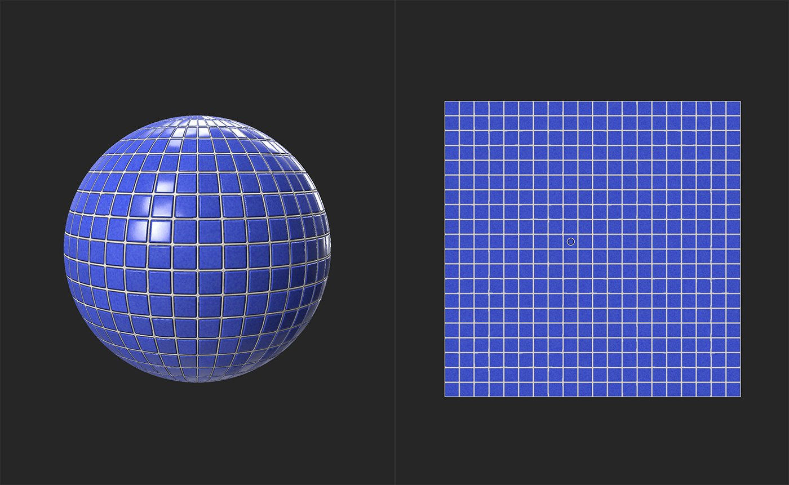
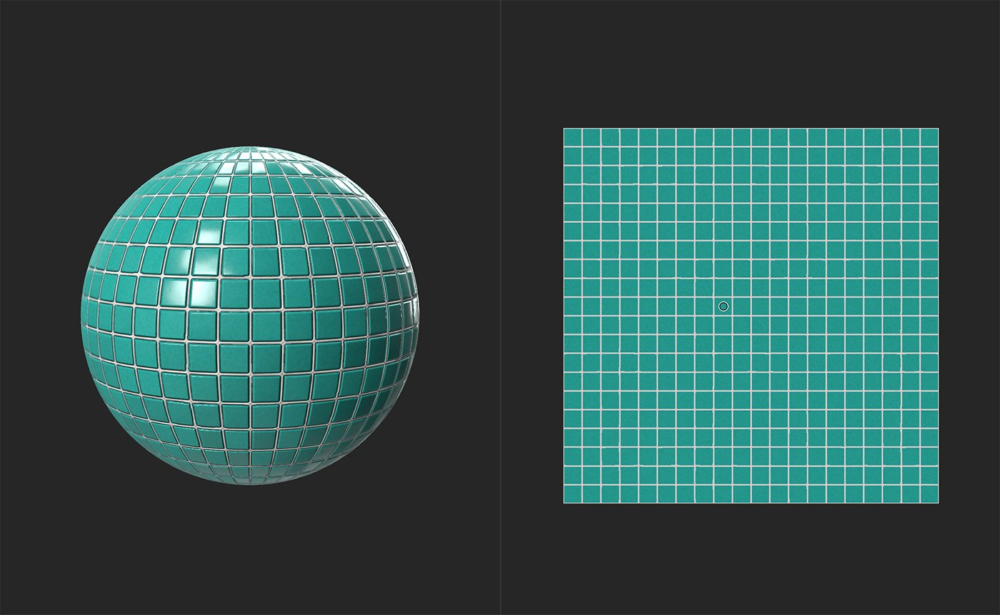

# Color Replace

<table>
<tr style="border: 0;">
<td width="41.60%" style="border: 0;" valign="top">

**In:** Adjustments

</td>
<td width="58.30%" style="border: 0;" valign="top">

## Description

Replace a chosen color or value in a channel.

The images below show **Color Replace** in action. Notice how the areas between the tiles remains the same color - only the tiles themselves are changed.

</td>
</tr>
</table>

## Parameters

**Basic parameters**

* **Advanced Segmentation**: toggle  
  When enabled, the filter can use a separate channel to generate mask information from the channel that is affected by the Color Replace.
  * **Mask** **From**:  
    Select a channel to act as a source for mask generation. For example, mask from the metallic value replace the base color of metallic areas of the material
* **Replace In**:   
  Select the channel affected by color replacement.
* **Target Color**: color select  
  Select the color that will replace the current channel colors.
* **Luminosity Variation**: 0-1  
  Adjust how much the of the original luminosity values are affected by the new color's luminosity.
* **Mask Range**   
  The Mask is created based on the combination of the following values
  * ******From Luminosity**: 0-1  
    The luminosity range used to build the mask****
  * **From Color**: 0-1  
    The color range used to build the mask
* **Mask Smoothness**: 0-1  
  Adjust the granularity of the mask
* **Mask Blur**: 0-1  
  Blur the mask

**Mask**

This mask is separate from the mask created under **Basic parameters** - you can use a custom mask to paint or use an image to specify areas to be affected by the **Color Replace** filter as a whole.

* **Use Custom Mask**: toggle  
  Enable or disable the use of a custom mask. If enabled the following parameters appear:
  * **Mask**: image/brush  
    Select an image to use as a mask or use the brush to paint a custom mask directly in the 2D view
  * **Custom Mask - Blur**: 0-1  
    Blur the mask
  * **Custom Mask - Invert**: toggle  
    Invert the mask

## Usage Guide

The **Color Replace filter** is a powerful way to modify the appearance of your materials - for example, use it to turn iron rust into oxidized copper

The filter works by first creating a mask based on the luminosity and color values of a chosen point, and then replacing the color of the area defined by that mask. So, to use the filter:

1. Add the **Color Replace filter** to the layer stack
1. Determine which channel you want to use to build the mask, and which channel you want to replace the color of
   1. If you want to base the mask on one channel but replace the color of another, then enable **Advanced Segmentation** and select the respective channels.
   1. If you want to base the mask on a channel and replace the color of the same channel, leave **Advanced Segmentation** disabled.
1. Move the control in the **2D view** over the color that you'd like to replace.
1. Adjust which areas the mask covers by using the **Mask Range**, **Mask Smoothness**, and **Mask Blur** controls.
1. Select a **Target Color**, and adjust the **Luminosity Variation** until you're happy with the effect.
1. Optionally add a custom mask to only apply the effects of the filter in the chosen areas. The custom mask does not impact the mask created in step 1, instead it is an additional mask that you can use to further adjust where the effect is applied.

Sometimes it can be useful to use multiple **Color Replace filters** on top of one another to create more advanced effects.
