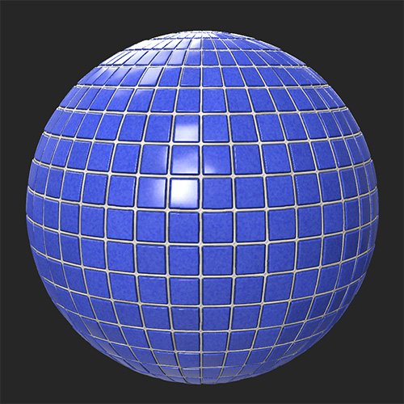
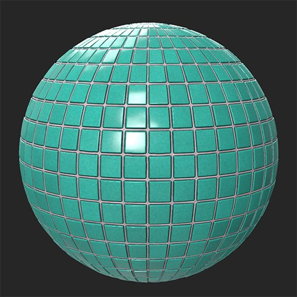

# Hue/Saturation

<table>
<tr style="border: 0;">
<td width="41.60%" style="border: 0;" valign="top">

**In:** Adjustments

</td>
<td width="58.30%" style="border: 0;" valign="top">

## Description

The Hue/Saturation filter lets you adjust the color of your base color and diffuse channels. You can also use a mask to specifically modify the colors for only parts of your image.

The images below show the **Hue/Saturation filter** used to adjust the Hue of a tile material.

<table>
<tr style="border: 0;">
<td style="border: 0;" valign="top">

{width="200px"}

</td>
<td style="border: 0;" valign="top">

{width="200px"}

</td>
</tr>
</table>

</td>
</tr>
</table>

## Parameters

**Basic parameters**

* **Hue**: -1 to 1  
  Adjust the hue of your image - this is useful for correcting colors in the Image to Material workflow.
* **Saturation**: -1 to 1  
  Adjust saturation to make colors pop, or decrease color intensity.
* **Lightness**: -1 to 1  
  Modify the lightness of your colors.
* **Colorize**: toggle  
  When disabled the filter adjusts the colors that are already present. When enabled, the filter will replace colors based on the Hue, Saturation, and Lightness sliders while maintaining detail.

**Mask**

* **Use Custom Mask**: toggle  
  Enable or disable the use of a custom mask. If enabled the following parameters appear:
  * **Mask**: image/brush  
    Select an image to use as a mask or use the brush to paint a custom mask directly in the 2D view
  * **Custom Mask - Blur**: 0-1  
    Blur the mask
  * **Custom Mask - Invert**: toggle  
    Invert the mask
