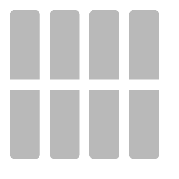
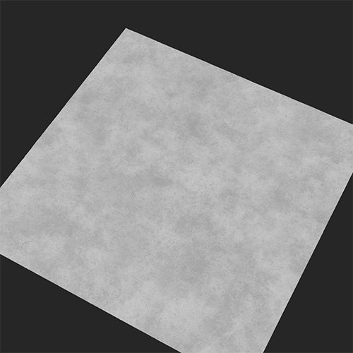
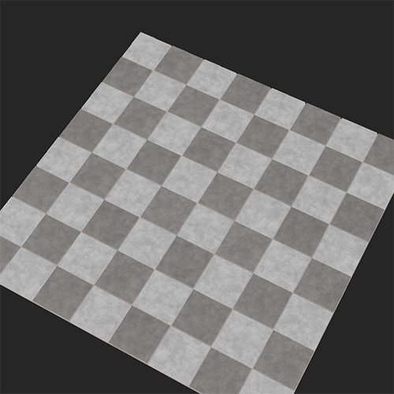

# Floor Tiles

<table>
<tr style="border: 0;">
<td width="41.60%" style="border: 0;" valign="top">

**In:** Generators

</td>
<td width="58.30%" style="border: 0;" valign="top">

## Description

The Floor Tiles filter breaks up the underlying material and converts it into an arrangement of Floor Tiles.

The images below show a concrete material converted into floor tiles with a checker pattern.

<table>
<tr style="border: 0;">
<td style="border: 0;" valign="top">

{width="200px"}

</td>
<td style="border: 0;" valign="top">

{width="200px"}

</td>
</tr>
</table>

</td>
</tr>
</table>

Parameters

<b>Basic parameters</b>

* <b>Random Seed</b>:   
  The random seed determines the random values of other parameters that use randomness in this filter.
* <b>Number of materials</b>:   
  Change the number of materials to convert into floor tiles. The first material is determined by layers under the Floor Tiles filter layer. If selected, the second can be added as an input
* <b>Input Materials Intensity</b>: 0-1   
  How much the details of the input materials will be visible in the tiles
* <b>Invert Materials</b>: Toggle   
  When using two materials, exchange where they appear in the tiles.
* <b>Color variation</b>: 0-1   
  How much the color varies between each tile of the same material
* <b>Bevel Radius</b>: 0-1   
  Size of the tile vs the size of the mortar
* <b>Bevel Depth</b>: 0-1   
  Depth of the mortar
* <b>Bevel Roundness</b>: 0-1   
  Determines the exterior angles of the tiles
* <b>Surface Grain</b>: 0-1   
  Determines how much the detail of the original material appears on the normal and height maps of the tiles
* <b>Pattern Mask</b>: Input.    
  Each Floor Tiles pattern mask has a different set of parameters available. Here we only cover the parameters available for <b>Square Tile</b>

  * <b>Random seed </b>  
    The random seed determines the random values of other parameters that use randomness in this filter.
  * <b>X Amount </b>  
    Adjust the number of columns of tiles
  * <b>Y Amount</b>   
    Adjust the number of lines of tiles
  * <b>Gradient </b>   
    Adjusts the proportion of the size of the tile compared to the size of the mortar.
  * <b>Luminance Random</b>  
    As luminance influences the height map, this parameter removes randomly some tiles
  * <b>Pattern Rotation</b>: 0-1   
    Rotates the angle of the tiles, keeping them away from each other to avoid superposition
  * <b>Shape Scale:</b> 0-1   
    Adjusts the proportion of the size of the tile compared to the size of the mortar.
  * <b>Shape Scale Random </b>  
    Adds randomly some difference in the size of the tiles
  * <b>Shape Size </b>  
    Adjust the length and width of the tiles
  * <b>Shape Size Random </b>  
    Add some randomness to the length and width of the tiles
  * <b>Position Offset Mode</b>: Dropdown list
  * <b>Position Offset </b>  
    Shifts randomly the tiles columns so the tiles are not horizontally aligned
  * <b>Position Random</b>   
    Positions the tiles randomy on the surface, with some potential superposition between the tiles
  * <b>Shape Rotation </b>  
    Rotate the angle of the tiles in the same direction, while keeping them as close as possible with potential superposition
  * <b>Shape Rotation Random </b>  
    Randomely rotate the angle of the tiles, while keeping them as close as possible with potential superposition

<b>Gap</b>

* <b>Gap Color</b>: color select   
  Change the color between tiles
* <b>Gap Roughness</b>: 0-1   
  Change the roughness value of the material between tiles.
* <b>Gap Metallic</b>: 0-1   
  Change the metallic value of the material between tiles.
* <b>Gap Height</b>: 0-1   
  Change the height value of the material between tiles.
* <b>Gap Irregularity</b>: 0-1   
  Adjust how neatly the mortar will be applied between the tiles.

<b>Age</b>

* <b>Floor Tilt</b>: 0-1   
  Add some tilt to random tiles
* <b>Height Random</b>   
  Add a height difference between tiles in a random way
* <b>Dirt</b>: 0-1   
  Add dirt to the tiles and gap
* <b>Damages</b>: 0-1   
  Remove some shards from the edge of the bevel of each tiles, randomly
* <b>Imperfections</b>   
  Add small holes and imperfections in the tiles

<b>Technical Parameters</b>

* <b>Material Scale</b>: 0-1   
  Scale of the material within the tiles
* <b>Normal Intensity</b>: 0-1   
  Adjust the intensity of the normal of the gap, the tiles and the material within

<b>Usage Guide</b>

The Floor Tiles filter lets you quickly convert your material into tiles. Most of the Floor Tiles filter is fairly straightforward to use, except when using multiple materials. To use two materials:

1. Set <b>Basic parameters &gt; Number of materials</b> to 2.
1. Drag the second material into the input slot that has appeared under the Floor Tiles filter in the layer stack.
1. Adjust the parameters of the input material until you're happy with the result.

While it is possible to add multiple materials and filters into a single input slot, it's generally a good idea to avoid doing this as it adds complexity and can make it harder to read your material when you come back to it later. Instead create new materials in your project and then drag an instance of your new material into the input slot. When you update the material in your project it will automatically update the material in the input slot, giving you full control and simplifying the layer stack.
