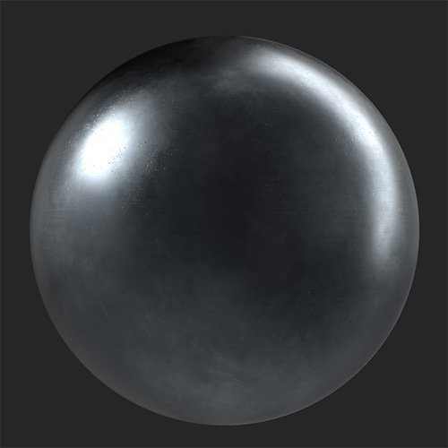
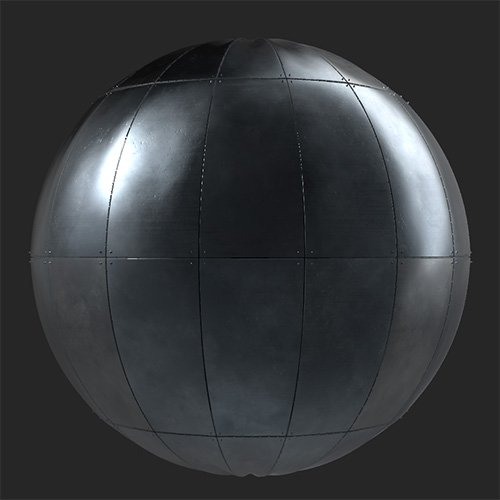

# Panel

<table>
<tr style="border: 0;">
<td width="41.60%" style="border: 0;" valign="top">

**In:** Generators

</td>
<td width="58.30%" style="border: 0;" valign="top">

## Description

Convert your material into panels. The Panels filter is particularly well suited to metal materials.

*A continuous metal material converted into panels.*

{width="200px"}

{width="200px"}

</td>
</tr>
</table>

## Parameters

**Presets**

Use presets to quickly modify parameters to create a specific effect.

**Basic parameters**

* **Random Seed**:  
  The random seed determines the random values of other parameters that use randomness in this filter.
* **X Amount**: 0-20  
  Change the number of panels in the X axis
* **Y Amount**: 0-20  
  Change the number of panels in the Y axis
* **Seam Type**:   
  Select different styles of seams between panels
* **Use Fasteners**:  
  Add fasteners between panels. When enabled the Fasteners section will appear in the list of parameters.

**Panels**

* **Offset Amount**: 0-1  
  Offset each row of panels from the preceding row by a percentage of the panel size.
* **Offset Random**: 0-1  
  Add a random value to the offset of each row
* **Vertical Offset**: toggle  
  Switch between horizontal offset and vertical offset.
* **Bulging Tension**: -1 to 1  
  Modify the normals of each panel to make it appear as if the panel is bulging inwards or outwards due to pressure.
* **Wrinkles**: 0-1  
  Add subtle dents and wrinkles to panels
* **Color Variation**: 0-1  
  Vary the color between individual panels randomly
* **Reflection Variation**: 0-1  
  Vary the roughness of individual panels randomly

**Seams**

The selection of parameters in this section depends on which value you have chosen in **Basic parameters &gt; Seam Type**.

* ***Gap***
  * **Seam Width**: 0-1  
    Modify the width between panel
  * **Gap Variation**: 0-1  
    Offset panels by a small amount to make the gaps between panels vary in width
  * **Gap Corner Rounding**: 0-1  
    Round the edges of panels
  * **Gap Bevel**: 0-1  
    Bevel the edges of panels
* ***Weld***
  * **Seam Width**: 0-1  
    Modify the width between panels
  * **Weld Quality**: 0-1  
    Adjust the uniformity of the weld
  * **Weld Discoloration**: 0-1  
    Modify the amount of discoloration of the weld compared to the color of the panels.
  * **Replace Weld Material**: toggle  
    Enable to customize the material used to create the weld. The following additional parameters will appear if this is enabled:
    * **Weld Material Color**: color select  
      Select the color of the weld. This will still be impacted by **Weld Discoloration**.
    * **Weld Material Roughness**: 0-1  
      Adjust the roughness of the weld seam between panels
* ***Overlap***
  * **Seam Width**: 0-1  
    Modify the width between panels
* ***Standing Seam***
  * **Seam Width**: 0-1  
    Modify the width between panels

**Fasteners**

* **Fastener Type**:  
  Select the style of fastener to use between panels
* **Fastener Amount**: 3-10  
  Change the number of fasteners to use along the edge between any two panels.
* **Fastener Size**: 0-1  
  Modify the size of the fasteners
* **Fastener Variation**: 0-1  
  Offset the position of the fasteners
* **Replace Fastener Material**: toggle  
  Modify the material used for fasteners separately from the base material. When enabled, the following parameters appear:
  * **Fastener Material Color**: color select  
    Select the color of the fastener material
  * **Fastener Material Roughness**: 0-1  
    Modify the roughness of the the fastener material

**Advanced**

* **Normal** **Intensity**: 0-3  
  Adjust the overall normal intensity of the material
* **Seams Height Range**: 0-1  
  Modify how high the custom seams elevate above the panels
* **Fastener Height Range**: 0-1  
  Modify the height of the fasteners
* **AO Height Depth**: 0-1  
  Change the strength of the AO
* **AO Radius**: 0-1  
  Modify the radius of the AO
