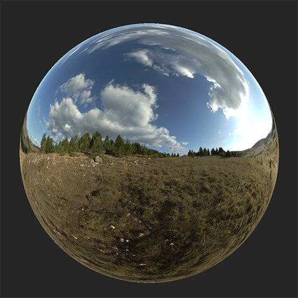
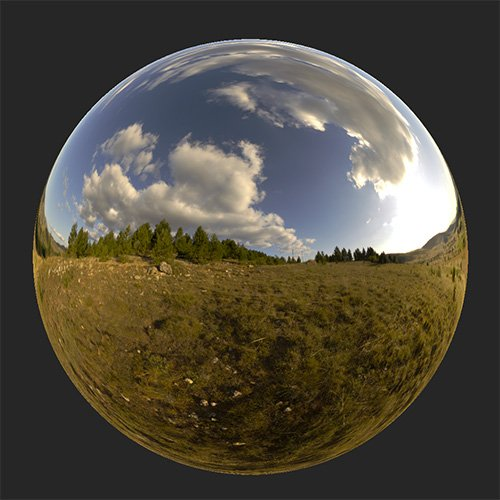

# Color Temperature Adjustment

<table>
<tr style="border: 0;">
<td width="41.60%" style="border: 0;" valign="top">

**In:** HDRI Tools

</td>
<td width="58.30%" style="border: 0;" valign="top">

## Description

Adjust the temperature of your environment light.

The images below show how the **Color Temperature Adjustment filter** can be used to make the light of an environment light appear warmer or cooler.

<table>
<tr style="border: 0;">
<td style="border: 0;" valign="top">

{width="200px"}

</td>
<td style="border: 0;" valign="top">

{width="200px"}

</td>
</tr>
</table>

</td>
</tr>
</table>

## Parameters

**Basic parameters**

* **Temperature**: -1 to 1  
  Modify the temperature to be cooler or warmer.
* **Magenta-Green**: -1 to 1  
  Modify the color on the magenta-green scale

**Mask**

* **Custom Mask**: toggle  
  Enable or disable the use of a custom mask. If enabled the following parameters appear:
  * **Mask**: image/brush  
    Select an image to use as a mask or use the brush to paint a custom mask directly in the 2D view
  * **Custom Mask - Blur**: 0-1  
    Blur the mask
  * **Custom Mask - Invert**: toggle  
    Invert the mask
