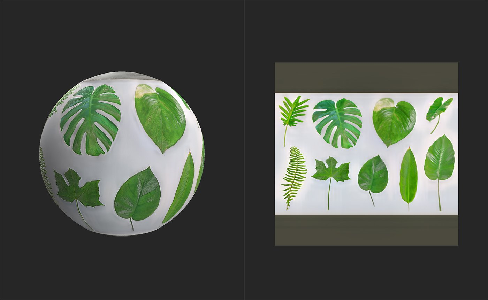
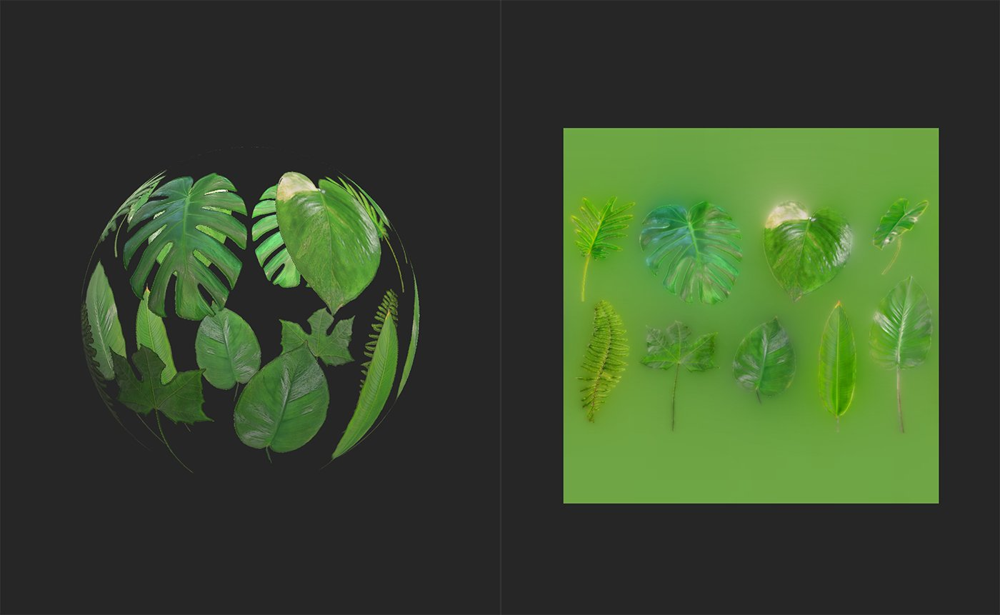

# Atlas Creator

<table>
<tr style="border: 0;">
<td width="41.60%" style="border: 0;" valign="top">

**In:** Tools

</td>
<td width="58.30%" style="border: 0;" valign="top">

## Description

The **Atlas Creator** **filter** lets you convert materials and images into an atlas. You can then use other filters like **Atlas Scatter** and **Atlas Splitter** to use atlas elements within materials.

The images below show an atlas of jungle leaves before and after being processed by the **Atlas Creator**.

In the image above, an atlas image has been imported and converted into a material, but it's still not an atlas material because the opacity map doesn't account for individual elements.

After running the **Atlas Creator** an opacity map is generated, and the area between atlas elements is filled in the base color channel.

</td>
</tr>
</table>

Parameters

**Basic parameters**

* **Remove Small Shapes**: 0-1

  Use this to adjust the minimum size of objects within the atlas. This is useful for removing artifacts.
* **Opacity - Chrominance Influence**: 0-2

  Fine tune the edges of atlas elements based on color values.
* **Add Opacity**: image/brush

  Import a file to use as a mask or use the brush to paint areas that should be opaque directly in the **2D view**.

Usage Guide

## Prepare an atlas image

Before using the **Atlas Creator filter**, it's a good idea to ensure that your atlas image is prepared correctly.

The **Atlas Creator** works based on the color of the image, and doesn't consider transparency. This means that the best way to prepare your atlas image is to ensure that the space between elements is a consistent black or white, this makes it easier for the **Atlas Creator** to generate the opacity mask.

## Generate an atlas material from an image

The **Atlas Creator** is designed to convert an atlas image into a material atlas.

1. Import your source image to the layer stack.
1. If prompted to select a material creation template, select Image to Material. Otherwise, with the image in the layer stack, add an **Image to Material (AI powered) filter** above your image.
1. Wait for the **Image to Material** filter to convert your source image into a material. Adjust parameters until you're happy with the result.
1. Add the **Atlas Creator filter** to the top of the layer stack.
1. Adjust the parameters of the **Atlas Creator** until you're happy with the results.

1. Add the image to the layer stack. If prompted to select a material creation template, select **Use as Bitmap**.
1. With the image layer selected, in the **Properties panel** change the **Output Usage** to **Base Color**.
1. Add the **Atlas Creator** to the top of the layer stack.
1. Adjust the parameters of the **Atlas Creator** until you're happy with the results - view the opacity channel in the **2D view** to see the filter results more clearly.
1. Use the **Export panel** to export the generated channels.
