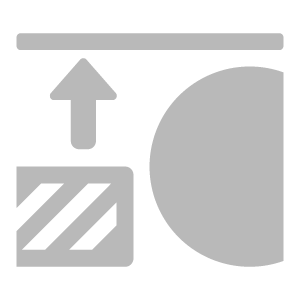
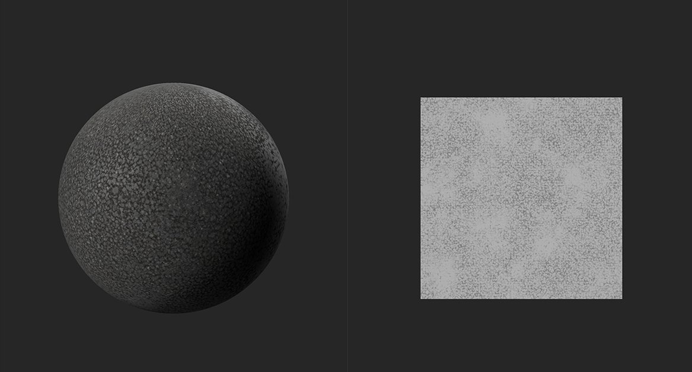
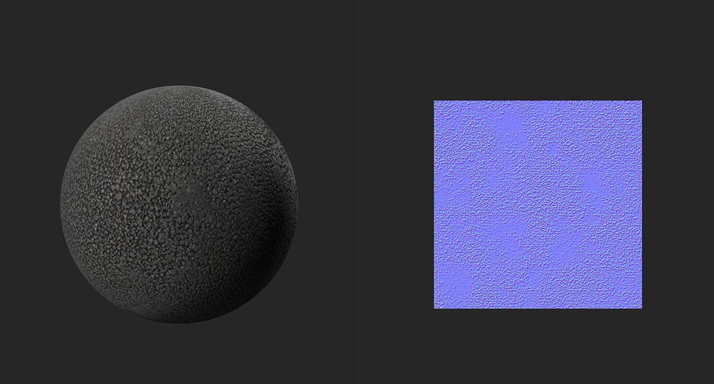

# Height to Normal

<table>
<tr style="border: 0;">
<td width="41.60%" style="border: 0;" valign="top">

**In:** Tools

</td>
<td width="58.30%" style="border: 0;" valign="top">

## Description

Generate Normal channel data based on the height channel.

In the images below you can see the **Height to Normal filter** in action.

In the image above, there is no normal data from the material. Only the height map is available, and shown in the **2D view**.

With the **Height to Normal filter**, normal data is generated from the height map shown in the top image. Light bounces more realistically off the material in the second image thanks to the generated normal map.

</td>
</tr>
</table>

## Parameters

**Basic parameters**

* **Use World Units**: toggle  
  Change whether parameters are measured using real world units or not. This modifies which parameters are available.
  * **If Use World Units is enabled:**  
    * **Surface Size (cm)**: 0-500  
      Set the size of the UV space in world units
    * **Height Depth (cm)**: 0-10  
      Set the distance represented by the height map. If the height map represents a small distance, then a large difference in height map values can have a small impact on the normal angle. If the height map represents a large distance, then a small difference in height map values can represent a large angle on the normal map.
  * **If Use World Units is disabled:**
    * **Intensity**: 0-3  
      Adjust the steepness of the normal angles
* **Combine Bottom Normal**: 0-1  
  Add the existing normal map to the results of this filter.

**Mask**

* **Custom Mask**: toggle  
  Enable or disable the use of a custom mask. If enabled the following parameters appear:
  * **Mask**: image/brush  
    Select an image to use as a mask or use the brush to paint a custom mask directly in the 2D view
  * **Custom Mask - Blur**: 0-1  
    Blur the mask
  * **Custom Mask - Invert**: toggle  
    Invert the mask
