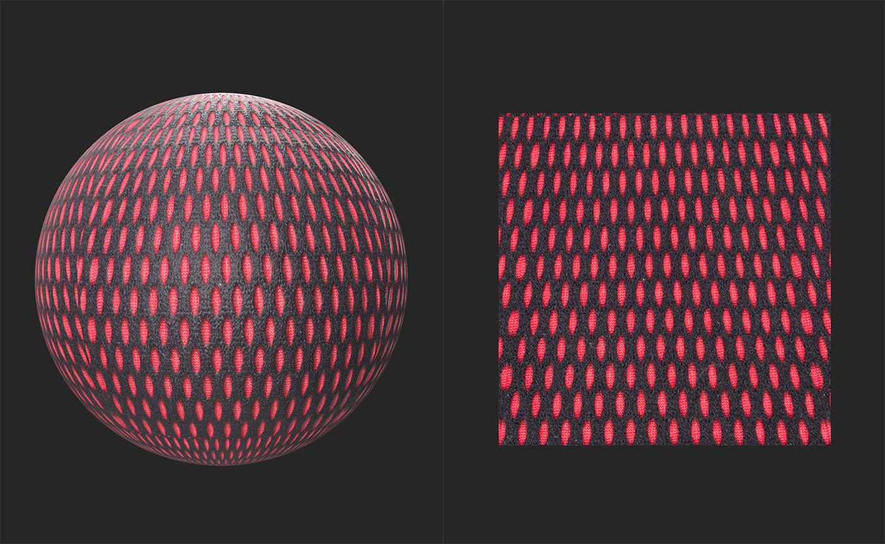
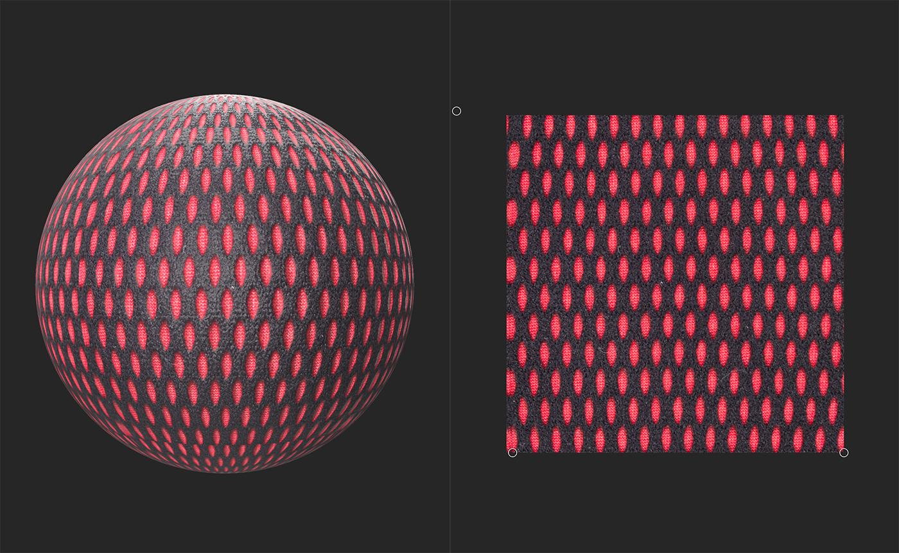

# Perspective Transform

<table>
<tr style="border: 0;">
<td width="41.60%" style="border: 0;" valign="top">

**In:** Tools

</td>
<td width="58.30%" style="border: 0;" valign="top">

## Description

Use the <b>Perspective Transform tool </b>to fix perspective issues in an image. <b>Perspective Transform</b> can also be used on materials.

The below image shows an example material before being fixed by the <b>Perspective Transform tool</b>. Notice how the shapes near the top of the 2D view are stretched vertically compared to the shapes at the bottom of the 2D view.

With the <b>Perspective Transform</b>, the shapes are consistent and form a grid. It would be easy from this point to use filters like <b>Tiling</b> or <b>Make it Tile</b> to convert this into a tileable material.

</td>
</tr>
</table>

## Usage Guide

With the Perspective Transform layer selected, a handle appears on each corner of the texture in the 2D view. Move them individually in the 2D space to correct the perspective.

{width="300px"}

## Toolbar

With the Perspective Transform layer selected, a toolbar appears at the top of the **2D view**. Use the **Reset positions button** to reset the Perspective Transform layer's handles to the default positions.
