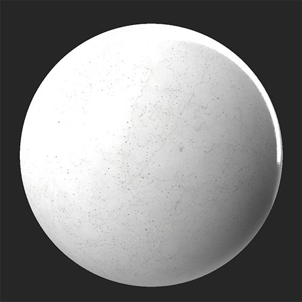
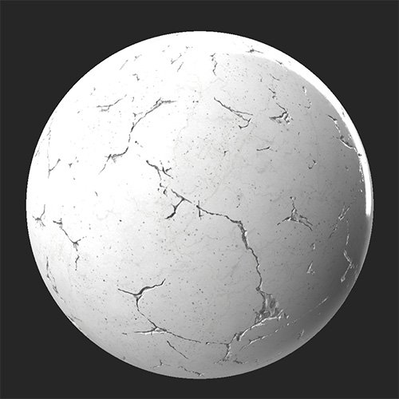

# Cracks

<table>
<tr style="border: 0;">
<td width="41.60%" style="border: 0;" valign="top">

**In:** Wear and Finish

</td>
<td width="58.30%" style="border: 0;" valign="top">

## Description

Use the **Cracks filter** to age and damage your material by adding a network of cracks and crevices to it.

The **Cracks filter** applied to a clean marble material.

<table>
<tr style="border: 0;">
<td style="border: 0;" valign="top">

{width="200px"}

</td>
<td style="border: 0;" valign="top">

{width="200px"}

</td>
</tr>
</table>

</td>
</tr>
</table>

## Parameters

**Basic parameters**

* **Random Seed**:  
  The random seed determines the random values of other parameters that use randomness in this filter.
* **Cracks Spread**: 0-1  
  Adjust how far the cracks spread - this modifies both crack width and length.
* **Cracks Amount**: 0-1  
  Change how many cracks appear.

**Mask**

* **Use Custom Mask**: toggle  
  Enable or disable the use of a custom mask. If enabled the following parameters appear:
  * **Mask**: image/brush  
    Select an image to use as a mask or use the brush to paint a custom mask directly in the 2D view.
  * **Custom Mask - Invert**: toggle  
    Invert the mask.

**Cracks**

* **Cracks Color**: color select  
  Change the color of the interior surface revealed by the cracks.
* **Cracks Roughness**: 0-1  
  Adjust the roughness value of the cracks.
* **Cracks Roughness Opacity**: 0-1  
  Adjust how much the **Cracks Roughness** value impacts the roughness map
* **Cracks Metallic**: 0-1  
  Modify the metallic value of the cracks.
* **Cracks Metallic Opacity**: 0-1  
  Adjust how much the **Cracks Metallic** value impacts the metallic map
* **Cracks height Intensity**: 0-1  
  Adjust the depth of the cracks. This impacts both the height map and the normal map results of the filter.

**Advanced Parameters**

* **Normal Intensity**: 0-1  
  Adjust the strength of the crack's normals.
* **Height Range**: 0-1  
  Modify the height range of the full material. To adjust the height of the cracks, use **Cracks &gt; Cracks Height Intensity**.
* **Height Position**: 0-1  
  Offset the height map of the full material.
