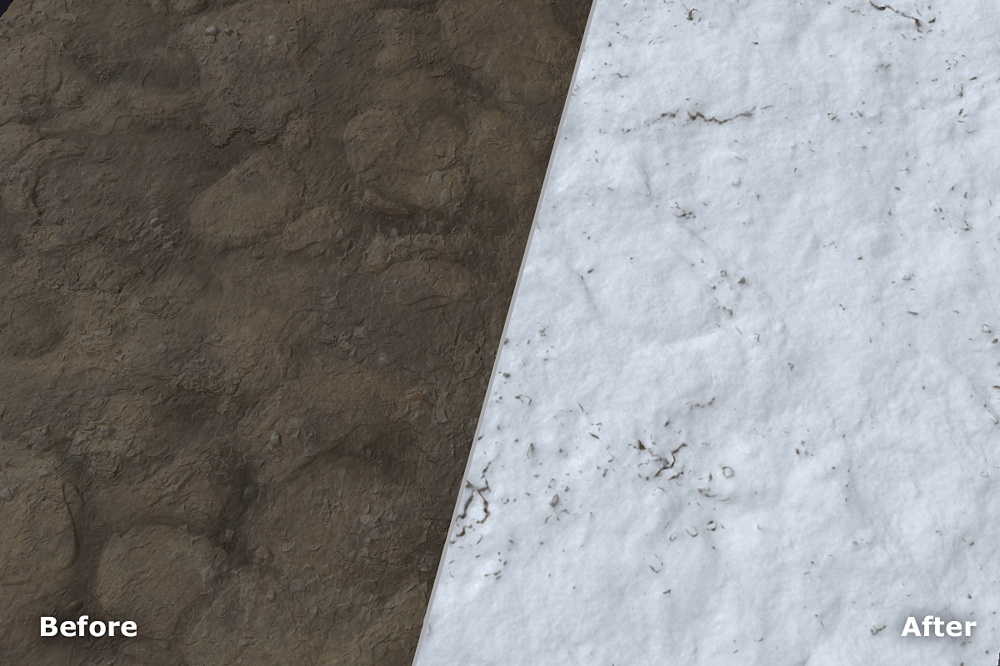

# Snow

<table>
<tr style="border: 0;">
<td width="41.60%" style="border: 0;" valign="top">

**In:** Wear and Finish

</td>
<td width="58.30%" style="border: 0;" valign="top">

## Description

Use the **Snow filter** to add anything from a dusting to a few feet of snow to your material.

</td>
</tr>
</table>

## Parameters

**Basic parameters**

* **Random Seed**:  
  The random seed determines the random values of other parameters that use randomness in this filter.
* **Fresh Snow**: 0-1  
  Change the amount of snow.
* **Melted Snow**: 0-1  
  Control the amount of melted snow. This parameter is highly sensitive.
* **Buildup**: 0-1  
  Adjust how much the snow has built up over time. This obscures underlying height details.
* **Smoothness**: 0-1  
  Control how smooth the snow appears. This obscures underlying height details when increased, and can make snow appear softer and deeper.
* **Flakes Intensity**: 0-1  
  Adjust how visible individual flakes of snow are.
* **Use Custom Mask**: toggle  
  Enable or disable the use of a custom mask. If enabled the following parameters appear:
  * **Custom Mask**: image/brush  
    Select an image to use as a mask or use the brush to paint a custom mask directly in the 2D view.
  * **Mask Blur**: 0-1  
    Blur the mask.
  * **Mask Intensity**: 0-1  
    Adjust the opacity of the mask.
