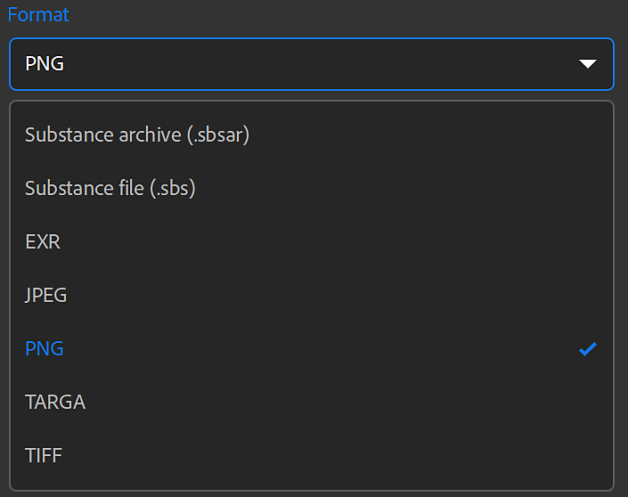
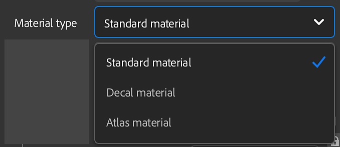
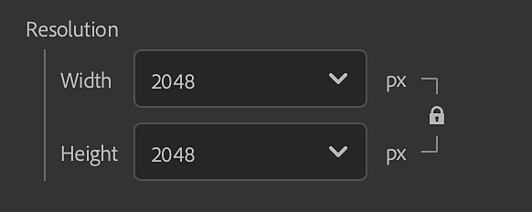
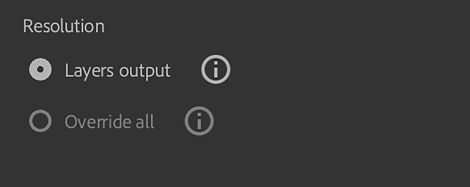
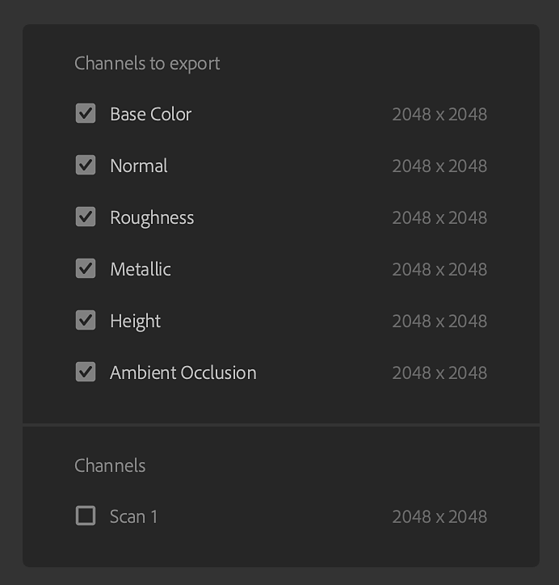
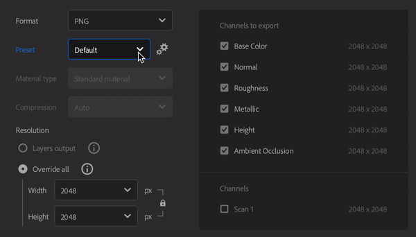
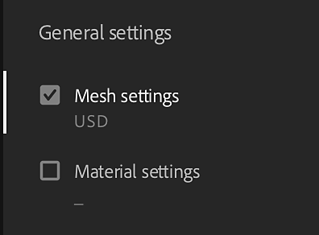

# Export Window

You can export your asset from the <b>Export</b> panel in the <b>Right bar</b>.

Export options depend on the type of asset being exported.

The Export window for a material export.

>[!NOTE]
>
> The Export panel also has options to Send your asset to Substance 3D Designer, Painter, or Stager. This will automatically export your asset with the correct settings for other Substance 3D applications.

## General Settings

The following settings are available for all asset types.

* <b>Name: </b>This field defines the name of the asset you're exporting. It will be used as a prefix in the file name of the exported files.
* <b>Save to: </b>Select the export destination for your asset. You can also optionally create a subfolder in the chosen location. The subfolder will be named after your asset if this option is enabled.

## Material Settings

When exporting Materials, the Material settings panel of the Export window has the following options:

* <b>Format</b>: Select a file format for your exported asset.
  * <b>SBSAR</b>: Export your material for use in any application that supports Substance materials.
  * <b>SBS</b>: Export your material so that it can be opened in Substance 3D Designer.
  * <b>EXR, JPEG, PNG, TARGA, TIFF</b>: Export your material as a collection of image files.

>[!NOTE]
>
> Bit depth is forced to 16 bits for the Normal and Height channels. Other channels are exported in 8/16 bits depending on your materials and the filters you asset uses. Depending on the file format, the bit depth can be changed as some file formats don't support high bit depth.

{width="400px"}

* <b>Preset </b>(EXR, JPEG, PNG, TARGA, TIFF): Select a preset to automatically set up the file export for a given application or pipeline.
  * The <b>Default (project workflow)</b> option shows a list of all available channels of your material(s) without any preset applied.
  * Use the <b>Manage presets </b>button to the right of the Presets parameter to edit presets or add your own.<b> </b>
  * [More information about Presets is available here.](../managing-presets/managing-presets.md)

>[!NOTE]
>
> Preset selection is not available when your export format is SBS or SBSAR. For these formats, the output file is already set up to be usable in all Substance products and Substance integrations.

* <b>Material type </b>(SBSAR, SBS): Select whether the exported material behaves like a standard material, decal, or atlas. This setting can change how it is treated by other applications that support SBSAR and SBS files.

* <b>Compression </b>(SBSAR, SBS): Select how the exported file is compressed
  * <b>Auto</b>: Allow Sampler to determine compression settings.
  * <b>Best</b>: This option results in smaller files, but can also mean longer loading and saving times while the file is encoded or decoded.
  * <b>None</b>: Without using compression, files will be larger, but will load and save faster.
* <b>Resolution (</b>SBSAR, SBS<b>)</b>: Select an output resolution for the material.
  * By default, the resolution is based on Sampler's Global parameters. If you select a different resolution, Sampler will recompute all your material(s) with this new resolution. It may affect the final look of your material(s).

* <b>Resolution </b>(Image formats): Select whether each layer's resolution is exported independently or override the resolution so that all layers are exported at a uniform size. If Override all is selected, options to modify the output resolution appear.
  * By default, resolution is based on each layer's output resolution. If you select a different resolution, Sampler will recompute all your material(s) with this new resolution. It may affect the final look of your material(s).

### Additional information

Available disk space on your selected destination drive is visible at the bottom of the <b>Export window</b>.

>[!NOTE]
>
> <b>Physical Size</b> is set during material creation and cannot be modified during the export.

### Channels

On the right side of the <b>Material settings panel</b>, a list of channels that can be exported and their resolutions is visible (default channels and custom channels).

Each preset has a different set of channels to export, and the name of exported files is based on the names visible in the <b>Channels to export</b> area. You can use the checkbox next to any channel to enable or disable export for that channel.

## Environment light settings

When exporting Environment lights, the Environment light settings panel of the Export window has the following options:

* <b>Format</b>: Select the image format of the exported light.
  * Further export options depend on which file format is selected.
  * The following formats are supported:
    * SBSAR
    * SBS (for use in Substance Designer)
    * EXR

### SBS or SBSAR options

* <b>Compression </b>(available for SBSAR): Select how the exported file is compressed
  * <b>Auto</b>:<b> </b>Allow Sampler to determine compression settings.
  * <b>Best</b>: This option results in smaller files, but can also mean longer loading and saving times while the file is encoded or decoded.
  * <b>None</b>: Without using compression, files will be larger, but will load and save faster.
* <b>Resolution</b>: Select the size in pixels of the exported asset. Higher resolutions mean more detail, but larger file sizes.
  * By default <b>Width </b>and <b>Height </b>are linked, so changing one will change the other. Click the lock to the right of the <b>Width</b> and <b>Height</b> parameters to lock or unlock the relationship between these values.

#### EXR options

* <b>Compression </b>(available for SBSAR): Select how the exported file is compressed
  * <b>Auto</b>:<b> </b>Allow Sampler to determine compression settings.
  * <b>Best</b>: This option results in smaller files, but can also mean longer loading and saving times while the file is encoded or decoded.
  * <b>None</b>: Without using compression, files will be larger, but will load and save faster.
* <b>Resolution</b>: Select whether each layer's resolution is exported independently, or override the resolution so that all layers are exported at a uniform size.

## Mesh Settings

When you export a mesh you can choose if you export the mesh and/or it's material.

### Formats

Sampler can export a wide range of formats. Currently supported formats are:

| Mesh Format |
| --- |
| <ul data-preserve-html="true"><li data-preserve-html="true">USD</li><li data-preserve-html="true">USDZ</li><li data-preserve-html="true">USDA</li><li data-preserve-html="true">GLB</li><li data-preserve-html="true">GLTF</li><li data-preserve-html="true">FBX</li><li data-preserve-html="true">OBJ</li><li data-preserve-html="true">STL</li></ul> |
