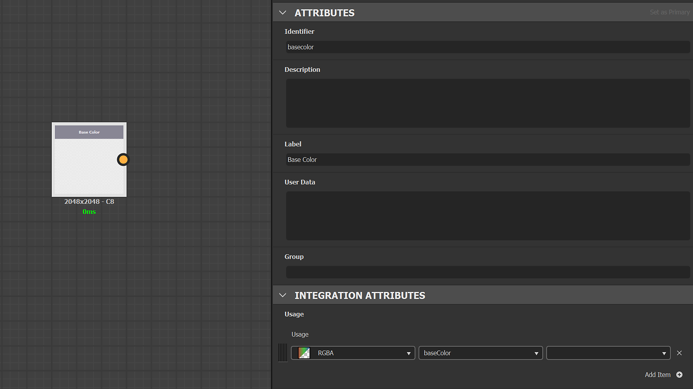
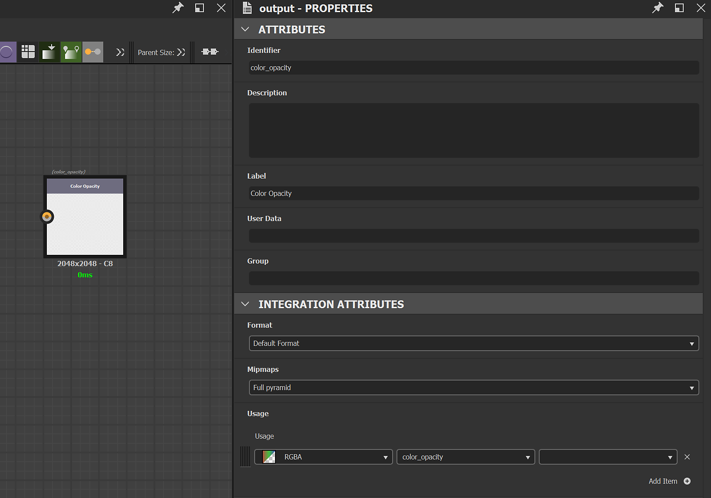
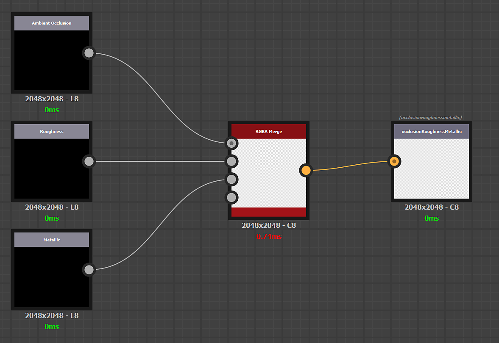
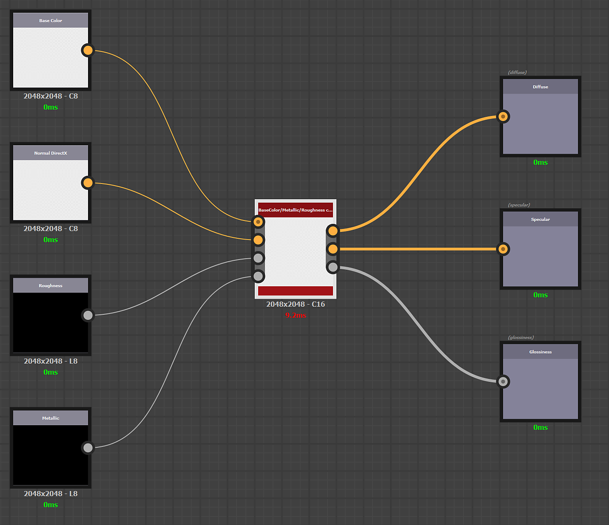
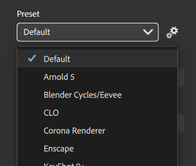

# Create and edit custom presets

Custom presets can be created with Substance 3D Designer.

The creation of custom presets respects the same rules as creating a custom filter for Sampler. Documentation is available [here](../../../filters/custom-filters/custom-filters.md).

## Creation

## Create the graph

Open Substance Designer and create a new Substance graph.

Open the graph properties and fill in the following mandatory information:

* Label: Enter the name of your custom preset that will be used in the Sampler interface
* User Data: <b>alchemist::type=filter</b>

## Definition of inputs and outputs

### Inputs

The inputs represent the material channels you want to transform before the export.

Create an Input Color node (or grayscale) per material channel and add a <b>usage</b> in the attributes to each input node to ensure the connection is made between your material(s) and your custom preset.

Example: Definition of the Base Color input

{width="600px"}

### Outputs

The outputs represent the result of your texture export.

Create one Output node per texture and add <b>usage</b> and a <b>label</b> in the attributes to each output node. The <b>label</b> will be displayed in the Channels list in the Exporter window and in the name of your texture file.

Example: Definition of the custom texture Color Opacity

{width="600px"}

#### Example of channel packing and channel conversion

Packing of 3 grayscale channels in one RGB texture:

{width="600px"}

Channel conversion from PBR Metallic/Roughness to PBR Specular/Glossiness:

{width="600px"}

## Import

To import your new preset:

1. Click the <b>Manage presets </b>button to the right of the <b>Presets dropdown</b>.
1. Use the <b>Import presets</b> button at the bottom of the <b>presets list</b>.

{width="400px"}
