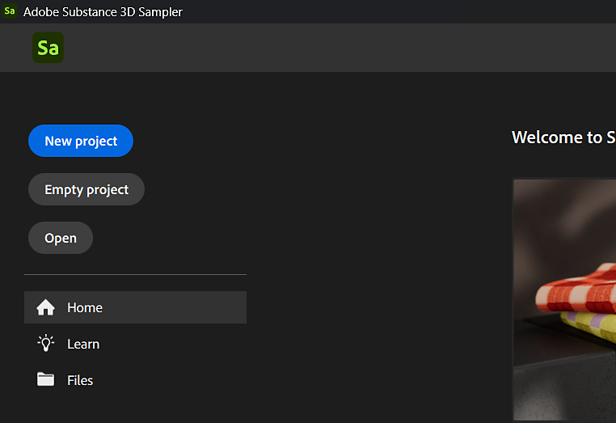
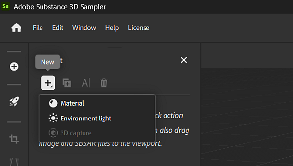

# Project management

In Substance 3D Sampler you can use collections to manage all your assets and materials. Projects are a good way to organize your materials. A project can be exported or imported to be easily shared across computers.

## Create a new project

To create a new project, select <b>Create new</b> in the <b>Home </b>screen or <b>File &gt; New Project</b>. Creating a new project will launch the Quick Start dialogue, where you can select a quick action or import an image or Substance file to start your project.

Alternatively, you can use the <b>Empty project</b> button to jump right into an empty project. If you create an empty project you can still manually import assets and content as needed.

After clicking the "Create New" button, the project will be automatically opened and named "*Untitled Project\**" until you save your project. You can add assets to your project with the highlighted <b>New asset button </b>in the <b>Project panel</b>.

{width="600px"}

## Save a project

To save a project use the <b>File &gt; Save </b>or <b>Save as</b> menu action. This will open a dialog to let you choose which name to use and where to save the project files.

Alternatively you can use shortcut <b>Ctrl + S</b> to <b>Save</b> or <b>Ctrl + Shift + S</b> to <b>Save as</b>.

Saved projects appear as a file named <b>YourProject.ssa</b>. SSA is samplers file format, which stores information about your project and any dependencies it may have.

## Open an existing project

Projects can be opened in a few ways:

* In the <b>Home Screen</b>: use the recent project list to quickly open a project by double-clicking it.
* In the <b>Home Screen</b>: Click <b>Open</b> to open a file browser where you can choose the file you'd like to open.
* Via the **File &gt; Open Project** menu.
