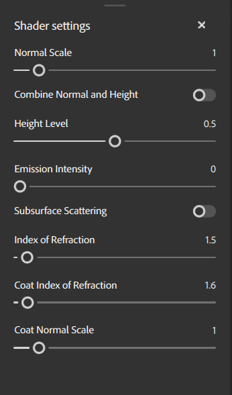

# Shader Settings panel

The <b>Shader Settings panel</b> is where you can configure how the shader renders your assets on the mesh in the 3D viewport.

## Material parameters

Material parameters let you adjust how your current material is rendered by the shader.

| Parameter name | Description |
| --- | --- |
| Normal Scale | Adjust the strength or intensity of the normal map. |
| Combine normal and height | Toggle whether Height and normal maps are combined into a single map. |
| Height Level | Change the base level of the height for displacement. |
| Emission Intensity | Adjust the strength of emissive maps. |
| Subsurface scattering | Toggle Subsurface scattering on or off. |
| Index of Refraction | Adjust the angle at which light refracts off surfaces. |
| Coat Index of Refraction | Adjust the angle at which light refracts off the surface coat. |
| Coat Normal Scale | Adjust the normal scale specifically for the surface coat. |
