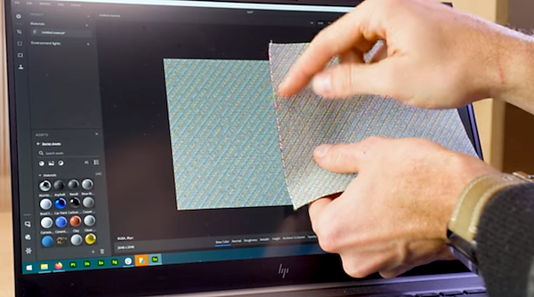
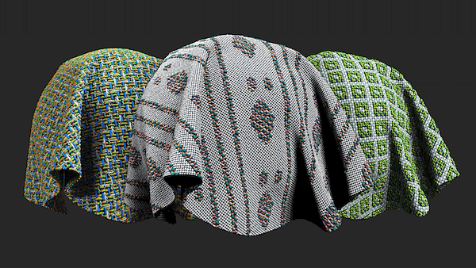
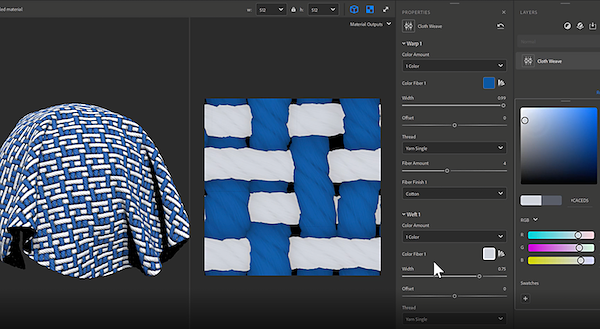
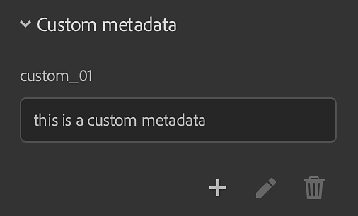
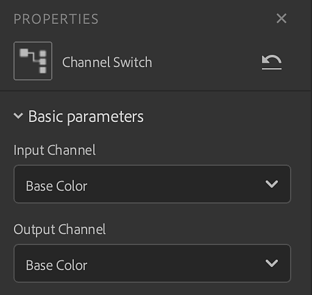
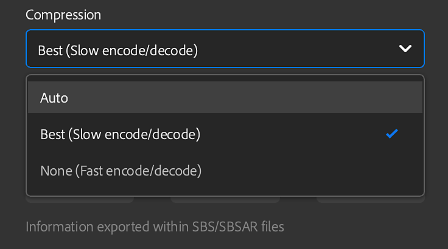
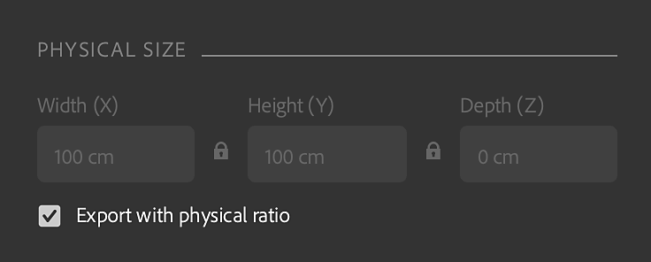

# Version 3.2

**Substance 3D Sampler 3.2** introduces an end-to-end material digitization workflow that captures and processes the material physical size, new filters as Cloth Weave and Channel Switch and the ability to create custom metadata.

Release date: 25 *January, 2022*

## Major Features

### Physical Size

A new material scanning workflow that captures and processes the physical size of materials is introduced in this release.  
  
Match the actual [physical size](../../../features-and-workflows/end-end-physical-size-wor/end-to-end-physical-size-workflow.md) of your samples/images in a digital context to create physically accurate materials in any software.

{width="400px"}

### Cloth Weave

Brand new Generator is added in this release. The Cloth Weave allows you to create and design cloth fabrics with custom weave patterns.

<table>
<tr style="border: 0;">
<td style="border: 0;" valign="top">

{width="390px"}

</td>
<td style="border: 0;" valign="top">

{width="400px"}

</td>
</tr>
</table>

### Custom Metadata

Add custom metadata to your materials. All custom metadata will be included in the material file (SBSAR) to ensure a more efficient workflow for sharing digital materials across applications.

{width="264px"}

### Channel Switch

With Channel Switch you can now switch the channels of the output maps of the material.

{width="300px"}

### Export

New export features has been added to this release.

* Set .sbsar file compression setting

  {width="400px"}
* Set the graph type when exporting a .sbs(ar) file
* Keep physical ratio for EXR, JPEG, PNG, TARGA, TIFF

  {width="400px"}

## Release Notes

### 3.2.0 Yakitori

*(Released 25 January, 2022)*

**Added:**

* &#91;Physical Size&#93; New Physical Size panel
* &#91;Physical Size&#93; Add Physical Size options to the Material Creation Template window
* &#91;Physical Size&#93; Add Physical Size measurement tool
* &#91;Physical Size&#93; Add Physical Size auto-measurement tool
* &#91;Physical Size&#93; Add Physical Size diagnostic tool
* &#91;Physical Size&#93; Allow setting the z value of the Physical Size
* &#91;Physical Size&#93; Dropdown widget to set the level of zoom in the 2D view
* &#91;Physical Size&#93; New "Display with physical ratio" option in the level of zoom dropdown
* &#91;Physical Size&#93; New "Fit to physical size" option in the level of zoom dropdown
* &#91;Physical Size&#93; Display the Physical Size in the 2D view
* &#91;Physical Size&#93; Display the Physical Size in the 3D viewport
* &#91;Physical Size&#93; In the image import dialog, show physical size depth if there is an imported height map
* &#91;Physical Size&#93; Show the Physical Size in the asset contextual menu
* &#91;Physical Size&#93; Set the length unit in the Preferences
* &#91;Physical Size&#93; Export textures respecting the physical ratio
* &#91;Metadata&#93; Ability to add custom metadata to a user-authored asset
* &#91;Export&#93; Export custom metadata to .sbs(ar) files
* &#91;Export&#93; Export description, category, author, and tags metadata to .sbs(ar) files
* &#91;Export&#93; Export the Physical Size to .sbs(ar) files
* &#91;Export&#93; Set .sbsar file compression setting
* &#91;Export&#93; Export the asset thumbnail to .sbs(ar) files
* &#91;Export&#93; Set the graph type when exporting a .sbs(ar) file
* &#91;Application&#93; Realtime Engine 2021 is no longer available
* &#91;Application&#93; Undo/Redo now supports Tiling (U,V) and height scale slider changes
* &#91;Rendering&#93; Generate disk cache when the authored asset is saved
* &#91;Assets&#93; Use Ctrl+click to enable multiple asset type filters in the Resources panel
* &#91;UI&#93; Ability to lock the Tiling (U,V) sliders
* &#91;UI&#93; Add a contextual menu with "Copy", "Cut", "Paste", "Copy all" and "Cut all" in text fields
* &#91;UI&#93; Length unit (meters, inches, parsecs, ...) support in labels and text fields
* &#91;UI&#93; The user can set the decimal precision used to display numbers
* &#91;UI&#93; Use units in measure popups everywhere it's relevant
* &#91;Localization&#93; Default new asset name is now localized
* &#91;Content&#93; New Cloth Weave generator
* &#91;Content&#93; New Channel Switch filter
* &#91;Content&#93; All relevant filters are now aware of the Physical Size
* &#91;Content&#93; New icons for Wood Finish
* &#91;Content&#93; All filters are now compatible with Adobe Standard Materials (ASM) channels
* &#91;Content&#93; Filters can now have an "environment" variation

**Fixed:**

* &#91;2D View&#93; Channel remains in the list when removed
* &#91;Application&#93; Cannot duplicate an asset loaded from the operating system file explorer
* &#91;Application&#93; Crash at exit
* &#91;Application&#93; Crash sometimes when clicking "Starter Assets" in the Assets panel
* &#91;Application&#93; Crash when deleting a material
* &#91;Application&#93; Environment variable "SUBSTANCE\_DISABLE\_SPECIFIC\_FEATURES" is still active when set to "0" or "".
* &#91;Application&#93; Freeze while saving a project with multiple materials
* &#91;Application&#93; Importing an image can lead to a crash
* &#91;Application&#93; Missing some starter assets on first launch
* &#91;Export&#93; Exporting an asset sometimes leads to a crash
* &#91;Layers&#93; Cannot import images when the layer panel is closed or invisible
* &#91;Layers&#93; Changing the language causes the current asset to recompute
* &#91;Layers&#93; Changing the usage of an imported image does not upate which filter variation to use
* &#91;Layers&#93; Image to Material (AI) is sometimes not computed when tweaking layers below it
* &#91;Layers&#93; Image to Material (AI) sometimes recomputes when not needed
* &#91;Layers&#93; No update is suggested when a custom filter is updated on the disk
* &#91;Layers&#93; Normal channel sometimes has the wrong pixel format
* &#91;Layers&#93; Some layers are still computed even when not visible
* &#91;Layers&#93; The 2D view tools may be broken when toggling a layer visibility
* &#91;Layers&#93; The UI freezes when using Image to Material (AI)
* &#91;Layers&#93; Toggling the visibilty of the Transform filter layer breaks the 2D view tool and may lead to a crash
* &#91;Layers&#93; Too many recomputations when removing a layer from the layer stack
* &#91;Layers&#93; When a compound filter contains an unusual or custom input/output, Sampler doesn't compute it
* &#91;Performance&#93; Asset panel is slow to open
* &#91;Performance&#93; Avoid some unnecessary recomputations of the layer stack
* &#91;Performance&#93; Loading project assets takes too much time
* &#91;Performance&#93; Render cache on disk may not be used
* &#91;Performance&#93; Switching between layers is slow
* &#91;Performance&#93; Tweaking a material or a filter is slow
* &#91;Project&#93; Saving a project when exiting may lead to a crash
* &#91;Rendering&#93; Removing an image may remove all outputs
* &#91;Rendering&#93; The rendering time displayed in the viewport is wrong when tweaking
* &#91;UI&#93; Can't scroll vertically in the export popup when needed
* &#91;UI&#93; It is possible to open the export popup when there is nothing to export
* &#91;UI&#93; Some popups do not scroll if their content overflows
* &#91;UI&#93; Text fields are not selected when clicking on it or opening a menu
* &#91;UI&#93; The name of the blend mode in the properties panel is sometimes not correct
* &#91;UI&#93; The Save option in the File menu is sometimes grayed out
* &#91;UI&#93; The text field doesn't go away after renaming two materials
* &#91;UI&#93; Typo in the preference popup

**Known Issues:**

* &#91;Color Picker&#93; Picking a color on a second monitor with a different resolution may not work
