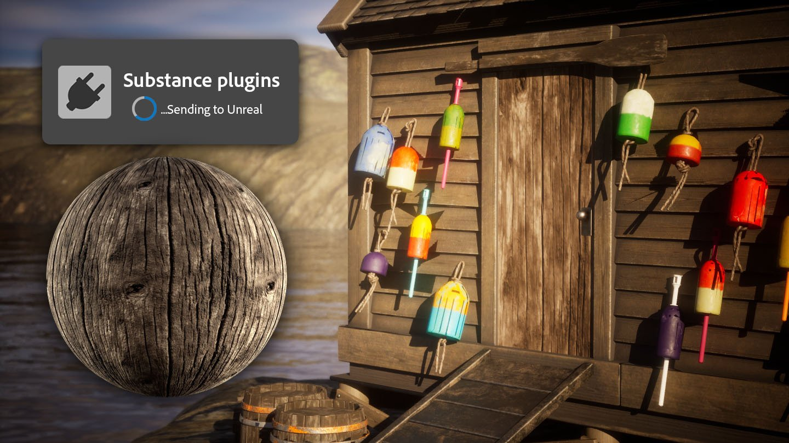

# Version 4.5

<b>Substance 3D Sampler 4.5</b> introduces a Send-to for third party apps.

It allows to send assets from Sampler to a third party applications in one click, to avoid having to go through the manual export and import process and gaining time.

More info [here](../../pipeline-and-integrations/substance-connector/substance-connector.md).

*Release date: 10 July 2024*

## Release Note

*(Released: 18 July 2024)*

<b>Added</b>:

* &#91;Interoperability&#93; Send materials to UE5, Blender, Maya, 3DsMax Unity
* &#91;Content&#93; New texture generator category - Gradients
* &#91;Content&#93; HDRI Tools - new Environment rotation filter

<b>Fixed:</b>

* &#91;Exposed Parameters&#93; Exposing .sbsar input values do not work
* &#91;Layers&#93; Base color turns red with greyscale images
* &#91;Rendering&#93; Grayscale images used in color channels have wrong color space
* &#91;Scripting&#93; Using an export preset sometimes doesn't export the expected channels
* &#91;Content&#93; Dirt - Applying a Dirt filter on top of Image to Material generates a black normal
* &#91;Content&#93; Emboss - Scaling of a pattern in the emboss filter is not linear between 0 and 1
* &#91;Content&#93; Make it tile - Improved normal and height consistency
