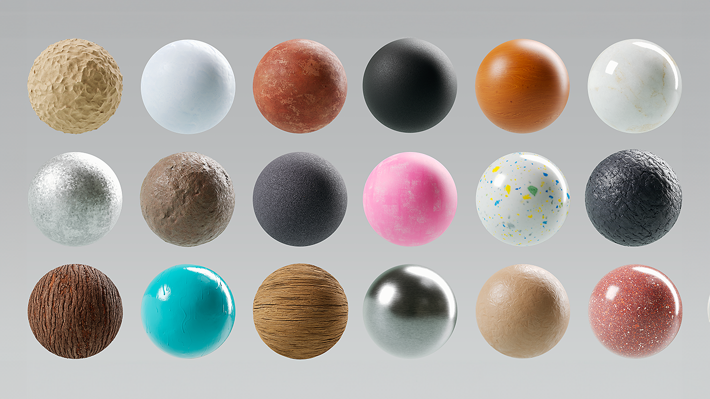
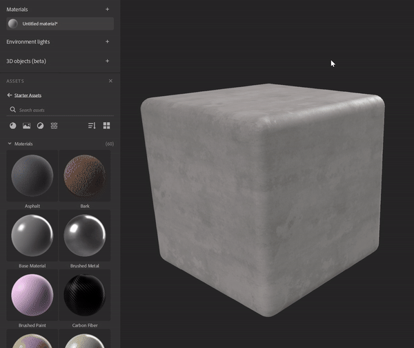
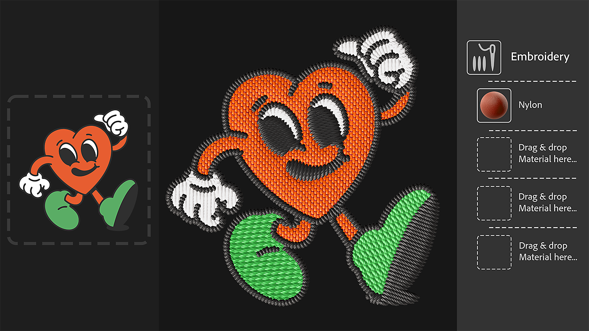
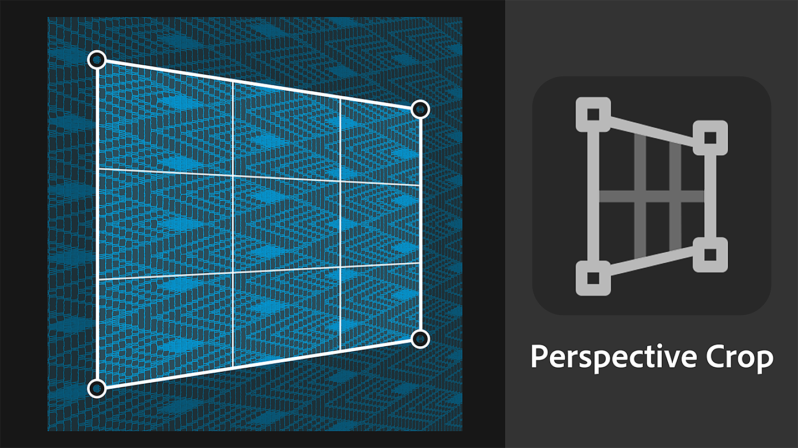
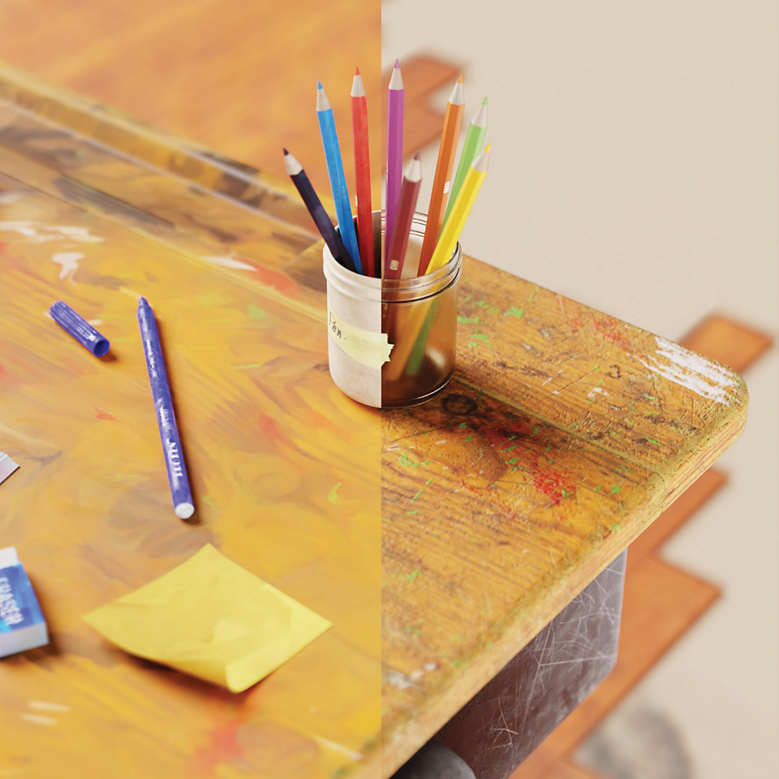
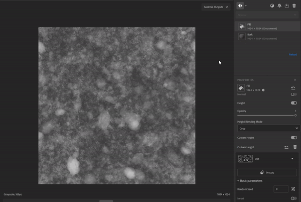
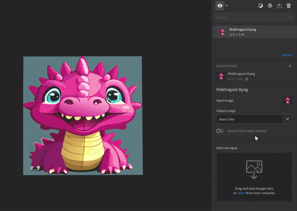

# Version 4.3

<b>Substance 3D Sampler 4.3</b> introduces new Starter Content, including <b>Texture Generators</b>, a new version of the <b>Embroidery</b> filter, and a <b>Perpective Crop</b> tool.

*Release date: 25 January 2024*

## A new Starter Assets content

The materials included with Sampler have been updated to better meet the needs of <b>industrial design</b> workflows, <b>fashion </b>workflows, and technical artists working in media and entertainment will now have more control over the technical aspects of creating textures.

## Texture Generator

New texture generators give improved control over material creation using <b>parametric noises, patterns </b>and<b> grunge</b> options.  The generated imagery can be used in masks or channels maps, making it easier than ever for technical and creative teams to collaborate on material design.

Use the new filtering icon to parse only texture generators.

## Embroidery

The updated Embroidery filter has improved stitching precision and supports up to 8 colors. The material's inputs are back in the layer stack which enables the insertion of other metarials in the patch.

## Perspective Crop

The new Perspective crop tool allows you to crop distorted materials and scans with four control points to remove perspective artefacts and obtain a tileable asset.

## Stylization

The Stylization filter allows you to style any materials to achieve a hand painted look.

## Blend mode in the Fill filter

The upgrade of the Fill filter introduces Blend modes, allowing you to multiply the value, the input maps or the texture generators of the Fill with the channel results of the layers below.

## Image import Layer improvements

You can add on an Import Image Layer multiple images and generate an Opacity map from the Alpha channel of an image.

## Release Note

*(Released: 25 January 2024)*

<b>Added</b>:

* &#91;Assets&#93; New asset type: Texture Generators
* &#91;Assets&#93; New materials included in the Starter Assets
* &#91;Assets&#93; New asset picker for image parameters in the Properties panel
* &#91;Assets&#93; Drag and drop Texture Generators from the Assets panel to the image pickers in the Properties panel
* &#91;Assets&#93; Drag and drop Texture Generators from the operating system file explorer
* &#91;Assets&#93; Filters can suggest fitting generators via a user tag on the image input
* &#91;Assets&#93; Texture Generators can define which filter should suggest them via a user tag
* &#91;Content&#93; New Perspective Crop filter
* &#91;Content&#93; New Stylization filter
* &#91;Content&#93; Blending mode on Fill Filter
* &#91;Content&#93; Updated Embroidery filter
* &#91;Content&#93; Updated Paint Wrap filter
* &#91;Content&#93; Updated all filters to support Texture Generators
* &#91;Layers&#93; Ability to chose a Texture Generator output channel when adding it to the layer stack
* &#91;Layers&#93; Ability to easily list and apply presets on Texture Generators
* &#91;Layers&#93; Display a Texture Generator preview in the image pickers
* &#91;Layers&#93; Texture Generator parameters can be exposed and exported
* &#91;Layers&#93; Assign the Base Color usage when importing a single image with the Texture Import Creation Template
* &#91;Layers&#93; Feedback when trying to drag and drop incompatible files in image pickers in the Properties panel
* &#91;Layers&#93; Generate an opacity channel from the alpha channel of an imported image
* &#91;Layers&#93; Image to Material (AI) is faster to compute when changing its category
* &#91;Layers&#93; Select the most relevant layer after a Creation Template is used
* &#91;Layers&#93; The position widgets can now be tweaked with a slider in the Advanced Parameters group
* &#91;Export&#93; Display a percentage in the queue instead of raw numbers
* &#91;Interoperability&#93; Opacity channel is now recognized as alpha channel when sending to Painter
* &#91;Application&#93; New dialog to display and save hardware information
* &#91;Application&#93; New preference to change the default height scale for every project
* &#91;Application&#93; Improve the way outdated assets are displayed
* &#91;Scripting&#93; New asset.documentResolution() and asset.setDocumentResolution() functions
* &#91;Scripting&#93; New select\_asset() function
* &#91;Scripting&#93; Python API for Texture Generators
* &#91;Scripting&#93; get\_project\_assets() now returns 3D objects
* &#91;UI&#93; Asset thumbnail size can be changed in the Assets panel
* &#91;UI&#93; Updated viewport display icons

<b>Fixed:</b>

* &#91;2D View&#93; Zoom with mouse wheel is blocked at 244%
* &#91;Application&#93; Crash at start when initializing the graphics API
* &#91;Application&#93; Crash if the project name contains the # character
* &#91;Application&#93; Possible crash when opening an old project
* &#91;Application&#93; Re-opening the current project can lead to a crash
* &#91;Application&#93; Some project changes are not registered and are lost without warning when closing the project if not saved
* &#91;Export&#93; .sbs/.sbsar export issues when using multiple files with the same name
* &#91;Export&#93; Wrong color space for exported grayscale images .sbs/.sbsar file
* &#91;Filters&#93; Opacity blend behavior issues
* &#91;Layers&#93; .svg files sometimes are not rendered at the correct resolution
* &#91;Performance&#93; Some project saves on disk are unnecessary
* &#91;Project&#93; Importing an old project does not load associated presets
* &#91;Scripting&#93; Unable to get parameters of the first inserted layer
* &#91;UI&#93; The preview popup when hovering an asset can appear in the wrong location or screen
* &#91;UI&#93; Undocked panels are visible and usable on top of the Welcome screen
