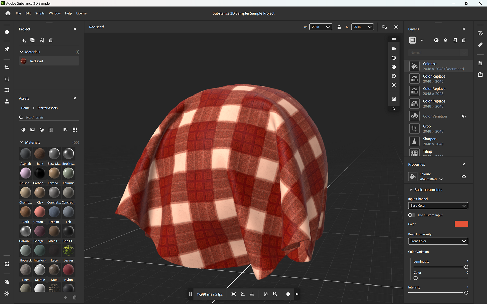

# Substance 3D Sampler

<table>
<tr style="border: 0;">
<td width="41.60%" style="border: 0;" valign="top">

<b>Substance 3D Sampler </b>allows you to create digital twins of your physical assets.

With this accessible <b>all-in-one digitization software</b> capture, process and augment your materials, models and lights with powerful tools.

Combine different technologies and creation methods to create accurate digital materials, and export them to use them in other Substance or third-party 3D apps.

</td>
<td width="58.30%" style="border: 0;" valign="top">

</td>
</tr>
</table>

>[!NOTE]
>
> If you are looking for the documentation of the legacy version **Substance Alchemist**, it can be downloaded as a [PDF file here](https://www.dropbox.com/s/sqvznduc12cuyuq/SubstanceAlchemist_June2021.pdf?dl=1). This documentation now focuses on Substance 3D Sampler.

<table>
<tr style="border: 0;">
<td style="border: 0;" valign="top">

## Getting Started

* [Activation and licenses](getting-started/activation-and-licenses/activation-and-licenses.md) — Activate and manage your licenses so you can start using Sampler.
* [System requirements](getting-started/system-requirements/system-requirements.md)
* [Shortcuts](getting-started/shortcuts/shortcuts.md)
* [Importing Resources](getting-started/importing-resources/importing-resources.md)
* [Quick actions](features-and-workflows/quick-actions/quick-actions.md)
* [HP Z Captis](pipeline-and-integrations/hp-z-captis-support/hp-z-captis-support.md)
* [Report a bug](getting-started/report-a-bug/report-a-bug.md)
* [Project Management](getting-started/project-management/project-management.md) — Use collections to manage your assets and materials.
* [Export](getting-started/export/export.md)

</td>
<td style="border: 0;" valign="top">

### Interface

* [The Home Screen](interface/the-home-screen/the-home-screen.md)
* [2D and 3D Viewport](interface/2d-and-3d-viewport/2d-and-3d-viewport.md)
* [Sidebars](interface/sidebars/sidebars.md)
* [Panels](interface/panels/panels.md)
* [Tools and Widgets](interface/tools-and-widgets/tools-and-widgets.md)
* [Preferences](interface/preferences/preferences.md)

</td>
<td style="border: 0;" valign="top">

### Features and Workflows

* [Image to Material (AI Powered)](filters/tools/image-to-material/image-to-material.md)
* [End-to-end Physical size workflow](features-and-workflows/end-end-physical-size-wor/end-to-end-physical-size-workflow.md)
* [Export parametric assets](features-and-workflows/export-parametric-assets/export-parametric-assets.md)
* [Scripting](scripting-and-development/scripting-and-development.md)
* [HDRI tools](filters/hdri-tools/hdri-tools.md)

</td>
</tr>
</table>

<table>
<tr style="border: 0;">
<td style="border: 0;" valign="top">

### Frequently Asked Questions

* [Exporting the log file](technical-support/exporting-the-log-file/exporting-the-log-file.md)
* [Configuration](technical-support/configuration/configuration.md)
* [Technical Issues](technical-support/technical-issues/technical-issues.md)

</td>
<td style="border: 0;" valign="top">

### Release Notes

* [All Changes](release-notes/all-changes/all-changes.md)
* [Version 5.0](release-notes/version-substance-sampl-1/version-5-0-substance-3d-sampler.md)
* [Version 4.4](release-notes/version-substance-sampl-3/version-4-4-substance-3d-sampler.md)
* [Version 4.3](release-notes/version-substance-sampl-4/version-4-3-substance-3d-sampler.md)
* [Version 4.2](release-notes/version-4-2/version-4-2.md)
* [Version 4.1](release-notes/version-4-1/version-4-1.md)
* [Version 4.0](release-notes/version-4-0/version-4-0.md)
* [Version 3.4](release-notes/version-3-4/version-3-4.md)
* [Version 3.3](release-notes/version-3-3/version-3-3.md)

</td>
</tr>
</table>
