# Adobe Standard Material

## Standard material properties

## Base surface properties

**Base color**

The color of the surface.

**Roughness**

How smooth or matte the surface is.

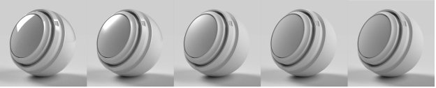

**Metallic**

The degree of metallic luster the surface has.

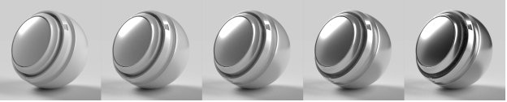

**Opacity**

The visibility of the surface.

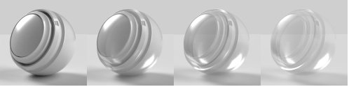

**Ambient occlusion**

Shadows from cavities and creases preventing light from hitting the surface.

**Specular level**

The strength of light reflections on the surface.

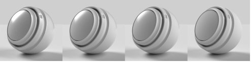

**Specular edge color**

The color of light reflections. Affects glancing angles for metallic materials.

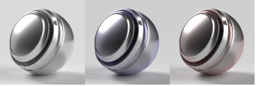

**Normal**

Simulates surface details like bumps and cracks.

**Normal scale**

The strength of the normal effect.

**Combine normal and height**

Applies the normal texture on top of the height texture.

**Height**

Creates surface details using bump or geometry displacement.

**Height scale**

The scale of height in scene units. Applies to both bump and displacement.

**Height level**

The value of the height texture representing zero displacement.

**Anisotropy level**

The amount that reflections stretch in one direction along the surface.

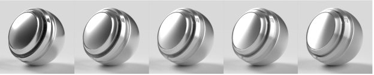

**Anisotropy angle**

The counterclockwise rotation of the anisotropic effect.

**Emission intensity**

The intensity of light emitted from the surface.

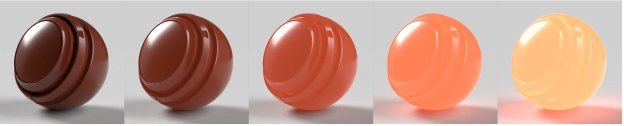

**Emission color**

The color of emitted light.

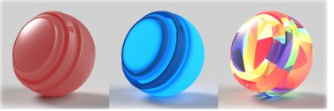

**Sheen opacity**

Simulates the effect of microscopic fibers or fuzz on the surface.

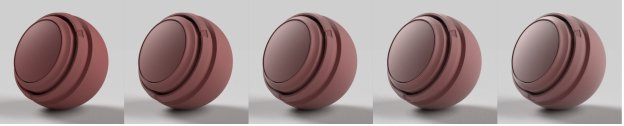

**Sheen color**

The color of the sheen effect.

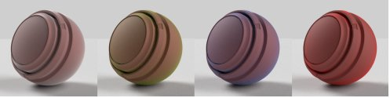

**Sheen roughness**

Softness of the sheen effect.

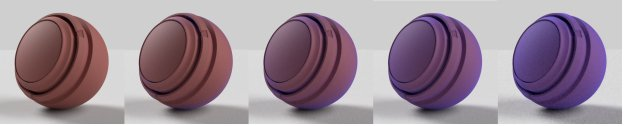

## Interior properties

**Translucency**

The amount of light able to transmit through the surface.

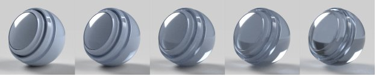

**Absorption color**

The color light will converge to as it is absorbed.

**Absorption distance**

Approximate distance in scene units that light will travel before reaching absorption color. If set to zero, thickness will not affect absorption color.

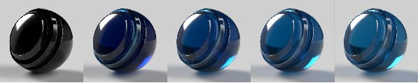

**Index of refraction**

The amount light bends as it passes through the object.

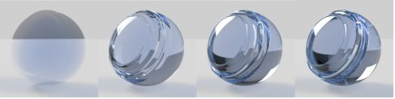

**Dispersion**

The amount the color spectrum spreads out when refracted.

**Subsurface scattering**

Scatters light below the surface, rather than passing straight through.

**Scattering color**

The color below the surface that scattered light will become.

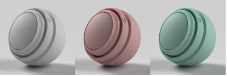

**Scattering distance**

Approximate distance light must travel before reaching full scattering.

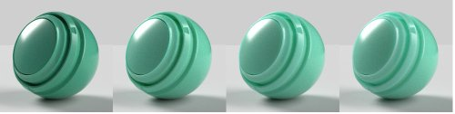

**Scattering distance scale**

A multiplier of the scatter distance. May be different for each color channel.

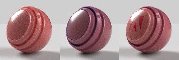

**Red shift**

Sets red light to travel further than other light colors. Useful for skin.

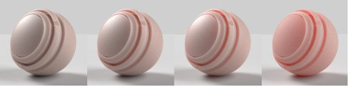

**Rayleigh scattering**

Sets orange light to travel further beneath the surface and blue light to travel less.

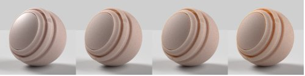

**Volume thickness**

The thickness of the surface relative to the bounding box of the object. Used for interior effects when the real thickness is not known.

**Volume thickness scale**

Multiplier of the volume thickness.

## Coat properties

**Coat opacity**

Simulates a layer on top of the material. Used to create clear coats, lacquers, and varnishes.

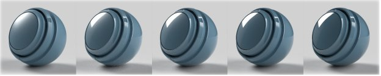

**Coat color**

The color of the coat.

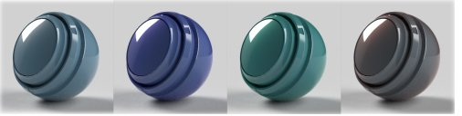

**Coat roughness**

How smooth or matte the coat surface is.

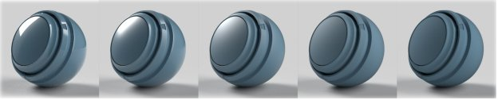

**Coat index of refraction**

The amount light bends as it passes through the coat.

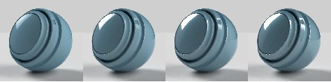

**Coat specular level**

The strength of light reflections on the coat at glancing angles.

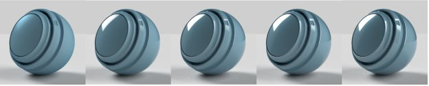

**Coat normal**

Simulate surface details like bumps and cracks on the coat surface.

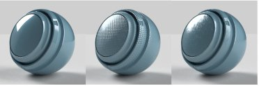

**Coat normal scale**

The strength of the coat normal effect.
