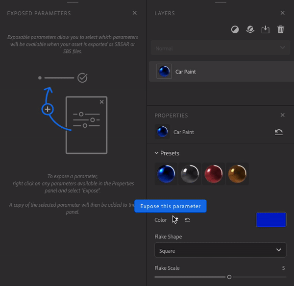
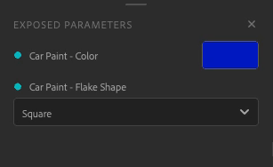
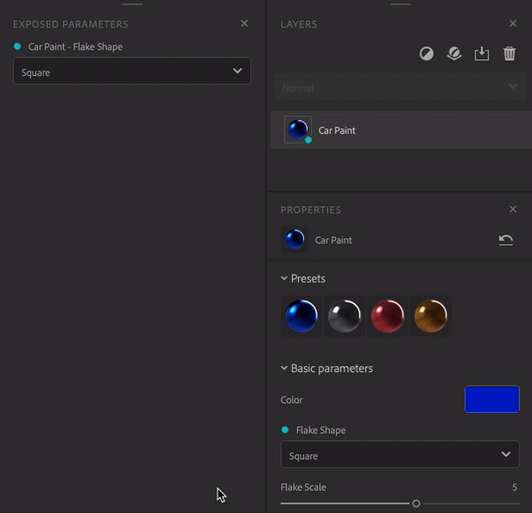
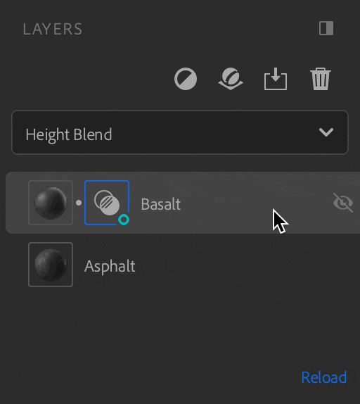
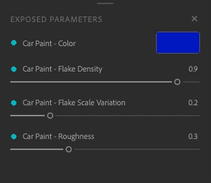
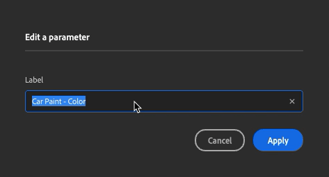

# Export parametric assets

Exposed parameters can be modified in other applications without coming back to Sampler. This cuts down on iteration time so you can focus on finding the best look without needing to move back and forth between applications.

## Expose and unexpose parameters

To expose parameters open the **Properties panel**. Hover or right click on the desired parameter, then click on pin icon or on "expose this parameter".

There are two ways to unexpose a parameter:

* In the **Exposed parameters panel**, right click on the parameter and choose "unexpose".

  
* In the **Properties panel** click on the crossed pin icon or right click on the parameter and choose "unexpose this parameter".

  

The parameters of the following filters can't be exposed:

* Image to material (AI Powered)
* Content-Aware Fill
* Normal to Height
* Upscale

If you add one of the filter above the layers that contain exposed parameters, they will not be exposed at export.  
To avoid this, remove the filter or place it where it will not affect layers with exposed parameters.  
  
If you have exposed parameters from a blend, they will be lost if you move de layer at the bottom of the stack.

## Edit your parameters

Edit the label of your parameter by right clicking on it on the **Exposed parameters panel**, enter the new name and click "Apply".

  
  
You can use the parameter in the **Exposed parameters panel** as in the **Properties panel**.

## Export your material

To export your material with your exposed parameters

1. Open the <b>Export panel.</b>
1. Click on export.
1. Select SBSAR or SBS.
1. Click "export".

You can now use your material with your exposed parameters in any software that supports SBSAR file format.

 