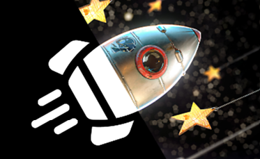
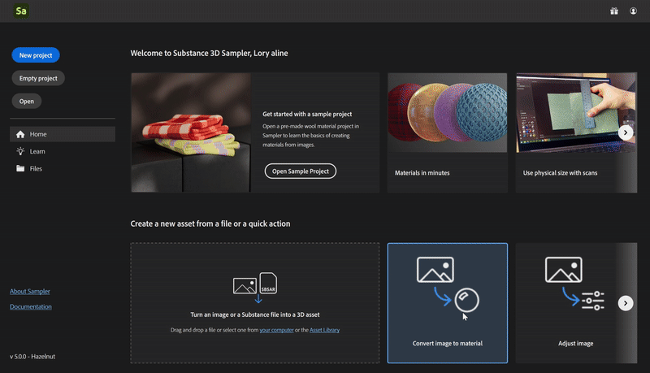
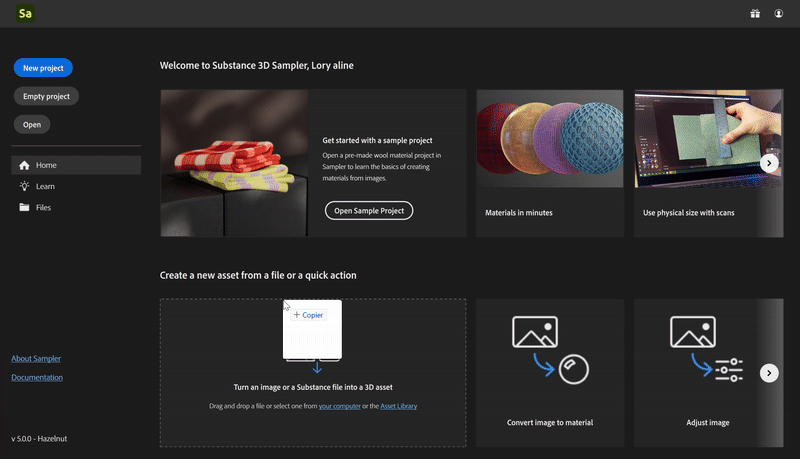
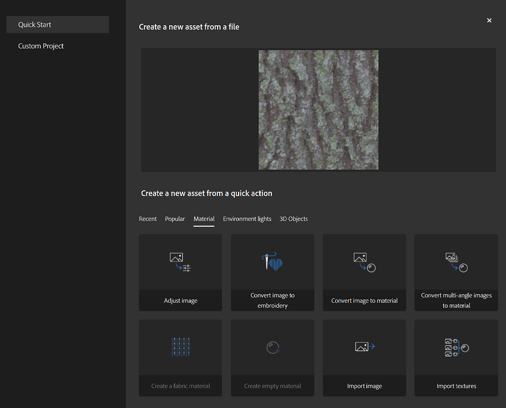

# Quick actions

Quick actions is a system that allows you to create an asset or add many layers in the stack in few clicks. Use Quick actions to create an asset, create a project or to add the layers you need to your existing stack.

You can find Quick actions in several places in Sampler:

* [The home screen](../../help/guide/interface/the-home-screen/the-home-screen.md)
* [Create New Window](../../help/guide/getting-started/project-management/project-management.md)
* [Quick action panel](../../help/guide/interface/panels/quick-actions-panel/quick-actions-panel.md)

| Quick Action Name | Description | Layers |
| --- | --- | --- |
| Convert image to material | Create a material with all the necessary channels from a single image. | Input Image to Material AI Equalize |
| Convert multi-angle images to material | Create a material by merging photos of a surface taken from different light angles | input Multiangle to material Equalize |
| Import textures | Create a material from texture maps. | Input |
| Import image | Create an empty material and add a single image as a layer. | Input |
| Import environment | Create a light from an environment map or a picture. | Input Exposure |
| Convert 360 panoramas to HDR | Create a High Dynamic Range (HDR) environment light by merging multiple 360-degree bracketed panoramic images. [Learn more](https://www.youtube.com/watch?v=cfW9IyoTXQ8) | Input HDR Merge Straighten Horizon Nadir Patch |
| Convert image to embroidery | Apply a procedural filter to make an image look like an embroidered patch. | Input Embroidery |
| <b>Create a fabric material</b> | Create a fabric material with a procedural filter. | ClothWeave |
| <b>Adjust image</b> | Choose filters to fine-tune and prepare an image for use in a material. | Input Crop Tiling Brightness/Constrast Hue/Saturation Color replace |
| <b>Create 3D Object from Photos</b> | Create a 3D model with photogrammetry, which stitches overlapping photos together. | None |
| <b>Create empty material</b> | Create a material with no channels. | None |
| <b>Create empty light</b> | Create an environment light with no channel. | None |

## How to use Quick action

<b>From home screen</b>

Click on a Quick action

or drag and drop an image on a quick action.

or drag and drop an image on a quick action.

<b>From Create new</b>

Choose any quick action or import files and see which quick actions you can use with your input

<b>From Quick Action Panel</b>

Click on a Quick action to add it to the stack or create a new asset depending on the Quick action type.

Options:

* <b>Apply :</b> Applies the quick action on the active stack.
* <b>Setup :</b> Opens the setup window to prearrange the Quick action before adding it to the stack.
* <b>Create new Asset :</b> Create a new asset from the selected quick action.
* <b>Create new Project : </b>Create a new project from the selected quick action.
