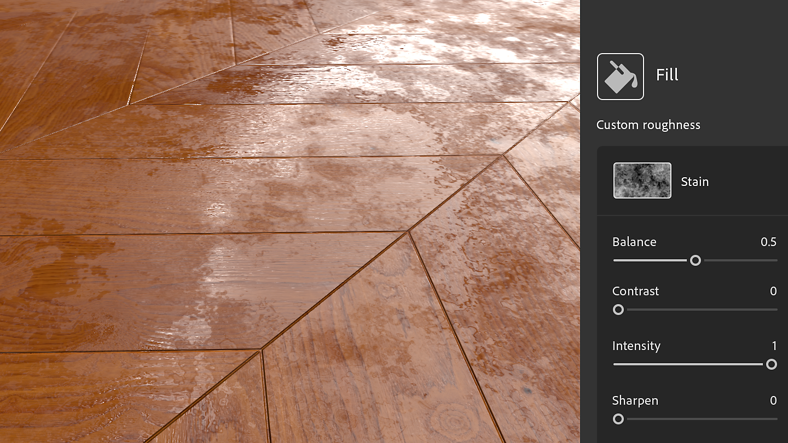
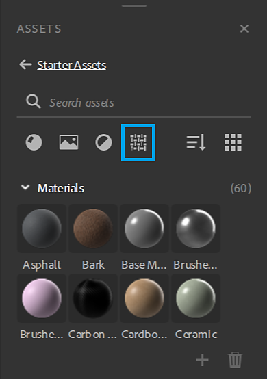
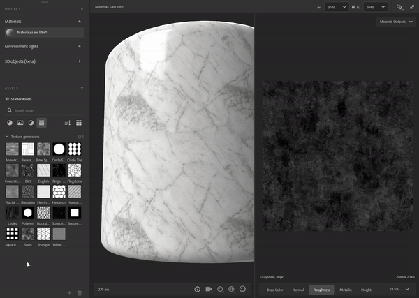
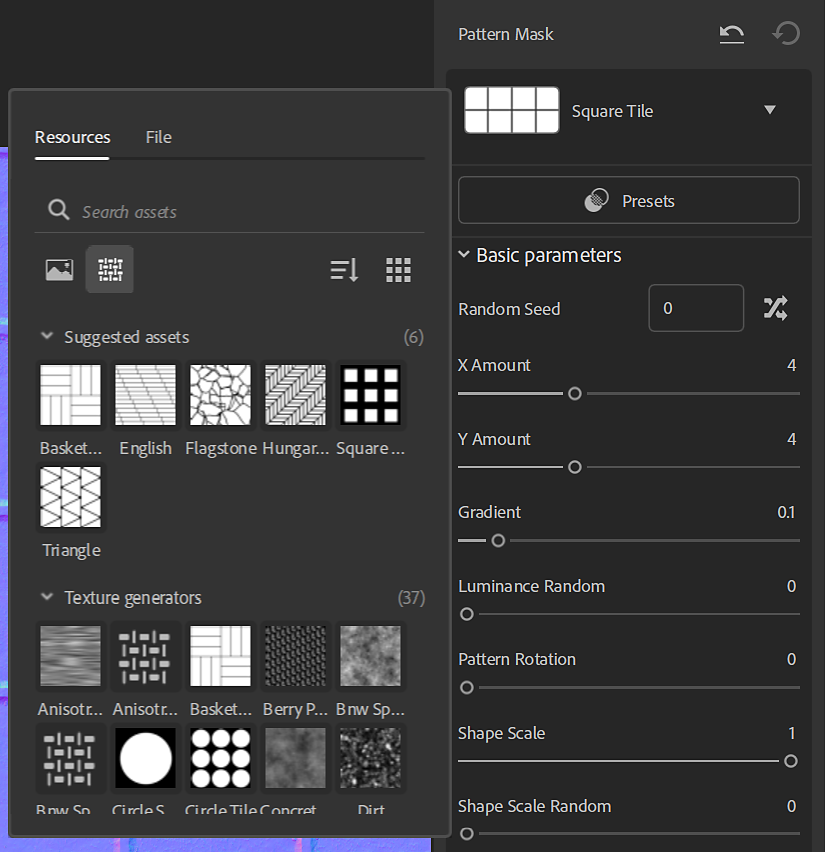
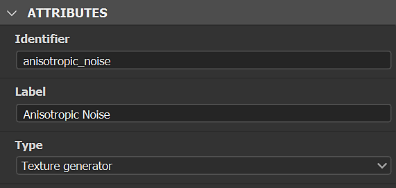
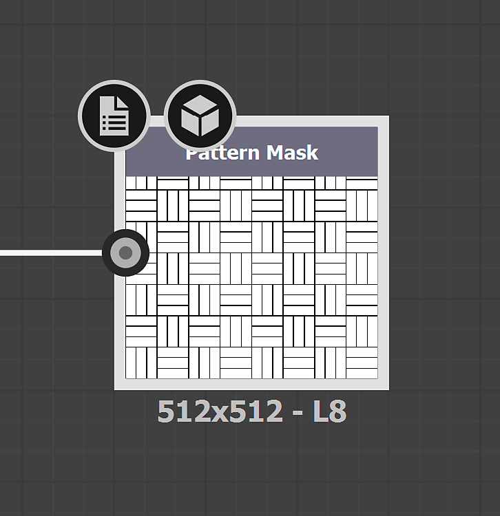
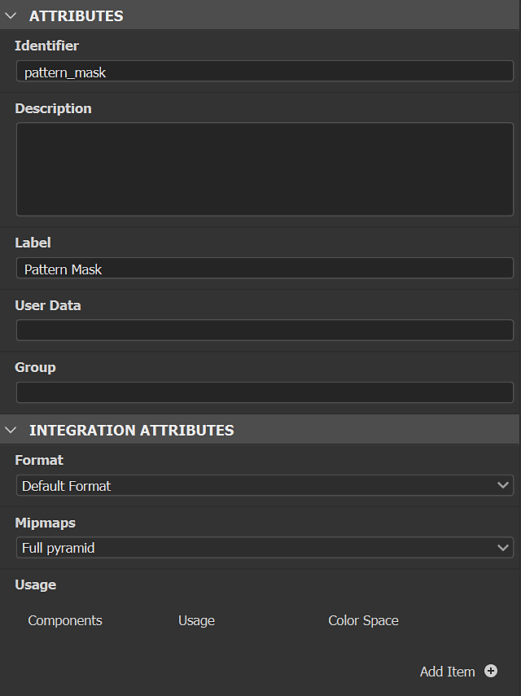
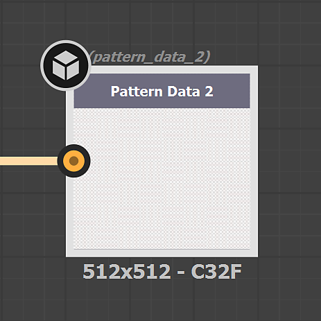
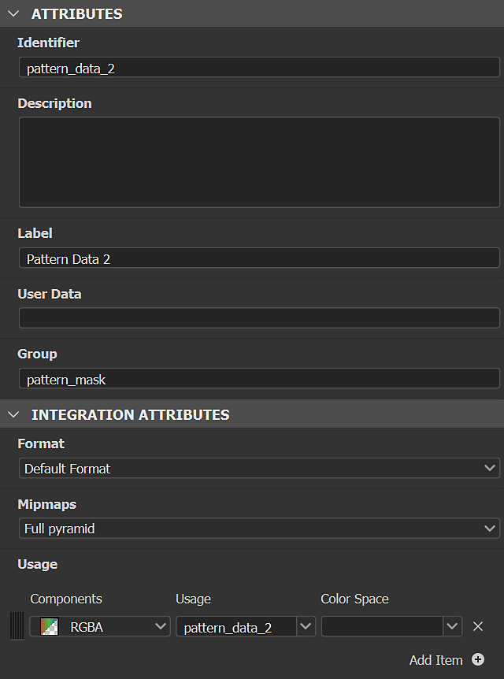

# Texture Generators

Texture generators give improved control over material creation using <b>parametric noises, patterns </b>and<b> grunges</b> options. The generated imagery can be used in masks or channels maps.

<table>
<tr style="border: 0;">
<td style="border: 0;" valign="top">

</td>
<td style="border: 0;" valign="top">

Texture Generators are a type of assets in Substance 3D Sampler. They can be filtered in the Assets panel with the Texture Generators icon.

</td>
</tr>
</table>

## How to use Texture Generators

### Channel maps

Drag and drop a texture generator in the 3D view, 2D view or the layer stack and select a channel to use it.

A Fill filter will be created in the stack with the Texture Generator in the right input. You can access the Texture Generator properties in the properties panel.

#### Filters

Some filters such as <b>Parquet</b> use by default texture generators for pattern masks.. Others work with an image or a Texture Generator like the <b>Pattern</b> filter.  
In filters you can use texture generators in any image property, for instance <b>custom masks</b>.

Filters can suggest generators to work with, they are displayed in the new asset picker, when you click in an image property.

#### Tutorial

You'll find all Substance 3D Sampler's tutorials on our [learning page](https://creativecloud.adobe.com/cc/learn/app/substance-3d-sampler).

[Textile Design with Sampler's Texture Generators](https://creativecloud.adobe.com/cc/learn/substance-3d-sampler/web/fabric-texture-generator?locale=en)

[Carbon Fiber Material In Minutes with Substance 3D Sampler](https://creativecloud.adobe.com/cc/learn/substance-3d-sampler/web/create-carbon-fiber-material?locale=en)

[Plaid Fabric Material In Minutes with Substance 3D Sampler](https://creativecloud.adobe.com/cc/learn/substance-3d-sampler/web/create-plaid-fabric-material?locale=en)

## How to create custom Texture Generators

You can import Texture Generators made with Adobe Substance 3D Designer via the *Import* button in the Layer Stack actions. They must be built in a specific way in Designer to work correctly while imported in Sampler.

### Type

Choose "Texture generator" as graph<b> type</b>.

#### Outputs

The filters' output node of the filter must have the <b>identifier</b> or <b>usage </b>defined:

* The main output of the Texture Generator shouldn't have any usage. Then, it can be recognize as the main output by 3D Sampler.

<table>
<tr style="border: 0;">
<td style="border: 0;" valign="top">

</td>
<td style="border: 0;" valign="top">

</td>
</tr>
</table>

* The <b>secondary output</b>(s) of the Texture Generator needs <b>usage</b> to be used.  
  Their Group name would be the main output <b>Identifier</b>.

>[!NOTE]
>
> If you build your own Filters and Texture Generators to work together, we recommend to use <b>custom usages</b> according to the <b>output Identifiers</b>.

<table>
<tr style="border: 0;">
<td style="border: 0;" valign="top">

</td>
<td style="border: 0;" valign="top">

</td>
</tr>
</table>

>[!IMPORTANT]
>
> If you want your custom Texture Generator to be in a filter Suggested assets list, you need to add the following userdata in your Substance graph:
> 
> alchemist::suggestedfilters=&#91;FilterName,FilterName2&#93;;

>[!NOTE]
>
> The userdata can be used with [custom filters](../filters/custom-filters.md).

#### Format

Export your filter as Substance Archive file (.sbsar)

>[!NOTE]
>
> You can expose filter parameters to control the filter directly in Sampler. See how-to [here](https://experienceleague.adobe.com/en/docs/substance-3d-designer/using/substance-graphs/manage-parameters/exposing-a-parameter)
