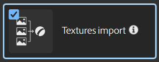

# Texture Import

The **Texture Import** template loads multiple images and automatically connects them to the correct output channels based on their filenames.

Channel matching is based on the specific naming conventions detailed below. In case of duplicates or textures without a match, images will be marked as such in the interface.

## Naming Conventions

Below is a list of the supported file naming conventions for each channel:

| *Channel* | *Naming* |
| --- | --- |
| **Ambient Occlusion** | <ul data-preserve-html="true"><li data-preserve-html="true">ambientocclusion</li><li data-preserve-html="true">ao</li><li data-preserve-html="true">occlusion</li><li data-preserve-html="true">ambient&#95;occlusion</li></ul> |
| **Base Color** | <ul data-preserve-html="true"><li data-preserve-html="true">basecolor</li><li data-preserve-html="true">color</li><li data-preserve-html="true">albedo</li><li data-preserve-html="true">base&#95;color</li><li data-preserve-html="true">base</li><li data-preserve-html="true">col</li><li data-preserve-html="true">colour</li><li data-preserve-html="true">base&#95;colour</li><li data-preserve-html="true">basecolour</li></ul> |
| **Diffuse** | <ul data-preserve-html="true"><li data-preserve-html="true">diffuse</li><li data-preserve-html="true">diff</li></ul> |
| **Emissive** | <ul data-preserve-html="true"><li data-preserve-html="true">emissive</li></ul> |
| **Glossiness** | <ul data-preserve-html="true"><li data-preserve-html="true">glossiness</li><li data-preserve-html="true">gloss</li></ul> |
| **Height** | <ul data-preserve-html="true"><li data-preserve-html="true">height</li><li data-preserve-html="true">heightmap</li><li data-preserve-html="true">displacement</li><li data-preserve-html="true">disp</li></ul> |
| **Metallic** | <ul data-preserve-html="true"><li data-preserve-html="true">metallic</li><li data-preserve-html="true">mtl</li><li data-preserve-html="true">metalness</li></ul> |
| **Normal** | <ul data-preserve-html="true"><li data-preserve-html="true">normal</li><li data-preserve-html="true">nrm</li></ul> |
| **Opacity** | <ul data-preserve-html="true"><li data-preserve-html="true">opacity</li><li data-preserve-html="true">alpha</li></ul> |
| **Roughness** | <ul data-preserve-html="true"><li data-preserve-html="true">roughness</li><li data-preserve-html="true">rough</li></ul> |
| **Specular** | <ul data-preserve-html="true"><li data-preserve-html="true">specular</li><li data-preserve-html="true">spec</li></ul> |
| **Specular Level** | <ul data-preserve-html="true"><li data-preserve-html="true">specularlevel</li><li data-preserve-html="true">specular&#95;level</li></ul> |
