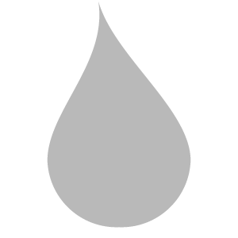
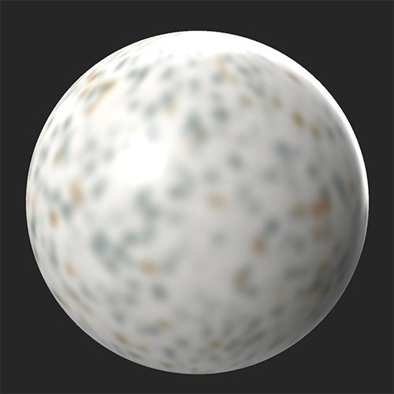

# Blur

<table>
<tr style="border: 0;">
<td width="41.60%" style="border: 0;" valign="top">

**In:** Adjustments

</td>
<td width="58.30%" style="border: 0;" valign="top">

## Description

Blur the full material or select specific channels to blur.

In the images below the **Blur filter** has been applied to the base color channel.

<table>
<tr style="border: 0;">
<td style="border: 0;" valign="top">

</td>
<td style="border: 0;" valign="top">

</td>
</tr>
</table>

</td>
</tr>
</table>

## Parameters

**Basic parameters**

* **Intensity**: 0-1  
  Adjust the amount of blur applied to all channels

**Custom by Channels**

Adjust the amount of blur for each channel independently using these controls. First, enable the channel specific blur and a slider will appear to control the amount of blur applied to that channel.

>[!NOTE]
>
> Channel specific blur overrides **Basic parameters &gt; Intensity** blur for the full material. So, if you set the material blur intensity to 1, but enable a channel and set it's blur intensity to 0, the channel will not be blurred at all, while all other channels will be blurred.

* ***Channel*** **- Custom Blur Intensity**: toggle  
  Enable channel specific blur value.
* ***Channel*** ***-*** **Blur Intensity**: 0-1  
  Adjust the blur for the specified channel.
