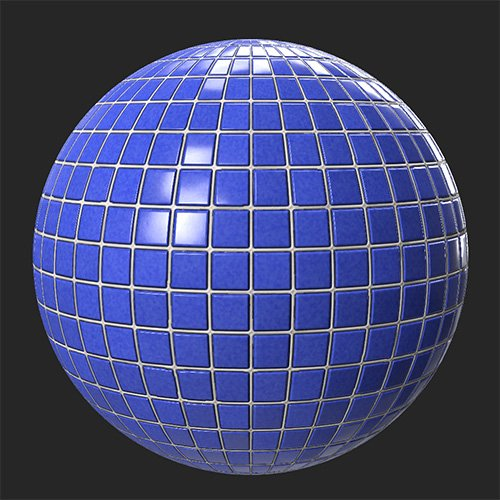
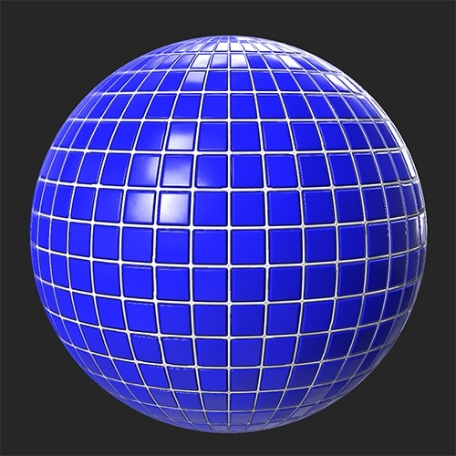

# Brightness/Contrast

<table>
<tr style="border: 0;">
<td width="41.60%" style="border: 0;" valign="top">

**In:** Adjustments

</td>
<td width="58.30%" style="border: 0;" valign="top">

## Description

As the name suggests, the Brightness/Contrast filter allows you to adjust the brightness and contrast of your material. It's important to note that you can use the Brightness/Contrast filter to target specific channels. For example, you can increase the contrast of the roughness channel, or the brightness of the emissive channel.

In the images below, the **Brightness/Contrast filter** has been used to increase the brightness and contrast of a tile material.

<table>
<tr style="border: 0;">
<td style="border: 0;" valign="top">

</td>
<td style="border: 0;" valign="top">

</td>
</tr>
</table>

</td>
</tr>
</table>

## Parameters

**Basic parameters**

* **Channel Selection**:  
  Select which channel the filter affects. Note: You cannot use the Brightness/Contrast filter to modify the Normal channel as it behaves differently from most channels.
* **Brightness**: -1 to 1  
  Modify the brightness of the selected channel
* **Contrast**: -1 to 1  
  Modify the contrast of the selected channel

**Mask**

* **Use Custom Mask**: toggle  
  Enable or disable the use of a custom mask. If enabled the following parameters appear:
  * **Mask**: image/brush  
    Select an image to use as a mask or use the brush to paint a custom mask directly in the 2D view
  * **Custom Mask - Blur**: 0-1  
    Blur the mask
  * **Custom Mask - Invert**: toggle  
    Invert the mask
