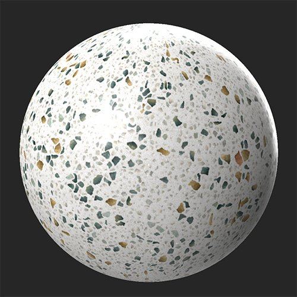
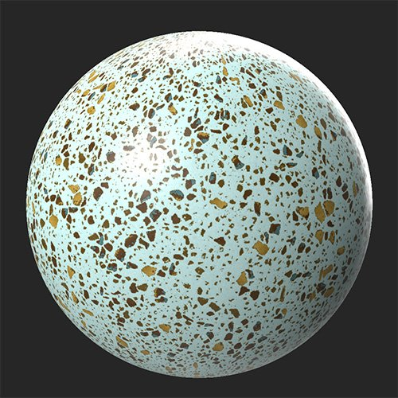

# Color Variation

<table>
<tr style="border: 0;">
<td width="41.60%" style="border: 0;" valign="top">

**In:** Adjustments

</td>
<td width="58.30%" style="border: 0;" valign="top">

## Description

The Color Variation filter lets you replace multiple colors in the base color or diffuse channel at once. This is similar to the **Color Replace filter**, but while **Color Variation** lets you adjust multiple colors in one filter, **Color Replace** gives you more control over the mask used to replace colors, and can be used on multiple channels.

In the images below, the **Color Variation filter** has been used to adjust not only the underlying white color to make it appear a pale turquoise, but also to increase the contrast of many of the smaller specks.

<table>
<tr style="border: 0;">
<td style="border: 0;" valign="top">

{width="200px"}

</td>
<td style="border: 0;" valign="top">

{width="200px"}

</td>
</tr>
</table>

</td>
</tr>
</table>

## Parameters

**Basic parameters**

* **Color Count**: 1-10  
  Modify the number of colors that will replace the colors of the channel
* **Luminosity Variation**: 0-1  
  Adjust how much the luminosity values are impacted by the replaced color
* **Segmentation**:  
  Base the mask used to apply colors on a different channel.
* **Color Selection Mode**:   
  Choose whether to select the source colors manually or automatically. If **Manual** selection mode is chosen, use the handles in the **2D view** to select colors.
  * **Show Text Helper**: toggle  
    This control is only visible if **Color Selection Mode** is set to **Manual**. When enabled, **Show Text Helper** will add text labels to the handles in the **2D view** to more easily distinguish color selection handles
* **Color X**: color select  
  The number of color controls available depends on the value selected with **Color Count**. For each color, select the new color to replace the original material color.

## Usage Guide

The **Color Variation filter** lets you quickly modify multiple colors of the base color channel at once. For some materials this can be useful for making small adjustments, but the **Color Variation filter** is best at completely overhauling the colors of your material with a single filter.

To use the **Color Variation filter**:

1. Add the **Color Variation filter** to the layer stack
1. Adjust the number of colors you want to replace with **Color Count**. The filter will replace all the color of the channel - the **Color Count** control lets you set how many new colors the existing colors will be replaced with.
1. Optionally select a **Segmentation**, or a different channel to base the colors on. For example, you can select the metallic channel, and use **Color Selection Mode &gt; Manual** to place one handle on a black metallic value, and another on a white metallic value. With this setup you can control the color of metallic and non-metallic parts of your material individually.
1. Select a **Color Selection Mode**. With manual mode selected, handles appear in the **2D view** that let you select the original base color that the new color will replace. Enable **Show Text Helper** to keep track of which handle is linked to which color.
1. Modify the color values with the **Color 1 - 10** controls.
1. Adjust the **Luminosity Variation** to adjust how much the luminosity is impacted by the color replacement. With a low **Luminosity Variation**, you can flatten the colors of your material completely, or use a high **Luminosity Variation** to maintain detail from the original colors.
