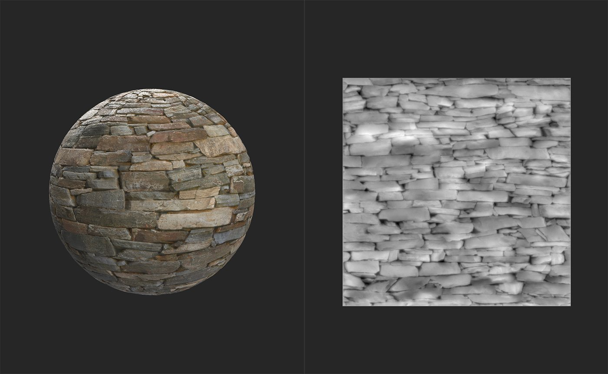
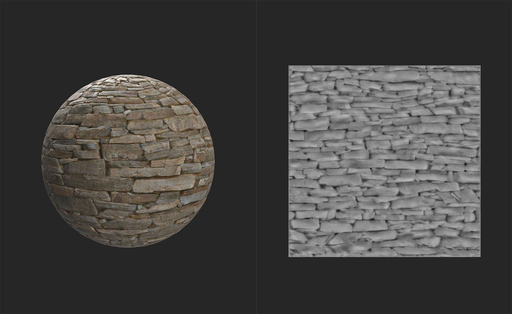

# Equalize

<table>
<tr style="border: 0;">
<td width="41.60%" style="border: 0;" valign="top">

**In:** Adjustments

</td>
<td width="58.30%" style="border: 0;" valign="top">

## Description

The Equalize filter adjusts local contrast based on a distance range. The goal of the Equalize filter is to reduce large differences in each channel. As a result, it's generally useful as part of the Image to Material (B2M) workflow - the Image to Material (AI powered) filter includes an Equalize pass within the filter to improve results.

The images below show the **Equalize filter** in action.

Before the **Equalize filter** has been added, there is significant variation across the height map and base color of this material.

After the **Equalize filter** has been added, both the height map and base color channels are more uniform without losing detail.

</td>
</tr>
</table>

## Equalize filter tutorial

## Parameters

<b>Basic parameters</b>

* <b>Input Tiled</b>: toggle  
  When enabled, treat the material as if it's tiled repeatedly, so changed near borders will be influenced by color values on the opposite border.
* <b>Radius</b>: 0-1  
  Spread the Equalize effect over a wider area.
* <b>Color bleeding</b>: 0-1  
  Control which colors bleed into the surrounding area.
* <b>Local details</b>: 0-1  
  Adjust how the Equalize filter tries to preserve local detail.

<b>*Channel*</b>

The controls for each channel work the same way.

* <b>Override Common Parameters</b>: toggle  
  Enable this to customize the Equalize effect for this channel. When enabled, additional controls appear:
  * <b>Input Tiled</b>: toggle  
    When enabled, treat the material as if it's tiled repeatedly, so changed near borders will be influenced by color values on the opposite border.
  * <b>Radius</b>: 0-1  
    Spread the equalize effect over a wider area.
  * <b>Keep Local Differences</b>: toggle  
    Enable to make the equalize effect work at a higher resolution to maintain details
* <b>Target Mode</b>:  
  Select how to bias the Equalize effect. By default Equalize attempts to move colors towards the average color of the channel. Use Parameter to instead bias towards a chosen color or value. With Parameter selected, an additional control will appear:
  * <b>Target</b>: color select  
    Select a color or value to act as a target for the Equalize algorithm.
* <b>Custom Color Variation</b>: HSL sliders  
  Adjust the Hue, Chroma (Saturation), and Lightness (Luminance) of the result after the Equalize algorithm has been run for the specified channel.

<b>Mask</b>

* <b>Custom Mask</b>: toggle  
  Enable or disable the use of a custom mask for this filter
* <b>Custom Mask</b>: image/brush  
  Select an image to use as a mask, or use the brush to paint a custom mask directly in the 2D view
* <b>Custom Mask Invert</b>: toggle
