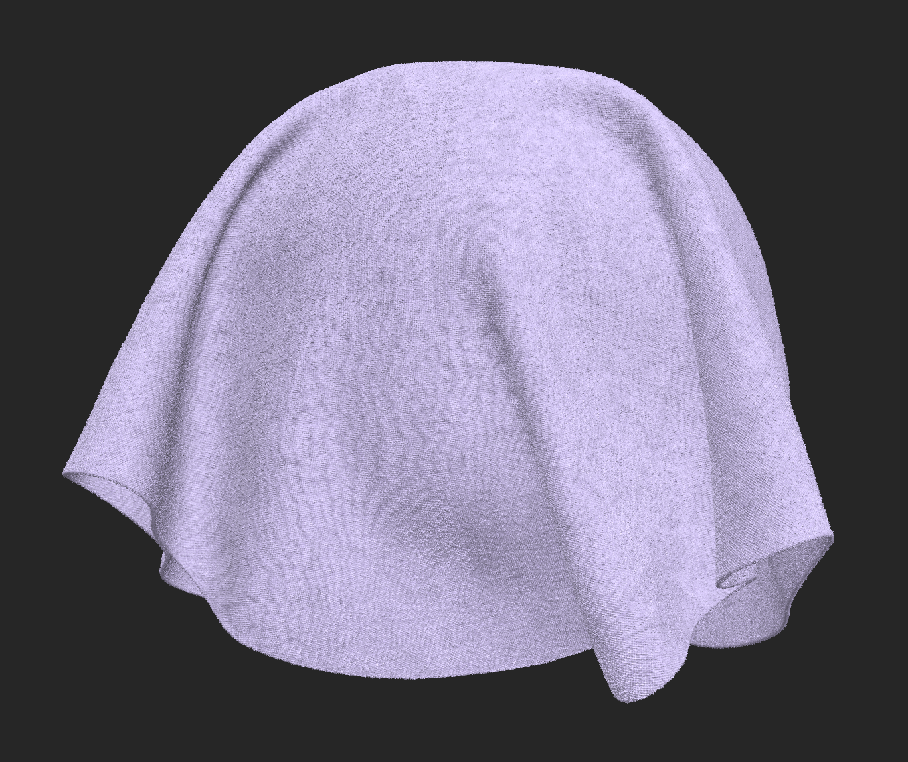
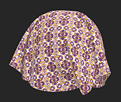

# Fill

<table>
<tr style="border: 0;">
<td width="41.60%" style="border: 0;" valign="top">

**In:** Adjustments

</td>
<td width="58.30%" style="border: 0;" valign="top">

## Description

The **Fill filter** lets you replace or adjust the values of specific channels based on a selected value.

In the images below, the base color channel has been replaced.

<table>
<tr style="border: 0;">
<td style="border: 0;" valign="top">

{width="200px"}

</td>
<td style="border: 0;" valign="top">

{width="200px"}

</td>
</tr>
</table>

</td>
</tr>
</table>

## Parameters

<b>Basic parameters</b>

For each channel, the following parameters are available:

* *<b></b>*: Toggle  
  Toggle whether the filter affects this channel. If enabled, the following parameters appear:
  * <b>Color</b>: color select  
    This parameter appears if the relevant channel holds color (RGB) information. Select the color to replace/modify the channel with.
  * <b>Value</b>: 0-1  
    This parameter appears if the relevant channel holds monochrome information. Select the value to replace/modify the channel with.
  * <b>Custom </b>*<b>*&gt;*</b>: toggle  
    If enabled, the following additional control will appear:
    * <b>Custom </b>: image/brush  
      Select an image to replace the selected channel with, or paint directly in the <b>2D view</b>.*
  * <b>Blending Mode:</b> Copy, Add (linear Dodge), Substract, Multiply, Add Sub, Max (lighten), Min (Darken), Switch, Divide, Overlay, Screen, Soft Light.  
    Select the blending mode to blend the custom input with the layers bellow.
  * <b>Opacity</b>: 0-1  
    Adjust the opacity of the new channel information relative to the existing channel information. In other words, this controls the opacity of the mask used to apply the new channel fill.
