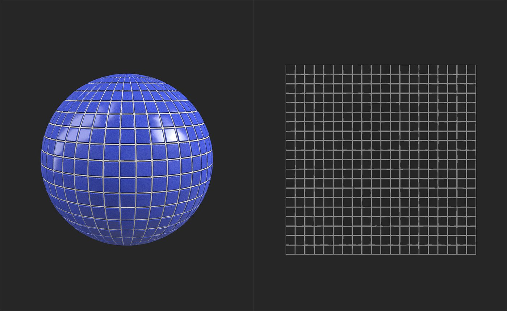
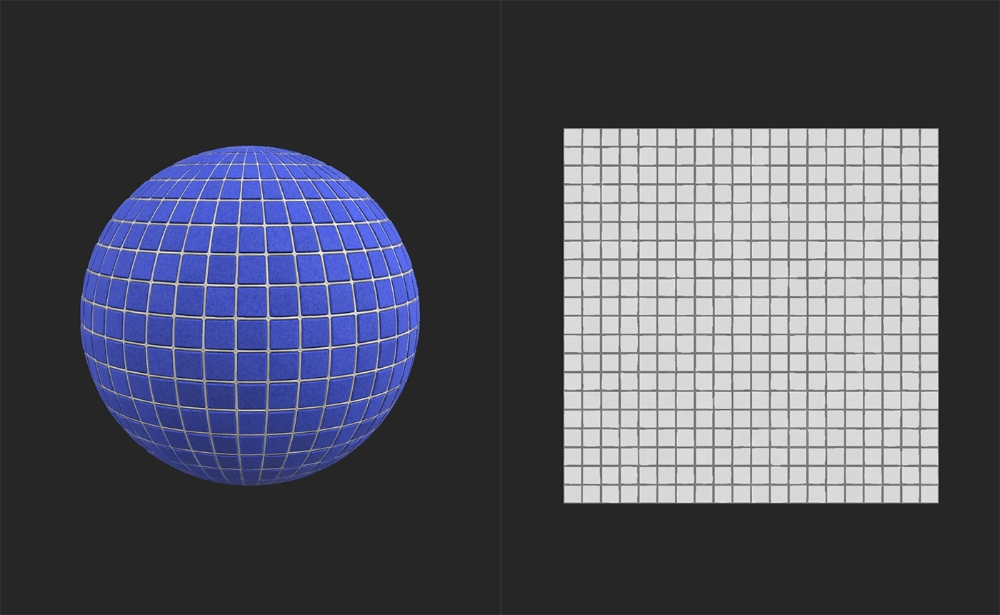

# Invert

<table>
<tr style="border: 0;">
<td width="41.60%" style="border: 0;" valign="top">

**In:** Adjustments

</td>
<td width="58.30%" style="border: 0;" valign="top">

## Description

Invert individual channels of the material.

In the images below you can see the impact of inverting the roughness channel of a tile material.

Before inverting, the tiles are shiny and reflect the environment light clearly.

After inverting, the tiles are matte and don't have strong specular highlights.

</td>
</tr>
</table>

## Parameters

**Basic parameters**

Each channel can be inverted independently through use of a toggle. Enable the toggle to invert the channel. If results aren't visible in the 3D view, select the channel at the bottom of the 2D view to see the impact.

**Mask**

* **Use Custom Mask**: toggle  
  Enable or disable the use of a custom mask. If enabled the following parameters appear:
  * **Mask**: image/brush  
    Select an image to use as a mask or use the brush to paint a custom mask directly in the 2D view
  * **Custom Mask - Blur**: 0-1  
    Blur the mask
  * **Custom Mask - Invert**: toggle  
    Invert the mask

## Usage Guide
