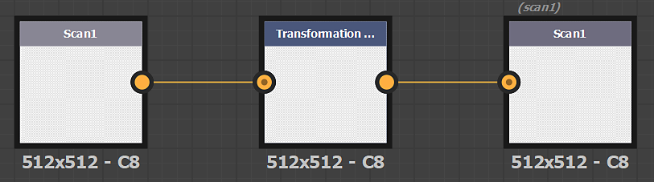
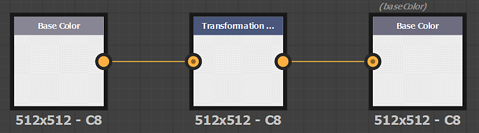
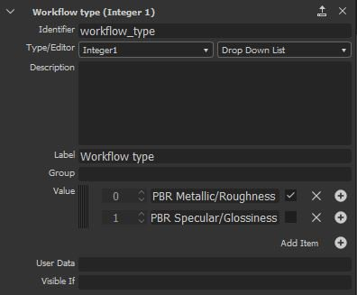

# Custom Filters

## Substance Custom Filters

You can import filters made with Adobe Substance 3D Designer via the *Import* button in the Layer Stack actions.

### Create a Substance Filter

Filters must be built in a specific way in Designer to work correctly once imported in Sampler.

The input and output nodes of the filter must have the identifier or usage defined.

>[!NOTE]
>
> It is possible to use either the **usage** or the **identifier** (the usage has the priority).

#### Format

Export your filter as a Substance Archive file (.sbsar)

>[!NOTE]
>
> You can expose filter parameters to control the filter directly in Sampler. See how-to [here](https://helpx.adobe.com/substance-3d-designer/substance-compositing-graphs/manage-parameters/exposing-a-parameter.html)

#### Create a filter to modify images

| Images name | Usage |
| --- | --- |
| *Scan1* | **scan1** |
| *Scan2* | **scan2** |
| *...* | **...** |

#### Create a filter to modify channels

| Channel name | Usage |
| --- | --- |
| *Base Color* | **basecolor** |
| *Diffuse* | **diffuse** |
| *Specular* | **specular** |
| *Specular Level* | **specularlevel** |
| *Metallic* | **metallic** |
| *Roughness* | **roughness** |
| *Glossiness* | **glossiness** |
| *Normal* | **normal** |
| *Height* | **height** |
| *Ambient Occlusion* | **ambientOcclusion** |
| *Opacity* | **opacity** |

>[!WARNING]
>
> When creating a custom filter for Sampler, you need to add the following userdata in your Substance graph:
> 
> alchemist::type=filter;

>[!WARNING]
>
> If in your package, you have one graph to process images (scan1 to scanX) and one graph to process material (PBR channels), Sampler is able to choose the correct graph depending where the filter is inserted in the layer stack.
> 
> On your "image" graph, add the following userdata:
> 
> alchemist::type=filter;alchemist::variation::type=multi
> 
> On your "material" graph, add the following userdata:
> 
> alchemist::type=filter;alchemist::variation::type=material

### Specific parameters

Specific parameters are globally managed by the application. It's a way to use global parameters of the application, the project, the layer stack in your custom filters.

#### Normal format

Control of the normal format over the application. Set to DirectX in Sampler

parameter identifier: normalformat, normal\_format, $normalformat, $normal\_format

#### Input Count

When you want to modify images (scan1 to scanX), you can use the number of images in the layer stack by using the Image Count parameter.

parameter identifier: input\_count

parameter type: integer1

#### Material Input

If you want to display a material slot in the layer stack like the atlas scatter or the splatter:

* Add a new set of Input nodes (Base Color, Normal, ... )
* All Input nodes of the background (bottom material in the layer stack) should be in the Group **Material1**
* All Input nodes of the first material you want to add on top should be in the Group **Material2**and etcetera if you want several material slots.
* Add a material input parameter:
  * parameter identifier: material\_input
  * parameter type: integer1

#### Workflow Type

If you want to display/hide some parameters based on the workflow of your project (PBR Metalic/Roughness or PBR Specular/Glossiness), you can the Workflow Type parameter

parameter identifier: workflow\_type

parameter\_type: integer1, dropdown list

options:

* 0: PBR Metallic/Roughness
* 1: PBR Specular/Glossiness

{width="300px"}
