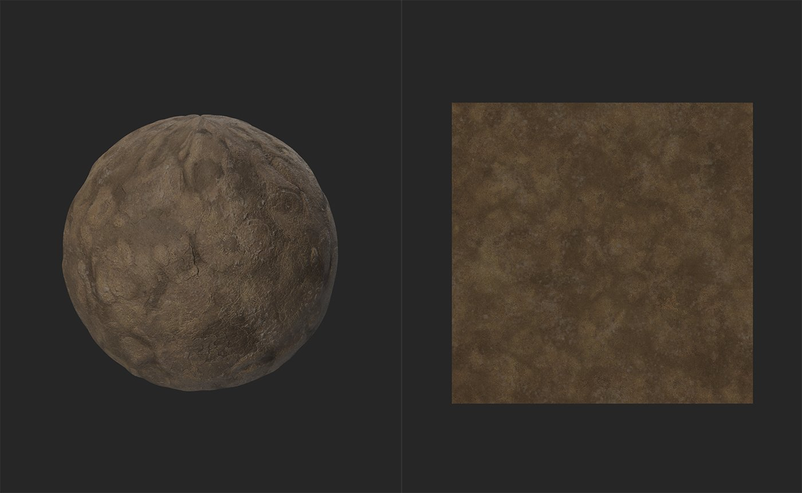
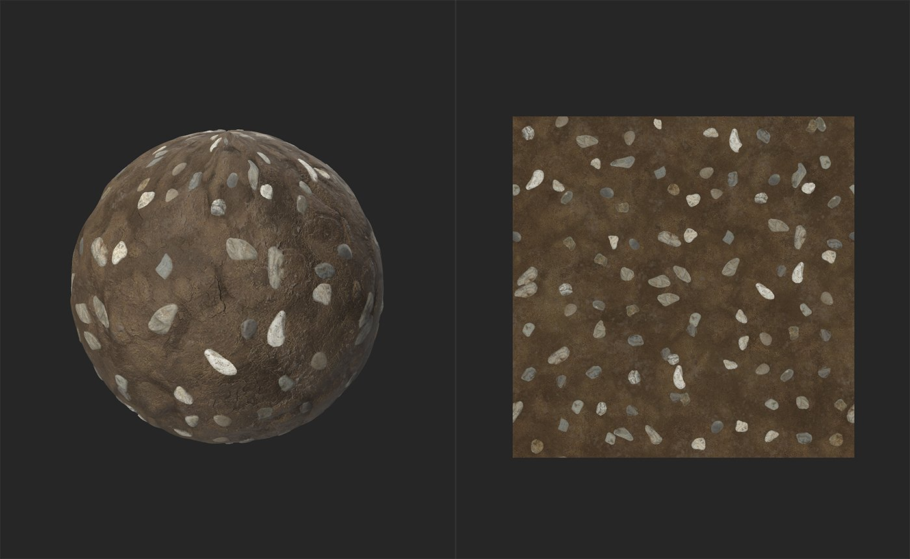

# Atlas Scatter

<table>
<tr style="border: 0;">
<td width="41.60%" style="border: 0;" valign="top">

**In:** Generators

</td>
<td width="58.30%" style="border: 0;" valign="top">

## Description

The Atlas Scatter filter scatters instances of the elements within an atlas material across the underlying material. Atlas Scatter is useful for scattering things like leaves, rocks, or trash across a material in a natural way.

The images below show the **Atlas Scatter filter** in action.

Before the **Atlas Scatter filter** is used, we have a basic mud material - not very exciting.

By adding the **Atlas Scatter filter** with a pebble atlas, the material becomes more interesting as pebbles are scattered and blend realistically with the underlying mud.

</td>
</tr>
</table>

## Parameters

**Basic Parameters**

* **X Amount**: 1-64  
  Number of instances in the X axis
* **Y Amount**: 1-64  
  Number of instances in the Y axis
* **Blend Mode**:  
  Method used to blend with underlying layers
* **Scale**: 0-5  
  Scale of instances
* **Position Random**: 0-2  
  Increase or decrease the random offset of instances from grid positions
* **Height Scale**: 0-1  
  Adjust height of instances
* **Conform to Background**: 0-1  
  Change how much the underlying height values impact scattered instances
* **Color from Background**:
  * **Hue:** 0-1  
    Adjust hue of instances
  * **Saturation:** 0-1  
    Adjust saturation of instances
  * **Value:** 0-1  
    Adjust value of instances

**Mask**

* **Custom Mask**: toggle  
  Enable or disable the use of a custom mask. When enabled the following controls appear:
  * **Custom Mask:**   
    Select a file to use as a mask or use the brush mode to manually mask.
  * **Invert Mask:** toggle  
    Invert the value of the mask
* **Mask Random**: 0-1  
  Hide a percentage of instances randomly

**Size**

* **Scale Random**: 0-1  
  The amount of randomized scale to apply to each instance
* **Scale No Overlap**: 0-1  
  Adjust the scale of each instance to avoid overlapping of instances

**Height**

* **Height Offset**: -1 to 1  
  Offset the height of instances from the base level of 0
* **Height Offset Random**: 0-1  
  Add a random value to height offset for each instance
* **Skew from Bg Slope**: 0-1  
  Adjust skew of normals based on background slope
* **Background Smoothness**: 0-2  
  Adjust background Smoothness

**Rotation**

* **Rotation**: 0-1  
  Rotate all instances by a set value
* **Rotation Random**: 0-1  
  Add a random value to the rotation of each instance
* **Rotation from Bg Slope**:  
  Rotate instances based on the slope of the underlying material

**Atlas Material Adjustments**

* **Color Adjustment**:  
  Adjust HSV values for the atlas
* **Color Random**:  
  Add randomness to the HSV values set in **Color Adjustment**
* **Roughness from Background**: 0-1  
  Use the roughness of the background instead of the roughness of each instance.
* **Roughness Adjustment**: -1 to 1  
  Add or subtract from each instances roughness values.
* **Normal Random**: 0-1  
  Rotate normals of each instance by a random value per instance
* **Recompute Ambient Occlusion**: toggle  
  If toggled on, Ambient Occlusion values will be recomputed based on the modified height values

**Atlas Shape Detection**

* **Pattern Range**:  
  Limit the available assets from the atlas based on position. Leave X and Y values at 0 to use all assets from the atlas.
* **Downscale Atlas Opacity**: 0-4
* **Shape Detection Precision**:  
  Select which algorithm to detect shapes. Different atlases will be suited to different detection algorithms. No failure mode is more computationally expensive than either of the other options.
* **Ignore Shape Smaller than**: 0-1  
  Use this to avoid picking up very small shapes as individual elements.

Usage Guide

The Atlas Scatter filter is a useful way to scatter assets across your material such as leaves, stones, or trash. To use the Atlas Scatter filter, you will need an atlas material for the filter to process.

>[!NOTE]
>
> An atlas material is a material that holds a collection (or atlas) of separate assets. For example, Sampler includes by default the Dry Laurel Leaves - this is an atlas material because it holds a collection of leaves in a single material where each leaf is separate from each other leaf. The Atlas Scatter node uses an algorithm to handle each leaf from the atlas material as a separate element.

To use the Atlas Scatter filter:

1. Add the Atlas Scatter filter to your layer stack
1. Under the Atlas Scatter layer, an Input slot will appear
1. Drag your atlas material into the Atlas Scatter input slot

You can adjust the scatter parameters in the **Properties panel** by selecting the Atlas Scatter layer.

You can adjust the parameters of the atlas material in the **Properties panel** by selecting the material in the input slot.
