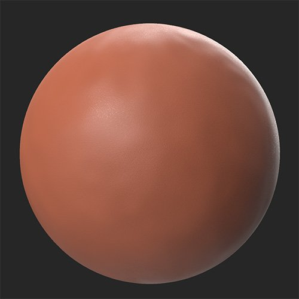
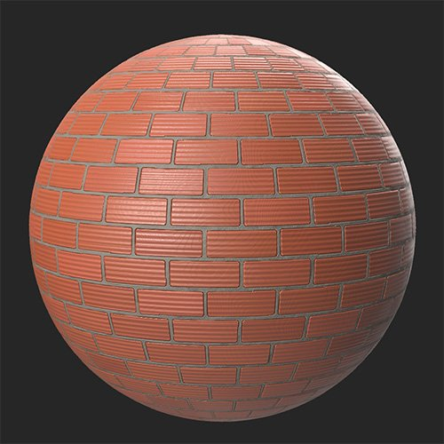

# Brickwall

<table>
<tr style="border: 0;">
<td width="41.60%" style="border: 0;" valign="top">

**In:** Generators

</td>
<td width="58.30%" style="border: 0;" valign="top">

DescriptionThe Brickwall filter generates a brick pattern based on the layers below it. This is useful for creating brick walls (as the name suggests) but also floors, or anywhere else bricks are used.

In the images below, a clay material is converted into a brick wall with the **Brickwall filter.**

<table>
<tr style="border: 0;">
<td style="border: 0;" valign="top">

{width="200px"}

</td>
<td style="border: 0;" valign="top">

{width="200px"}

</td>
</tr>
</table>

</td>
</tr>
</table>

## Parameters

**Presets**

Select from a number of presets to quickly emulate a specific style.

**Basic Parameters**

* **Random Seed**: randomized number  
  The random value used to determine other random values in this filter.  
  Click the number to get a new random value. When a random value has been selected, click the parameter name to reset the value to 0.
* **Brick Bond**:  
  Merge bricks together based on the selected style
* **Brick Type**:  
  Select the style of brick
* **Tile**: 1-25  
  Change the amount of tiling on the X and Y axes.
* **Offset**: 0-1  
  Modify the offset of each row of bricks from the preceding row.
* **Use Custom Color**: toggle  
  Merge bricks together based on the selected style

**Mix**

* **Mix Mode**:  
  Change how bricks are organized. Using a **Mix Mode** creates a second set of bricks that can be controlled independently from the base set.  
  With **Mix Mode** set to **None**, no other parameters will appear in this section.
* **Brick Type 2**:  
  Select the style of the second set of bricks.
* **Height Offset**: 0-1  
  Offset the height of the second set of bricks

**Cement**

* **Cement Color**: color picker  
  Change the color of the cement between bricks.
* **Cement Roughness**: 0-1  
  Change the roughness of the cement between bricks.
* **Cement Interstice**: 0-1  
  Change the width of the cement between bricks. Changes the brick size.
* **Cement Level**: 0-1  
  Change the height of the cement
* **Cement Disorder**: 0-1  
  Adjust the flatness of the cement. At high values cement can rise above the bricks.

**Age**

* **Brick Disorder**: 0-1  
  Randomly adjust the rotation of each brick in 3 dimensions.
* **Brick Shatter**: 0-1  
  Add cracks in bricks
* **Brick Edge**: 0-1  
  Damage and break the edges of bricks
* **Brick Unstuck**: 0-1  
  Remove bricks at random
* **Brick Color Variation**: 0-1  
  Vary the color of bricks to make the wall appear less uniform
* **Brick Dirtiness**: 0-1  
  Add dirt to bricks

**Advanced Parameters**

* **Height Blend Intensity**: 0-1  
  Adjust the blend of the height from the base material. A value of 0 ignores the height of the base material and only uses the Brickwall filter parameters to generate height information. A value of 1 uses the base material to generate height information.
* **Normal Intensity**: 0-1  
  Adjust the strength of the normals generated by the Brickwall filter. A value of 0 effectively means no normals.
* **Ambient Occlusion Intensity**: 0-1  
  Adjust the strength of the AO. A value of 0 effectively means no Ambient Occlusion.

Usage Guide

The Brickwall filter breaks up the underlying material into individual bricks that it then rearranges. For this reason, the Brickwall filter works best with hard surfaces like rocks or metals - in other words the materials most well suited to being bricks in the real world.

The Brickwall filter is useful for creating a base material that you can then layer other effects on top of, like moss, snow or dirt.
