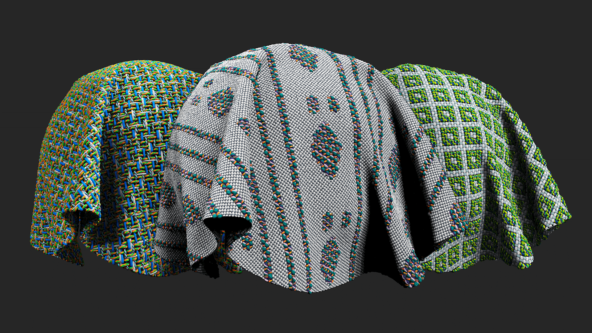

# Cloth Weave

<table>
<tr style="border: 0;">
<td width="41.60%" style="border: 0;" valign="top">

</td>
<td width="58.30%" style="border: 0;" valign="top">

## Description

Design cloth fabrics with custom weave patterns.

</td>
</tr>
</table>

Parameters

**Basic parameters**

* **Draw Custom Weave:** Draw the weaves on your 2D viewport.
* **Color Custom Weave:** Draw colors on 2D viewport to tint the weaves.
* **Weave Pattern:** Set the weave pattern.
* **Pattern Size:** Set the size of the pattern manipulating the Warp (vertical fibers) and the Weft (horizontal fibers).
* **Size Multiplier:** Multiply the fibers only (masks will not be multiplied).
* **Lock Weave to Size Multiplier:** Toggle  
  Apply the Size Multiplier to the weave and open color and mask constrains.
* **Lock Custom Color to Size Multiplier:** Toggle  
  Apply the Size Multiplier to the Custom Color.
* **Lock Mask to Size Multiplier:** Toggle  
  Apply the Size Multiplier to the Custom Mask.
* **Fibers Tension:** Warp 0-1, Weft 0-1  
  Set the tension of the fibers.
* **Color Mode Warp:** Set between Unicolor, Bicolor or None.
* **Color Mode Weft:** Set between Unicolor, Bicolor or None. Add image to illustrate result.

**Warp 1**

* **Color Amount:** 1 to 4  
  Set the number of color used in thread.
* **Width:** 0-1  
  Set the Width of the wrap threads.
* **Offset:** 0-1  
  Offset the grunge map in the X and Y axes.
* **Thread:** Set the type of thread.
* **Fiber Amount:** 0-8  
  Set the number of fibers the thread contains.
* **Fiber Finish:** Set the quality of the fibers.

**Weft 1**

* **Color Amount:** 1 to 4  
  Set the number of color used in thread.
* **Width:** 0-1  
  Set the Width of the wrap threads.
* **Offset:** 0-1  
  Offset the grunge map in the X and Y axes.
* **Thread:** Set the type of thread.
* **Fiber Amount:** 0-8  
  Set the number of fibers the thread contains.
* **Fiber Finish:** Set the quality of the fibers.

**Advanced**

* **Blending Mode****:** Select the blending mode for the basecolor channel. Changing the blending mode can substantially change the appearance of the cloth Weave.
* **Imperfection Intensity:** 0-1  
  Set the intensity of threads imperfections.
* **Normal Intensity:** 0-2  
  Adjust the strength of the normal map.
* **Height Position:** 0-1  
  Offset the height of the full material.

**Mask**

* **Use Custom Mask:** toggle  
  Enable or disable the use of a custom mask. If enabled the following parameters appear:
* **Custom Mask – Blur:** 0-1  
  Blur the mask.
* **Custom Mask – Invert:** toggle  
  Invert the mask.
