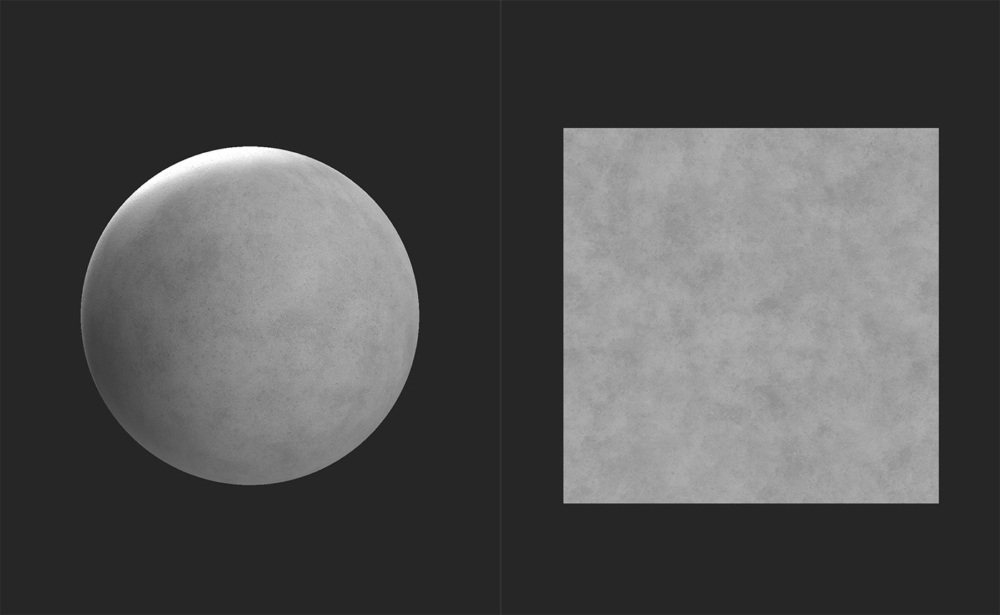
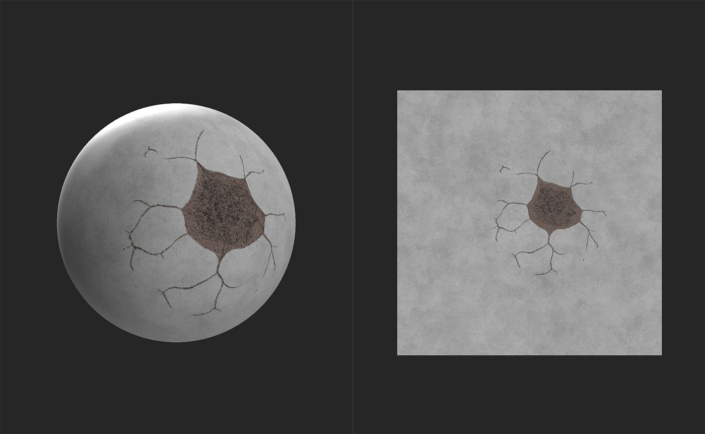

# Decal

<table>
<tr style="border: 0;">
<td width="41.60%" style="border: 0;" valign="top">

**In:** Generators

</td>
<td width="58.30%" style="border: 0;" valign="top">

## Description

The Decal filter allows you to add instances of another material in a specific location. This is useful for adding things like stickers or specific details that might not be easy to generate procedurally.

The images below show the **Decal filter** being used to add damage to concrete.

Before the decal is added, the concrete base layer is clean and undamaged.

With the **Decal filter** applied, realistic cracks and damage are added to the material.

</td>
</tr>
</table>

## Parameters

**Basic Parameters**

* **Tiling mode**:  
  Determines whether to tile beyond the handles in the **2D view**.   
  H stands for Horizontal, while V stands for Vertical.
* **Bottom Material Color Match**: 0-1  
  Adjust the colors of the decal material to match the color value of the layers below it.
* **Normal Blending mode**:  
  Adjust how normals are blended between the decal material and the underlying layers
* **Normal Opacity Blend**: 0-1  
  Change the opacity of the decal material's normals
* **Decal Height Position**: 0-1  
  Adjust the height of the decal relative to the underlying layers height
* **Decal Height Scale**: 0-1  
  Change the contrast of the height map for the decal material

**Advanced Parameters**

* **Decal Transformation**:   
  Adjust the matrix transform values for the decal. In general it is easier to just use the handles in the **2D view** to adjust the decal's transform.
* **Decal** **Offset**: -1 to 1  
  Adjust the offset of the decal.

## Usage Guide

To use the Decal filter:

1. Add the Decal filter to your layer stack
1. Under the Decal layer, an Input slot will appear
1. Drag your decal material into the Decal layer's input slot

You can adjust the filter parameters in the **Properties panel** by selecting the Decal layer.

You can adjust the parameters of the decal input material in the **Properties panel** by selecting the material in the input slot.
