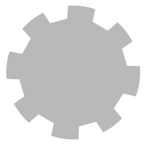

# Embossing

<table>
<tr style="border: 0;">
<td width="41.60%" style="border: 0;" valign="top">

**In:** Generators

</td>
<td width="58.30%" style="border: 0;" valign="top">

## Description

Emboss text or patterns onto your materials.

</td>
</tr>
</table>

## Parameters

**Basic Parameters**

* **Emboss Size**: 0-1  
  Change the size of each instance
* **Emboss Distance**: 0-1  
  Change the thickness of embossed lines
* **Pattern Selection**:  
  Select which pattern to emboss. From here you can select to emboss text or a custom pattern.
* **Pattern Tile X**: 1-64  
  Change the number of instances on the X axis
* **Pattern Tile Y**: 1-64  
  Change the number of instances on the Y axis

**Emboss**

* **Use Border Emboss**: toggle  
  Toggle whether to emboss the border of the chosen pattern
* **Border Emboss Invert**: toggle  
  Invert the height of the border emboss
* **Border Emboss Intensity**: 0-1  
  Change the strength of the emboss effect
* **Use Fill Emboss**: toggle  
  Toggle whether to emboss the fill of the chosen pattern
* **Fill Emboss Invert**: toggle  
  Invert the height of the fill emboss effect
* **Fill Emboss Intensity**: 0-1  
  Change the strength of the emboss effect

**Pattern**

* **Use Color**: toggle  
  Toggle whether or not to add color to the embossed area  
  When **Use Color** is toggled on, an additional **Color** parameter will appear to adjust the color.
* **Pattern Mask** **Distance**: 0-1  
  Change size of the mask used to apply color to the embossed area
* **Pattern Mask Contrast**: 0-1  
  Adjust the contrast of the mask. Decreasing the contrast makes the edges of the mask appear more blurred.
* **Use Pattern Tile**: toggle  
  Toggle on to tile the pattern, toggle off to have only a single instance. When the pattern isn't tiled, the **Pattern Tile** options will not appear under the **Basic Parameters** section.
* **Pattern Rotation**: 0-1  
  Rotate the pattern
* **Pattern Offset**: 0-1  
  Offset each row of the pattern from the previous row.
* **Use Pattern Roughness**: toggle  
  Enable this to override the underlying material roughness with a custom roughness value wherever the emboss effect appears.  
  When enabled, a **Pattern Roughness** control will appear to set the roughness.
* **Use Pattern Metallic**: toggle  
  Enable this to override the underlying material metallic values with a custom metallic value wherever the emboss effect appears.  
  When enabled, a **Pattern Metallic** control will appear to set the roughness.

**Text** - This section only appears if **Pattern Selection** under **Basic parameters** is set to **Text**

* **Font Selection**:  
  Select a typeface
* **Text**: text field  
  Type in the text to be embossed
* **Text Size**: 0-1  
  Adjust the font size

**Eraser**

* **Eraser Normal**: 0-1
* **Eraser Ambient Occlusion**: 0-1
* **Eraser Opacity**: 0-1

**Advanced parameters**

These parameters allow you to adjust values for the entire material.

* **Luminosity**: 0-1
* **Contrast**: -1 to 1
* **Hue Shift**; 0-1
* **Saturation**: 0-1
* **Normal Intensity**; 0-1

## Usage Guide

Add the Embossing filter to the top of the layer stack, then start adjusting parameters.

The most important parameters are generally **Basic Parameters &gt; Pattern Selection** to modify which pattern the filter will use and **Pattern &gt; Use Pattern Tile** to toggle tiling on and off.
