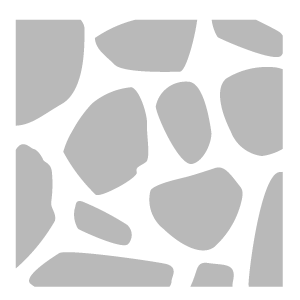
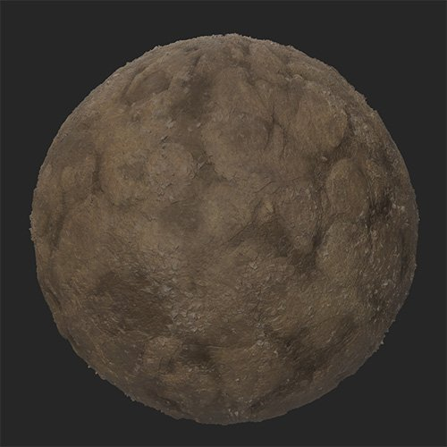
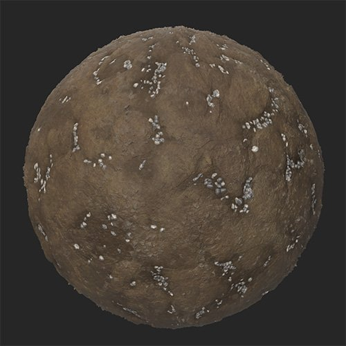

# Gravel

<table>
<tr style="border: 0;">
<td width="41.60%" style="border: 0;" valign="top">

**In:** Generators

</td>
<td width="58.30%" style="border: 0;" valign="top">

## Description

The Gravel filter layers gravel on top of your material in a natural way, filling crevasses.

These images show the **Gravel filter** being used to fill the crevasses of a mud material with gravel.

<table>
<tr style="border: 0;">
<td style="border: 0;" valign="top">

</td>
<td style="border: 0;" valign="top">

</td>
</tr>
</table>

</td>
</tr>
</table>

## Parameters

**Basic parameters**

* **Random Seed**:  
  The random seed determines the random values of other parameters that use randomness in this filter.
* **Quantity**: 0-1  
  Change the amount of gravel spread across the material.
* **Primary Color**: color select  
  Select the base color of the gravel stones
* **Secondary Color**: color select  
  Select the secondary color of the gravel stones
* **Bottom Material Color Match**: 0-1  
  Adjust how much the gravel color is impacted by the color of the underlying material
* **Enable Cavity Mask**: toggle  
  When enabled, the gravel will fill cavities and not be spread on higher parts of the material. This can result in a more realistic scattering of gravel.
* **Scattering Volume Threshold**: 0-50  
  Adjust the volume of scattering based on height values
* **Random Masking**: 0-1  
  Set the percentage of gravel to randomly mask out
* **Stone Size**: 1-10  
  Control the size of the stones
* **Stone Size Variation**: 0-1  
  Control the randomness of the stone size
* **Stone Roundness**: 0-1  
  Make stones rounder or more angular
* **Stone Roughness**: 0-1  
  Modify the roughness value of the stones
* **Stone Height**: 0-1  
  Modify the height of the stones. This impacts how the stones blend with the underlying material.
* **Stone Elevation**: 0-1Modify the base elevation of the stones. Elevation sets the floor of where the stones lie, while height sets the height of the stones off the floor.
* **Stone Elevation Random**: 0-1  
  Add a random value to the elevation of each stone.
* **Surface Smoothness**: 0-1  
  Smooth the tops of stones
* **Use Custom Mask**: toggle  
  Enable or disable the use of a custom mask to paint stone locations. The following parameters will only be visible if **Use Custom Mask** is enabled.
  * **Mask Blur**: 0-1  
    Blur the edges of the painted mask
  * **Custom Mask**: image/brush  
    Click the brush to paint a custom mask where stones will appear. Click the square to import an image to use as a mask.

**Advanced parameters**

* **Surface Size (cm)**: 0-1000  
  Modify the size of the surface being represented by your material. Increasing the surface size means that the physical size of gravel stones is larger, and they will be modified accordingly.
* **Height Depth** **(cm)**: 0-100  
  Modify the physical depth represented by the height map of your material. An increased height depth means that the stones physical size is taller than it would be otherwise, so stones normal intensity is increased.
