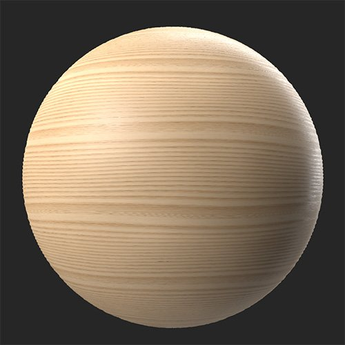
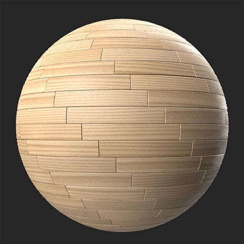

# Parquet

<table>
<tr style="border: 0;">
<td width="41.60%" style="border: 0;" valign="top">

**In:** Generators

</td>
<td width="58.30%" style="border: 0;" valign="top">

## Description

Convert your material into a parquet floor.

*A wood material converted into a parquet pattern with the **Parquet filter**.*

<table>
<tr style="border: 0;">
<td style="border: 0;" valign="top">

{width="200px"}

</td>
<td style="border: 0;" valign="top">

{width="200px"}

</td>
</tr>
</table>

</td>
</tr>
</table>

## Parameters

**Presets**

Use presets to quickly change parameters to see different styles of parquet floor.

**Basic parameters**

* **Random Seed**:  
  The random seed determines the random values of other parameters that use randomness in this filter.
* **Pattern Type**:   
  Select the parquet pattern
* **X Amount**: 1-30  
  Change the number of planks on the X axis
* **Y Amount**: 1-30  
  Change the number of planks on the Y axis
* **Seam Distance**: 0-1  
  Modify the distance of the bevel around the seams of planks
* **Planks Variation**: 0-1  
  Automatically vary color and roughness of each plank

**Advanced**

* **English Pattern Offset**: 0-1 (This parameter is only available if **Basic parameters &gt; Pattern Type** is set to **English**)  
  Change the offset of each row of planks from the previous row
* **Seam Intensity**: 0-1  
  Adjust the normals of the seams between planks to make them more or less noticeable
* **Seam Bevel Curve**: 0-1  
  Modify the width of the bevel between planks
* **Seam Height Range**: 0-1  
  Adjust the height of the seams
* **Planks Normal Rotation Variation**: 0-1  
  Vary the angle of each plank by a random amount
* **Planks Roughness Variation**: 0-1  
  Randomly vary the roughness of each plank.
