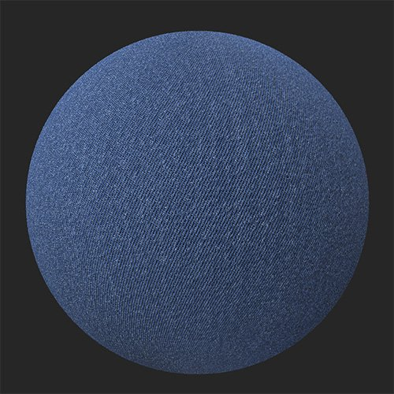
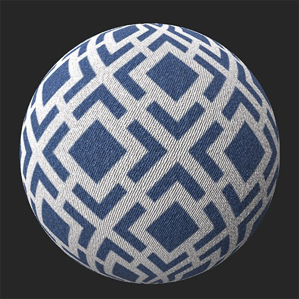

# Pattern

<table>
<tr style="border: 0;">
<td width="41.60%" style="border: 0;" valign="top">

**In:** Generators

</td>
<td width="58.30%" style="border: 0;" valign="top">

## Description

Add a pattern to your material from one of the available options, or use an image or brush to customize your own.

*An example of the **Pattern filter** applied to denim.*

<table>
<tr style="border: 0;">
<td style="border: 0;" valign="top">

{width="200px"}

</td>
<td style="border: 0;" valign="top">

{width="200px"}

</td>
</tr>
</table>

</td>
</tr>
</table>

## Parameters

<b>Basic parameters</b>

* <b>Random Seed</b>: 0-1  
  The random seed determines the random values of other parameters that use randomness in this filter.
* <b>Pattern </b>: Image picker and/or paint  
  Select a pattern in the texture generator or import one
* <b>Color Mode Selection </b>: Material or Color Only  
  <b>Material</b> mode influence all *PBR channels* and the <b>Color Only</b> mode influence only the *BaseColor* of the material.
* <b>Color Amount </b>: 1-10  
  Select the amount of color active from the pattern
* <b>hue</b>: 0-1  
  Adjust the color hue of the pattern
* <b>Mask Color</b> : toggle  
  Mask the color selected, depends on the <b>Color Amount</b>
* <b>Replace Color: </b>toggle  
  Replace the color selected, depends on the <b>Color Amount</b>
* <b>Roughness</b>: 0-1  
  Set the roughness of the selected color, depends on the <b>Color Amount</b>
* <b>Metallic</b>: 0-1  
  Set the roughness of the selected color, depends on the <b>Color Amount</b>
* <b>Emboss Mode</b>: toggle  
  Select the direction of the Emboss of the selected color,depends on the<b> Color Amount</b>
* <b>Emboss Intensity: </b>0-1<b>  
  </b>Adjust the strengh of the embossing of the selected color,  depends on the<b> Color Amount</b>
* <b>Emboss Distance: </b>0-1  
  Stretch and smooth the embossing zone of the selected color,  depends on the<b> Color Amount</b>
* <b>Emboss Grain: </b>0-1  
  Add grain in the selected color,  depends on the <b>Color Amount</b>
