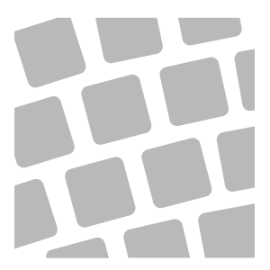

# Pavement

<table>
<tr style="border: 0;">
<td width="41.60%" style="border: 0;" valign="top">

**In:** Generators

</td>
<td width="58.30%" style="border: 0;" valign="top">

## Description

Convert your material into a pavement pattern. The Pavement filter includes a number of options to change the style of pattern quickly and easily.

*An example of the **Pavement filter**.*

</td>
</tr>
</table>

## Parameters

**Basic parameters**

* **Random Seed**:   
  The random seed determines the random values of other parameters that use randomness in this filter.
* **Base Material Scale**: 0-1   
  Control the scale of the material used in each brick
* **Brick Spacing**: 0-1  
  Modify the amount of space between bricks
* **Corner Roundness**: 0-1  
  Make the corners of bricks more or less rounded.
* **Edge Roundness**: 0-1  
  Smooth the edges of bricks to make them appear more worn from use
* **Tilt Intensity**: 0-1  
  Change the strength of the random tilt applied to each brick
* **Random Elevation Intensity**: 0-1  
  Modify the height variation of bricks relative to each other.

**Pattern**

Each pattern has a different set of parameters available that will appear when the pattern is select in **Pattern Type**. Experiment with parameters to see the effect.

* **Pattern Type**:  
  Select the pattern to lay the bricks.

**Joint**

* **Joint** **Height**: 0-1  
  Modify the height of the material between bricks
* **Joint Width**: 0-1  
  Adjust how far the material between bricks overlaps the edges of bricks
* **Joint Width Variation**: 0-1  
  Adjust the randomness of the **Joint Width**
* **Joint Luminosity**: 0-1  
  Modify the appearance of the material between bricks. This can be useful for masking purposes.

**Advanced parameters**

* **Surface Intensity**: 0-1  
  Control the strength of the normals for surface deformations like cracks or dents.
* **Surface Size (cm)**: 0-1000  
  Adjust the physical size represented by the material
* **Surface Height Scale (cm)**: 0-1000  
  Change the physical space represented by the height map
* **Surface Smoothness**: 0-1  
  Control the amount of variation and detail in the surface
* **Surface Poke**: 0-1  
  Add damage or variation to the surface by modifying the height and normals at random
* **Surface Poke Mask Threshold**: 0-1  
  Modify the threshold of the mask used to control **Surface Poke**
* **Enable Scalemap**: toggle  
  Use a scalemap to adjust the size of bricks based on their position
* **Scalemap Intensity**: 0-1  
  Adjust how much the scalemap impacts the scale of bricks.
