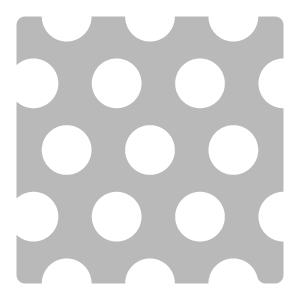
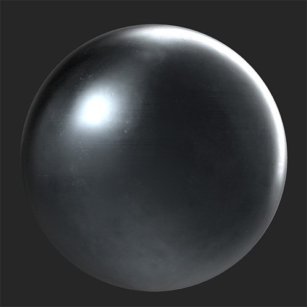
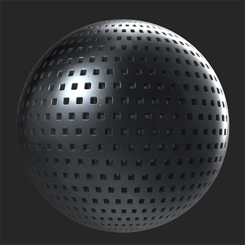

# Perforate

<table>
<tr style="border: 0;">
<td width="41.60%" style="border: 0;" valign="top">

**In:** Generators

</td>
<td width="58.30%" style="border: 0;" valign="top">

## Description

Use the Perforate filter to add holes to your material.

*Before and after applying the **Perforate filter**.*

<table>
<tr style="border: 0;">
<td style="border: 0;" valign="top">

{width="200px"}

</td>
<td style="border: 0;" valign="top">

{width="200px"}

</td>
</tr>
</table>

</td>
</tr>
</table>

## Parameters

**Basic parameters**

* **Random Seed**:  
  The random seed determines the random values of other parameters that use randomness in this filter.
* **Pattern Selection**:   
  Select the shape of the holes or choose Custom Pattern to create your own.
* **Perforation Position**:   
  Select whether the normals and height recede into your material or stand out from the material
* **Perforation Chamfer Size**: 0-1  
  Change the size of the chamfer on the edges of holes
* **Hole Size**: 0-1  
  Change the size of the holes
* **Use Mask**: toggle  
  Enables the **Mask section** which you can use to mask out the perforation with a brush or image.
* **Use Scale Map**: toggle  
  Enables the use of a scale map. When enabled the following parameters will appear:
  * **Scale Map Multiplier**: 0-1  
    Adjust how much of an impact the scale map has on the scale of the perforation
  * **Invert Scale Map**: toggle  
    Invert the values of the scale map
  * **Custom Scale Map**: image/brush  
    Import an image to use as a scale map or use the brush to paint a scale map directly in the **2D** **view**

**Mask**

This section is only visible if **Basic parameters &gt; Use Mask** is enabled

* **Invert Mask**:
* **Mask Blur**: 0-1  
  Adjust the blur applied to the mask
* **Mask Threshold**: 0-1  
  Modify the threshold of the mask. Use the **Mask Blur** and **Mask Threshold** values together to fine tune the edges of your mask.
* **Custom Mask**: image/brush  
  Import an image to use as a mask or paint your own mask directly in the **2D view**

**Perforation**

* **Perforation Size**: 0-1  
  Change the size of each perforation - this includes the hole and the chamfer.
* **Perforation Y Amount**: 1-64  
  Adjust the number of perforations on the Y axis
* **Perforation X Amount**: 1-64  
  Adjust the number of perforations on the X axis
* **Perforation Density**: 0-1  
  Randomly mask perforations
* **Perforation Offset**: 0-1  
  Adjust the offset of every second row of perforations
* **Perforation Color Opacity**: 0-1  
  Adjust the transparency of the color of the chamfered area of perforations
* **Perforation Color**: color select  
  Select the color of the chamfered area of each perforation
* **Perforation Roughness**: 0-1  
  Modify the roughness value of perforations
* **Perforation Metallic**: 0-1  
  Modify the metallic value of perforations

**Advanced parameters**

* **Luminosity**: 0-1
* **Contrast**: -1 to 1
* **Hue Shift**: 0-1
* **Saturation**: 0-1
* **Normal Intensity**: -1 to 1  
  Adjust the strength of each perforations normals
* **Height Intensity**: 0-1  
  Adjust the strength of each perforations height map
