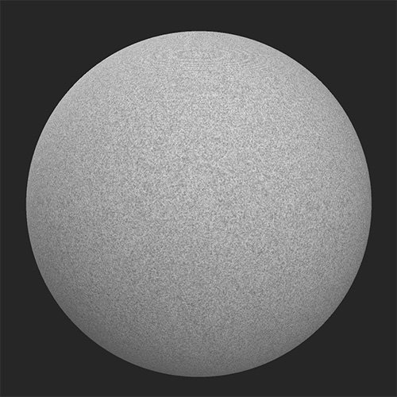
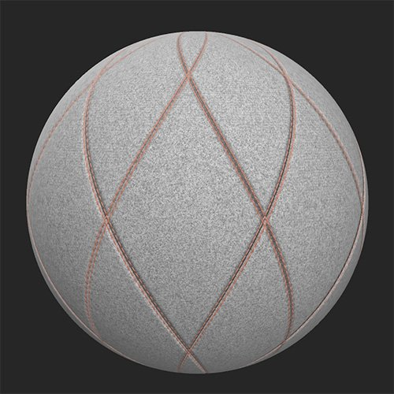

# Quilt Stitch

<table>
<tr style="border: 0;">
<td width="41.60%" style="border: 0;" valign="top">

**In:** Generators

</td>
<td width="58.30%" style="border: 0;" valign="top">

## Description

Emulate a stitched quilt pattern in your materials with this filter.

*Before and after applying the **Quilt Stitch filter**.*

<table>
<tr style="border: 0;">
<td style="border: 0;" valign="top">

{width="200px"}

</td>
<td style="border: 0;" valign="top">

{width="200px"}

</td>
</tr>
</table>

</td>
</tr>
</table>

## Parameters

**Basic parameters**

* **Random Seed**:   
  The random seed determines the random values of other parameters that use randomness in this filter.
* **Pattern Selection**:   
  Select the style of pattern for the stitching/quilt to follow
* **Amount**: 1-5  
  Control the amount of tiling of the pattern
* **Rotation**:   
  Rotate the pattern
* **Topstitch**: toggle  
  Enable to add a topstitch and see relevant parameter section
* **Seam**: toggle  
  Enable to add a seam and see relevant parameter section
* **Quilt**: toggle  
  Enable to add quilting and see the relevant parameter section
* **Edge Paint**: toggle  
  Enable to pain the edge between quilted sections and see the relevant parameter section
* **Advanced**: toggle  
  Enable to see the **Advanced** parameters

**Topstitch**

* **Topstitch Color**: color select  
  Set the color of the thread used for the topstitch
* **Topstitch Offset**: 0-1  
  Offset the topstitch from the edges of the quilted area
* **Topstitch Rotation**: 0-1  
  Change the orientation of the stitches that make up the topstitch
* **Topstitch Scale**: 0-1  
  Adjust the size of the topstitch in each dimension - width, length, and height
* **Puncture Intensity**: 0-1  
  Adjust the indentation into the quilting caused by the topstitch
* **Topstitch Roughness**: 0-1  
  Adjust the roughness of the thread
* **Topstitch Metallic**: 0-1  
  Adjust the metallic value of the thread

**Seam**

* **Seam** **Selection**:  
  Select the style of seam to use
* **Seam Intensity**: 0-1  
  Modify the normal and height intensity of the seam
* **Stretch Intensity**: 0-1  
  Adjust how much of an impact the stretch of the fabric has on the seam. This effect is quite subtle.

**Quilt**

* **Quilt Type**:  
  Select the style of quilting to use
* **Quilt Intensity**:  
  Adjust the normal and height intensity of the quilting effect

**Edge Paint**

* **Edge Selection**:  
  Select whether the pain overrides the normal and height details of the underlying material or not
* **Edge Color**: color select  
  Select the paint color
* **Edge roughness**: 0-1
* **Edge Metallic**: 0-1

**Advanced**

* **Base Material Height**: 0-1  
  Adjust the strength of the height map from the underlying material
* **Normal Intensity**: 0-1  
  Adjust the strength of the normal map changes due to the **Quilt Stitch** filter. This does not impact the normal of the underlying material.
