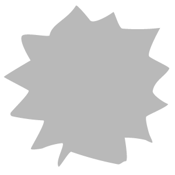

# Surface Relief

<table>
<tr style="border: 0;">
<td width="41.60%" style="border: 0;" valign="top">

**In:** Generators

</td>
<td width="58.30%" style="border: 0;" valign="top">

## Description

Use the Surface Relief filter to add noise to your material. This can help break up large shapes or add visual interest.

</td>
</tr>
</table>

## Parameters

<b>Basic parameters</b>

* <b>Random Seed</b>:  
  The random seed that all other random parameters in this filter is based on.
* <b>Intensity</b>: 0-1  
  Change the amplitude of the noise
* <b>Blur Intensity</b>: 0-1  
  The strength of the blur applied to the noise
* <b>Surface Imperfection </b>: Image/Brush/Texture Generator  
  Use an image or a Texture Generator to use as the surface imperfection.

<b>Noise Parameters</b>

* <b>Clamp</b>: 0-1  
  Clamp the noise to a certain range
* <b>Contrast</b>: 0-1  
  Modify the contrast of the noise
* <b>Invert</b>: toggle  
  Invert the noise's height map

<b>Transform</b>

* <b>Tiling</b>: 1-16  
  Unlike <b>Basic parameters &gt; scale</b>, <b>Tiling</b> manages the number of instances of the noise.
* <b>Mirror</b>:  
  Mirror the noise across one or both axes
* <b>Offset</b>:  
  Reposition the noise in the X and Y axes
* <b>Rotation</b>:  
  Rotate the noise. The rotation angle snaps to ensure that tiling is still possible.

<b>Mask</b>

* <b>Use Custom Mask</b>: toggle  
  Enable to see Custom Mask controls:
  * <b>Mask</b>: image/brush/Texture Generator  
    Import an image to use as a mask or use the brush to paint directly in the <b>2D view</b>
  * <b>Custom Mask - Blur</b>: 0-1  
    Blur the mask
  * <b>Custom Mask - Invert</b>: toggle

<b>Advanced Parameters</b>

* <b>Height Intensity</b>: 0-1  
  Control the blend of the noise heightmap with the underlying materials heightmap
* <b>Height - Replace Base</b>: toggle  
  Toggle whether to replace the base height or not
* <b>Normal Intensity</b>: 0-1  
  Adjust the strength of the noise's normal map
* <b>Normal - Replace Base</b>: toggle  
  Toggle whether to replace the base normal map or not
* <b>Normal -Direction</b>:  
  Modify which axes to use for normal generation
* <b>Normal - Rotate Direction</b>
* <b>Ambient Occlusion - Intensity</b>
* <b>Ambient Occlusion - Radius</b>
