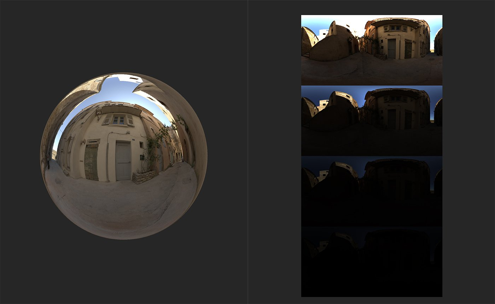

# Exposure Preview

<table>
<tr style="border: 0;">
<td width="41.60%" style="border: 0;" valign="top">

**In:** HDRI Tools

</td>
<td width="58.30%" style="border: 0;" valign="top">

## Description

The **Exposure Preview** **filter** lets you preview a spectrum of exposure values quickly.

Below you can see what the **Exposure Preview filter** does.

In the image above, an environment light has been created and the HDR image data is visible in the **2D view**.

With the **Exposure Preview** **filter** added to the layer stack, a new channel - Environment Diagnostics - becomes available which shows the the environment light at various exposures.

</td>
</tr>
</table>

## Parameters

**Basic parameters**

* **Min Exposure (EV)**: -8 to 8  
  Set the exposure of the least exposed image.
* **Max Exposure (EV)**: -8 to 8  
  Set the exposure of the most exposed image.

## Usage Guide

The **Exposure Preview filter** works a little differently to other Sampler filters. It's a tool that's meant to help find the correct exposure for your environment light, but it doesn't actually impact the Environment channel at all - instead, when you add the **Exposure Preview filter** to the layer stack, an additional channel becomes available to view in the **2D view** - the Environment Diagnostic channel.

If you view the Environment Diagnostic channel, you should be able to see a few instances of your 2D environment image at varying exposure values. Adjust the parameters of the **Exposure Preview filter** to change the range of exposures visible in the Environment Diagnostic channel.
