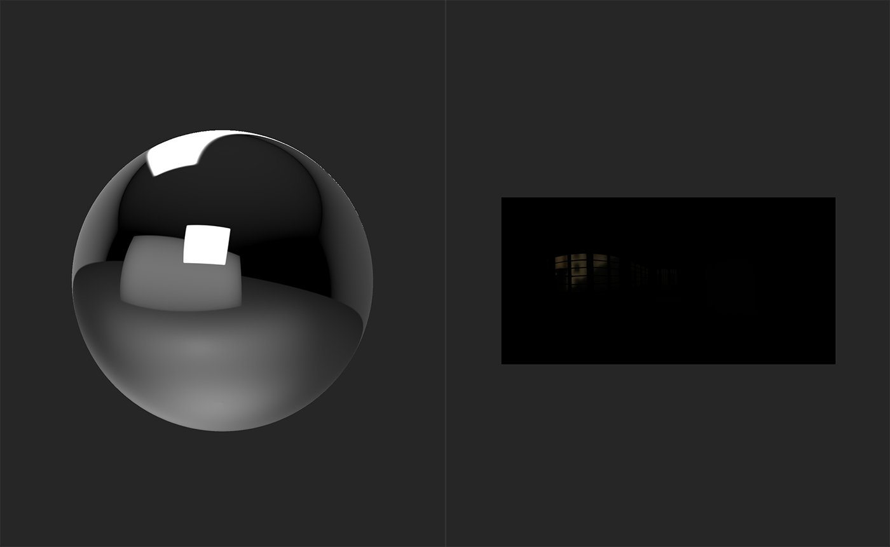
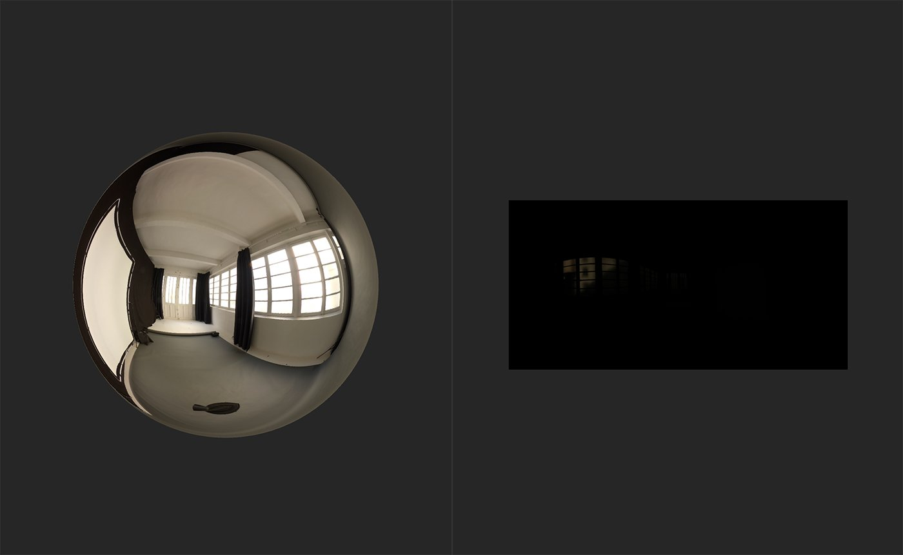

# HDR Merge

<table>
<tr style="border: 0;">
<td width="41.60%" style="border: 0;" valign="top">

**In:** HDRI Tools

</td>
<td width="58.30%" style="border: 0;" valign="top">

## Description

The **HDR Merge** **filter** lets you merge a collection of SDR (Standard Dynamic Range) images to create an HDR image.

The images below show the results of the **HDR Merge**.

Before the **HDR Merge** is done, the sphere in the **3D view** reflects the default environment light. The **2D view** displays the imported image data for the first scan image by default, which in this case is the lowest exposed image.

After the **HDR Merge** **filter** is added, the sphere reflects a new environment light - the HDR image generated from the input images.

</td>
</tr>
</table>

## TParameters

**Basic parameters**

* **Input Exposure Delta (EV)**: 0-2  
  Set the exposure difference between the highest and lowest input exposures. A high exposure delta will increase the resulting contrast of the merge operation.
* **Output Auto Exposure**: toggle  
  Enable or disable automatic exposure adjustment.
* **Output Exposure Offset (EV)**: -5 to 5  
  Offset the exposure.

## Usage Guide

Watch this to find out how to use the **HDR Merge filter** as well as other filters that can help in converting SDR images into an HDR environment light.

The basic steps to use the **HDR Merge** **filter** are as follows:

1. Import the set of images to be merged to the layer stack.
1. Add the **HDR Merge filter** to the layer stack.
1. Modify the parameters to ensure that exposure values are correct.
