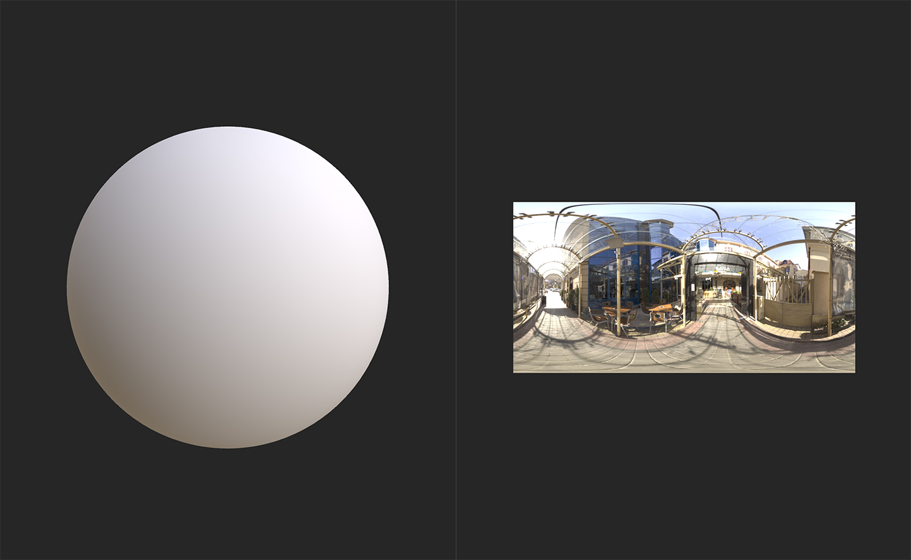
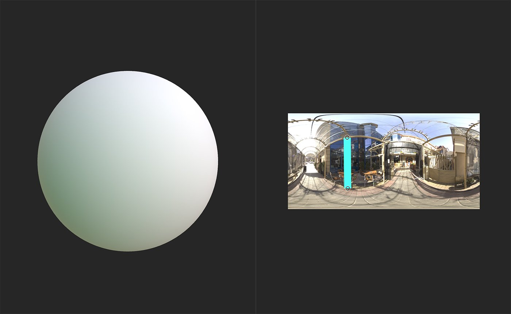

# Line Light

<table>
<tr style="border: 0;">
<td width="41.60%" style="border: 0;" valign="top">

**In:** HDRI Tools

</td>
<td width="58.30%" style="border: 0;" valign="top">

## Description

Add a **Line Light** to your environment light.

The images below show how you can use a **Line Light** to adjust the lighting of your environment.

The image above shows a sphere with no modifications to the environment light.

After adding a **Line Light** the sphere's appearance has noticeably changed.

</td>
</tr>
</table>

## Parameters

**Basic parameters**

* **Exposure (EV)**: 0-10  
  Adjust the exposure or brightness of the light.
* **Shape Color Mode**:   
  Select which method to use to determine the light's color. Available parameters will change based on this selection.
  * **Temperature (Kelvin)**
    * **Temperature**: 1000 - 27000  
      Adjust the temperature of the light.
  * **RGB**
    * **Color**: color select  
      Select the color of the light.
  * **Image Input**
    * **Shape Image Input**: image/brush  
      Import an image to use as the color. You can use the brush tool to paint directly in the **2D view**, but this can have unpredictable results with this filter.
  * **Sample Background**  
    * Sample background doesn't make new parameters available - instead it bases the light color on background values.
* **Position Mode**:   
  Change the method used to determine the lights position. Parameters in the **Position Coordinates** section will change based on selection. With **World Position** selected, the handles will disappear from the **2D view**, instead use the parameters in **Position Coordinates** to modify the light's position.

**Shape**

* **Line Rotation**: 0-1  
  Rotate the light
* **Line Thickness**: 0-1  
  Adjust the thickness of the line that forms the light.
* **Pattern**:   
  Change the shape of the line
* **Pattern Hardness**: 0-1  
  Soften the edges of the light
* **Pattern UV Mode**:   
  Modify how the pattern on which the light is based. **Stretch** stretches the whole shape to match the line endpoints. **Stretch Middle only** stretches the middle of the shape keeping the ends of the line undistorted. **Repeat + Spacing** creates stamps of the shape along the lines length and adds an additional parameter to manage spacing:
  * **Pattern Repeat Spacing**: 0-1  
    Adjust the width of the spacing between shape instances

**Position Coordinates**

Available parameters depend on the selection made for **Basic parameters &gt; Position Mode**. If **Ground/Ceiling** or **Distance from Origin** are selected, the following parameters are available:

* **Line Absolute Height**: 0-1  
  Change how far the light is from the camera.
* **Camera Position**: 0-1  
  Adjust the relative position of the camera to the light in the X, Y, and Z axes.

If **World Position** is chosen in **Basic parameters &gt; Position Mode** the following parameters are available:

* **Up Vector**:   
  Change which direction is up.
* **Point 1 World Position**: -2 to 2  
  Adjust the position of the first point of the line in the X, Y, and Z axes.
* **Point 2 World Position**: -2 to 2  
  Adjust the position of the second point of the line in the X, Y, and Z axes.
* **Camera Position**: 0-1  
  Adjust the relative position of the camera to the light in the X, Y, and Z axes.

**Background**

* **Show Ground Grid**: toggle  
  Display or hide the ground grid.
* **Enable Ground Clipping**: toggle  
  Select whether the light can clip through the ground or not. If enabled, the following control will appear:
  * **Ground Height**: -2 to 2  
    Adjust the height of the ground for the purposes of clipping the light.
* **Background Gamma**:  
  Select the color system used to determine background Gamma.
